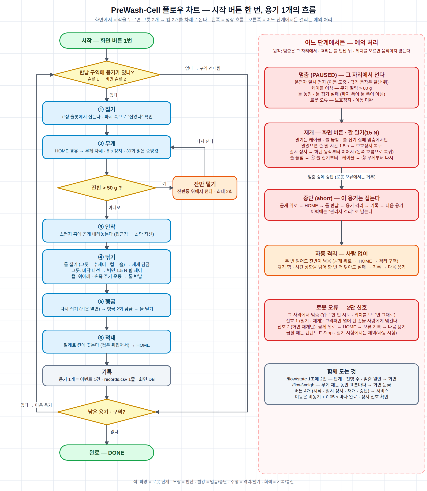

# PreWash-Cell — 협동로봇 다회용기 예비세척 · 식기세척기 팔레트 적재 자동화

반납된 다회용 그릇과 컵을 협동로봇이 집어 **잔반을 털고, 안쪽을 수세미 · 솔로 닦고, 헹군 뒤 식기세척기 팔레트에 꽂는다.** 카메라 없이 **파지 폭 · 무게 · 힘** 세 신호만으로 판단하고, 운영자는 웹 화면에서 시작 버튼 하나만 누른다.

https://github.com/user-attachments/assets/fe7334f8-1464-4c8a-8df6-dcc02b2ce02a

> 두산 ROKEY Boot Camp 9기 · 협동-1 프로젝트 "ROS2를 활용한 로봇 자동화 공정 시스템 구현" · D-2조 **디투(D2)** (한석형 · 민범진 · 박진용 · 황인재, 멘토 이일주) · 2026-09-18 ~ 09-30

| 항목 | 내용 |
|---|---|
| 하드웨어 | Doosan M0609(6축 협동로봇) + OnRobot RG2 그리퍼 |
| 소프트웨어 | Ubuntu 24.04 · ROS 2 Jazzy · Python 3.12 · FastAPI + Next.js(운영 화면) · SQLite |
| 결과 | 시작 1번으로 그릇 2 · 컵 2 무정지 완주(배속 1.0 · 약 13분) · 예외 8종 설계 · 7종 실기 복구 · 자동 시험 616개 통과 |
| 바로 해 보기 | 로봇 없이 Ubuntu 24.04 PC 한 대로 흐름과 운영 화면을 돌려 본다 → [실행 방법 1~4](#실행-방법) |

## 목차

1. [주요 기능](#주요-기능)
2. [시스템 구성](#시스템-구성)
3. [결과](#결과)
4. [실행 방법](#실행-방법)
5. [개발 환경 · 사용 장비](#개발-환경--사용-장비)
6. [프로젝트 구조](#프로젝트-구조)
7. [팀 · 라이선스](#팀--라이선스)

## 주요 기능

- **비전 없는 3신호 판단** — 집었는지 · 툴이 있는지는 그리퍼가 되읽는 파지 폭으로, 잔반은 무게로, 닦을 때의 접촉은 관절 토크로 추정한 툴 힘으로 본다.
- **그릇 · 컵에 맞춘 닦기** — 둘 다 접촉 하강으로 바닥을 찾는다. 그릇은 바닥 나선 → 1.5 N 힘 제어로 벽면을 돌고, 컵은 솔을 위아래 ±15 mm · 손목 ±90° 주기 운동으로 닦는다(힘 제어 없이 상한 10 N 만 감시).
- **잔반 판정과 자동 털기** — 30번(0.5 s 간격) 읽은 무게의 중앙값에서 빈 용기 기준값을 뺀다. 50 g 을 넘으면 잔반통 위에서 털고 다시 재며, 그래도 남으면 사람 없이 격리 구역으로 보낸다.
- **바로 멈추고 이어 가는 운전** — 이동 명령을 비동기로 보내고 0.05 s 마다 완료 · 정지 신호를 확인해 이동 도중에도 그 자리에서 선다. 사람을 부르는 멈춤은 원인을 치운 뒤 팔을 한 번 가볍게(15 N) 밀고 손을 떼면(1.5 s 뒤) 또는 화면에서 재개하면 이어 간다.
- **운영 화면과 기록** — 웹 화면에서 시작 · 일시 정지 · 재개 · 중단을 누르고, 단계 · 실시간 무게 · 팔레트 · 소모품 · 누적 KPI · 이력을 본다. 기록은 SQLite 표 5개와 용기별 `records.csv` 에 남는다.
- **로봇 없이 도는 개발 · 시험** — 기능 함수 13개의 약속(`cobot_api`)과 서명이 같은 가짜 기능으로 로봇 · 드라이버 없이 흐름과 화면을 돌리고, 자동 시험(`pytest`)과 화면 계산 시험(`node --test`)으로 확인한다.

## 시스템 구성

### 아키텍처

<p align="center">
  <a href="https://hwang-injae.github.io/rokey_9_pjt1_D2/images/system_architecture_pc.html"></a><br>
  <sub><a href="https://hwang-injae.github.io/rokey_9_pjt1_D2/images/system_architecture_pc.html">시스템 아키텍처 HTML</a> · <a href="docs/images/system_architecture_pc.png">PNG</a></sub>
</p>

**PC 2대 · 프로그램(노드) 2개**(PC 1대로도 돌아간다). 기능(집기 · 무게 · 닦기 …)은 노드가 아니라 **파이썬 함수**이고, 메인 프로그램 `flow_node` 가 순서대로 부르며 로봇 명령도 여기서만 낸다. 두 PC 는 GPU PC 의 Fast DDS Discovery Server 로 서로를 찾는다([5-4](#실행-방법)).

| 위치 | 구성 | 역할 |
|---|---|---|
| GPU PC (로봇과 유선) | Discovery Server · 두산 · RG2 드라이버 · `flow_node` | 기능 함수 호출 · 실패 처리 · 정지/재개/중단 · 용기별 기록 · 로봇 명령 |
| 화면 PC (무선) | `hmi_bridge`(FastAPI · WebSocket) · 웹 화면(Next.js) · SQLite | 운영 화면과 기록 DB(`prewash.db`) |

| 통신 | 종류 | 방향 | 내용 |
|---|---|---|---|
| `/flow/state` | 토픽 · 1초에 2번 | `flow_node` → `hmi_bridge` | 지금 단계 · 진행 수 · 멈춤 원인 |
| `/flow/event` | 토픽 · 용기마다 1건 | `flow_node` → `hmi_bridge` | 용기 1개의 결과(무게 · 걸린 시간 · 완료/격리) |
| `/flow/weigh` | 토픽 · 무게 재는 동안 | `flow_node` → `hmi_bridge` | 재고 있는 무게 표본 |
| `/flow/start` · `stop` · `resume` · `abort` | 서비스 | `hmi_bridge` → `flow_node` | 화면 버튼(시작 · 일시 정지 · 재개 · 중단) |

좌표 · 힘 · 횟수 · 시간은 코드가 아니라 설정 파일 두 개(`src/cobot_common/config/cell.yaml` · `params.yaml`)에 있다. 패키지별 역할은 [src/README.md](src/README.md), 함수 · 메시지 약속은 [인터페이스 문서](docs/02_인터페이스_IRD.md)에 있다.

### 동작 흐름

<p align="center">
  <br>
  <sub>왼쪽: 용기 1개의 정상 흐름 · 오른쪽: 예외 처리 · <a href="docs/images/flow_chart.svg">플로우 차트 SVG</a></sub>
</p>

```
① 집기   반납 구역의 고정 슬롯에서 용기를 집는다 (슬롯 1 → 비면 슬롯 2)
② 무게   HOME 을 거쳐 무게 재는 자세(집은 자리 위 100 mm)에서 든 채로 잰다 → 잔반이 50 g 을 넘으면 잔반통 위에서 털고 다시 잰다
③ 안착   스펀지 홈에 용기를 놓는다
④ 닦기   툴 집기(그릇 = 수세미 · 컵 = 솔) → 세제 → 안쪽 닦기 → 툴 반납
⑤ 헹굼   용기를 다시 집어 헹굼 구역에 2회 담근 뒤 물을 턴다
⑥ 적재   식기세척기 팔레트 칸에 꽂는다(컵은 뒤집어서) → HOME → 다음 용기
```

그릇 2개 → 컵 2개를 순서대로 처리하고 용기마다 기록을 남긴다. 상태 머신 전체는 [설계 문서 §5.1](docs/03_설계_SDD.md)에 있다.

### 예외 처리

사람을 부르는 멈춤에서는 쥔 것을 그대로 두고 그 자리에 선다. 격리할 때는 곧게 위로 빠져 툴을 홀더에 반납한 뒤 옮긴다. 로봇 위치를 모르면 스스로 움직이지 않는다.

| 상황 | 로봇 | 사람 |
|---|---|---|
| 반납 구역이 비어 있다 | 그 구역을 건너뛴다 | — |
| 털어도 잔반이 남는다 · 닦기 힘/시간 상한을 넘었다 | 닦기는 즉시 멈추고 위로 빠진 뒤, 툴을 쥐고 있으면 한 번 더 닦는다(툴이 없으면 툴 놓침 멈춤). 그래도 실패하거나 잔반이 남으면 사람 없이 격리 구역으로 보내고 다음 용기로 간다 | — |
| 케이블 이상 · 툴 놓침 · 툴 집기 실패 | 그 자리에서 멈춘다 | 케이블을 풀거나 툴을 홀더에 꽂고, 팔을 가볍게 한 번 밀고 손을 떼거나(1.5 s 뒤 움직임) 화면에서 재개 → 케이블은 무게 단계부터, 툴은 툴 집기부터 다시 한다 |
| 운영자 일시 정지 · 중단 | 이동 도중에도 그 자리에서 멈춘다(닦기 동작 중이면 그 동작이 끝난 뒤). 멈춘 상태에서 중단하면 툴을 반납하고 용기를 격리한 뒤 다음 용기로 간다(로봇 오류 · 케이블 이상 멈춤에서는 중단을 받지 않는다) | 재개하면 하던 동작부터 이어 간다. 중단한 용기는 이력에 "관리자 격리"로 남는다 |
| 로봇 오류(보호 정지 등) | 그 자리에서 멈춘다(예외였으면 곧게 위로 한 번만 시도). 사람 신호 전까지 움직이지 않는다 | 밀기 · 재개 → 그리퍼만 열려 쥔 것을 받는다 → 화면 재개 → 곧게 위로 → HOME → 다음 용기 |

전체 예외 · 오류 목록은 [설계 문서 §7](docs/03_설계_SDD.md)에 있다.

## 결과

실기(Doosan M0609)와 로봇 없는 자동 시험에서 확인한 값이다. 최종 실기(9/30)에서도 전체 흐름과 예외 처리가 모두 정상 동작했다. 근거는 [결과표](docs/04_결과_결과표.md)와 [시험 기록](docs/test-reports/)에 있다.

| 항목 | 결과 | 목표 | 판정 |
|---|---|---|---|
| 완전성 | 배속 0.5 완주 3회 · 배속 1.0 무정지 완주 1회(약 13분) · 사람 개입 0 | 시작 1회로 그릇 2 · 컵 2 를 팔레트까지 | 달성 |
| 잔반 판정 | 98 g 대용품 4/4 감지 · 빈 용기 오판 0/8 | 대용품 100 % · 오판 0 (임계 50 g) | 달성 |
| 파지 · 안착 · 적재 | 슬롯 집기 12/12 · 홈 놓기 12/12 · 컵 재파지 6/6 · 팔레트 12/12 · 낙하 0 | 90 % 이상 · 낙하 0 | 달성 |
| 닦기 힘 | 그릇 평균 2.64 / 2.06 N · 최대 6.91 / 6.34 N(그릇 1 / 2 · 바닥 나선 포함) · 컵 최대 3.39 N · 힘 로그 기록 | 상한(10 N) 초과 0 · 초과 시 즉시 후퇴 | 달성 |
| 예외 복구 | 예외 8종 설계 · 7종 실기(6종 + 빈 시작) 모두 정의대로 복구 · 로봇 오류는 안전망(실기 시험 제외 · 자동 시험) | 실패마다 재시도 · 격리 · 정지 · 재개가 정의대로 | 달성 |
| 운영 화면 · 기록 | 기록 누락 0 · 두 PC 사이 버튼 응답 7~96 ms(무선) | 누락 0 · 응답 1 s 이내 | 달성 |
| 용기당 사이클 타임 | 배속 1.0 에서 그릇 153 · 219 s(잔반 털기 1회 포함) · 컵 182 · 192 s · 평균 186.5 s | 90 s 이내 | **미달** |
| 자동 시험 | `pytest` 616 passed · 9 skipped · 1 xfailed · 화면 계산 15 pass | 로봇 없이 실패 0 | 달성 |

## 실행 방법

**1~4 는 로봇 없이 Ubuntu 24.04(데스크톱) PC 한 대에서 그대로 따라 하면 된다.** 인터넷만 있으면 되고, 위에서 아래로 명령을 복사해 실행한다. 저장소는 2 의 `git clone` 이 `~/rokey_pjt01_ws` 에 받는다.

### 1. ROS 2 Jazzy 설치

이미 `/opt/ros/jazzy` 가 있으면 건너뛴다. [ROS 2 공식 설치 안내](https://docs.ros.org/en/jazzy/Installation/Ubuntu-Install-Debs.html)와 같은 방법이다.

```bash
sudo apt update && sudo apt install -y software-properties-common curl
sudo add-apt-repository -y universe
export ROS_APT_SOURCE_VERSION=$(curl -s https://api.github.com/repos/ros-infrastructure/ros-apt-source/releases/latest | grep -F "tag_name" | awk -F'"' '{print $4}')
curl -L -o /tmp/ros2-apt-source.deb "https://github.com/ros-infrastructure/ros-apt-source/releases/download/${ROS_APT_SOURCE_VERSION}/ros2-apt-source_${ROS_APT_SOURCE_VERSION}.$(. /etc/os-release && echo ${UBUNTU_CODENAME:-${VERSION_CODENAME}})_all.deb"
sudo dpkg -i /tmp/ros2-apt-source.deb
sudo apt update && sudo apt install -y ros-jazzy-ros-base ros-dev-tools
```

| 확인 | 통과 기준 |
|---|---|
| `ls /opt/ros/jazzy/setup.bash` | 파일이 있다 |

### 2. 받기 · 빌드 · 자동 시험

```bash
sudo apt install -y git python3-colcon-common-extensions python3-pytest python3-venv python3-pymodbus
cd ~ && git clone https://github.com/hwang-injae/rokey_9_pjt1_D2.git rokey_pjt01_ws
cd ~/rokey_pjt01_ws
source /opt/ros/jazzy/setup.bash
colcon build --symlink-install
source install/setup.bash
python3 -m pytest -q src
```

| 확인 | 통과 기준 |
|---|---|
| 빌드 마지막 줄 | `Summary: 8 packages finished` |
| 시험 마지막 줄 | `616 passed, 9 skipped, 1 xfailed` · `failed` 없음 (건너뛴 9개는 3 의 화면 부품이 있어야 도는 시험) |

### 3. 운영 화면 부품

화면 서버용 가상환경과 웹 화면을 만든다.

```bash
sudo apt install -y nodejs npm
python3 -m venv --system-site-packages ~/venvs/hmi
~/venvs/hmi/bin/pip install -r ~/rokey_pjt01_ws/requirements.txt
cd ~/rokey_pjt01_ws/src/f4_hmi/web && npm install && npm run build && cd ~/rokey_pjt01_ws
```

| 확인 | 통과 기준 |
|---|---|
| `npm run build` 끝 | `(Static)  prerendered as static content` · `src/f4_hmi/web/out/index.html` 이 생긴다 |

(선택) 화면 쪽 시험 — 2 와 같은 터미널(새 터미널이면 `cd ~/rokey_pjt01_ws && source /opt/ros/jazzy/setup.bash && source install/setup.bash` 먼저)에서:

```bash
~/venvs/hmi/bin/python3 -m pytest -q src/f4_hmi
cd src/f4_hmi/web && node --test test/ && cd ~/rokey_pjt01_ws
```

통과 기준은 `51 passed` 와 `pass 15` · `fail 0`.

### 4. 로봇 없이 실행

로봇과 드라이버 없이 메인 프로그램과 운영 화면을 띄운다. 기능은 가짜로 돈다.

```bash
cd ~/rokey_pjt01_ws
source /opt/ros/jazzy/setup.bash && source install/setup.bash
export ROS_AUTOMATIC_DISCOVERY_RANGE=LOCALHOST
ros2 launch prewash_bringup prewash_mock.launch.py
```

| 확인 | 통과 기준 |
|---|---|
| 터미널 | `IDLE — /flow/start 를 기다린다` 와 `HMI 서버를 연다 → http://localhost:8000` |
| 브라우저 <http://localhost:8000> | 화면이 뜨고 연결 점이 초록이다 |
| 화면의 **시작** 버튼 | 곧바로 그릇 2 · 컵 2 완료(기능이 가짜라 로봇 동작 시간이 없다) |

- `setup_io 를 건너뛴다` 경고 두 줄은 두산 드라이버가 없을 때 나오는 정상 안내다. 끌 때는 Ctrl+C.
- 브라우저 없이 확인하려면 새 터미널에서 `source /opt/ros/jazzy/setup.bash && export ROS_AUTOMATIC_DISCOVERY_RANGE=LOCALHOST && ros2 service call /flow/start std_srvs/srv/Trigger` → `success=True`. 같은 방법으로 `stop` · `resume` · `abort` 도 부른다.

<details>
<summary><b>멈춤 화면 골라 보기 (가짜 상태 발행기)</b></summary>

4 의 launch 대신 터미널 2개로 돌린다. 두 터미널 모두 4 의 첫 세 줄(`cd` · `source` · `export`)을 먼저 실행한다. launch 와 같은 포트를 쓰므로 한 번에 하나만 켠다.

```bash
ros2 run f4_hmi hmi_bridge
```

```bash
ros2 run f4_hmi fake_state_pub tool_lost
```

`tool_lost` 자리에 넣을 수 있는 이름: `normal` · `paused` · `isolate` · `error` · `empty_zone` · `tool_lost` · `leftover_remain` · `cable` · `tool_fail`. 기록 DB 조회는 `ros2 run f4_hmi hmi_db kpi`.

</details>

### 5. 실제 로봇

두산 M0609 + RG2 와 우리 워크셀이 있을 때만 한다. 1~3 을 마친 PC 에서 이어서 한다.

<details>
<summary><b>5-1. 두산 드라이버 설치 (처음 한 번)</b></summary>

드라이버는 이 저장소에 없다. 교육 과정 배포본(`doosan-robot2` · 그리퍼 드라이버 `onrobot_rg_control` · `m0609_rg2_bringup`)을 `~/ws_cobot_pjt/ws_dsr` 에 받아 빌드한다. 절차는 [환경 설정 문서 §8](docs/env/M0609_환경설정.md)에 있다. RViz 가 필요하므로 데스크톱 패키지도 설치하고, 빌드가 끝나면 확인한다.

```bash
sudo apt install -y ros-jazzy-desktop
source ~/ws_cobot_pjt/ws_dsr/install/setup.bash
ros2 pkg prefix m0609_rg2_bringup && python3 -c "import DR_init; print('DR_init OK')"
```

통과 기준은 설치 경로 한 줄과 `DR_init OK`. `DR_init` 을 못 찾으면 아래 줄을 `~/.bashrc` 맨 아래에 넣고 터미널을 새로 연다.

```bash
export PYTHONPATH=$PYTHONPATH:~/ws_cobot_pjt/ws_dsr/install/dsr_common2/lib/dsr_common2/imp
```

**터미널 준비(로봇용)** — 5-2 와 5-3 의 모든 터미널에서 먼저 실행한다.

```bash
cd ~/rokey_pjt01_ws
source ~/ws_cobot_pjt/ws_dsr/install/setup.bash && source install/setup.bash
export ROS_DOMAIN_ID=60 ROS_AUTOMATIC_DISCOVERY_RANGE=LOCALHOST
```

</details>

<details>
<summary><b>5-2. 가상 로봇 (RViz)</b></summary>

**터미널 1 — 가상 브링업**

```bash
ros2 launch m0609_rg2_bringup bringup.launch.py mode:=virtual host:=127.0.0.1 port:=12345 model:=m0609
```

**터미널 2 — 좌표 순회**

```bash
python3 src/cobot_common/test/rig_coords.py --from 1
```

RViz 에 로봇이 뜨고 셀 좌표를 차례로 돈다. 통과 기준은 마지막 줄 `결과: 통과 — OK n · FAIL 0`. 가상 로봇에는 힘 · 무게 · 접촉이 없다.

</details>

<details>
<summary><b>5-3. 실제 로봇 — PC 1대</b></summary>

> **주의**
> - `cell.yaml` 의 좌표는 우리 워크셀 배치 기준이다. 배치가 다른 셀에서는 좌표를 다시 티칭한 뒤에 돌린다.
> - 처음 켜는 셀과 다시 티칭한 뒤의 첫 실행은 `vel_scale:=0.3` 을 붙여 천천히 돌린다.
> - 급할 때는 Ctrl+C 가 아니라 **E-Stop**.

| 전제 | 값 |
|---|---|
| PC 유선 주소 | `192.168.1.x/24` 로 고정 |
| 로봇 제어기 · 그리퍼 | `192.168.1.100` · `192.168.1.1` |
| 티치 펜던트 | 툴 `Tool Weight`(1.440 kg)와 TCP `GripperDA_v1`(Z 208 mm) 등록 — 이름이 다르면 프로그램이 시작을 거부한다 |

**① 터미널 1 — 브링업**

```bash
ping -c 3 192.168.1.100
ros2 launch m0609_rg2_bringup bringup.launch.py mode:=real host:=192.168.1.100 port:=12345 model:=m0609
```

**② 터미널 2 — 툴 · TCP 확인**

```bash
ros2 service call /dsr01/dsr_controller2/tool/get_current_tool dsr_msgs2/srv/GetCurrentTool
ros2 service call /dsr01/dsr_controller2/tcp/get_current_tcp dsr_msgs2/srv/GetCurrentTcp
```

통과 기준은 `Tool Weight` 와 `GripperDA_v1`.

**③ 터미널 2 — 빈 용기 기준값** (실행 직전에 한 번 · 무게 값이 시간에 따라 흐르므로)

그리퍼가 빈 상태에서 아래 첫 줄을 실행한다. 그리퍼가 열리고 `▶ BOWL 을(를) 그리퍼 사이에 대 주세요 — 준비되면 Enter` 가 뜨면 빈 그릇을 대고 Enter 를 누른다. 다음 줄은 로봇이 HOME 을 거쳐 무게 재는 자세로 움직여 잰다(약 1분 30초). 마지막 줄은 그릇을 **손으로 받친 채** 실행한다.

```bash
python3 src/f2_sense_flow/test/rig_f2.py grip --kind BOWL
PREWASH_VEL_SCALE=0.3 python3 src/f2_sense_flow/test/rig_f2.py empty --kind BOWL -n 3
python3 src/f2_sense_flow/test/rig_f2.py release
```

출력의 `중앙값 X g (폭 Y g)` 에서 폭이 20 g 이하면, 중앙값을 `src/cobot_common/config/params.yaml` 의 `f2.empty_weight_g.BOWL` 에 넣는다. 컵도 같은 순서로 재서 `f2.empty_weight_g.CUP` 에 넣는다.

```bash
python3 src/f2_sense_flow/test/rig_f2.py grip --kind CUP
PREWASH_VEL_SCALE=0.3 python3 src/f2_sense_flow/test/rig_f2.py empty --kind CUP -n 3
python3 src/f2_sense_flow/test/rig_f2.py release
```

**④ 터미널 2 — 메인 프로그램과 화면**

팔레트와 격리 구역을 비우고, 반납 구역에 그릇 2개와 컵 2개를 놓는다.

```bash
ros2 launch prewash_bringup prewash.launch.py hmi:=true
```

| 확인 | 통과 기준 |
|---|---|
| 터미널 | 시작부에 `[prewash] use_mock=없음(전부 실제) · vel_scale=1 · hmi=True` → 문지기 통과 → 케이블 확인 → `IDLE` |
| 브라우저 <http://localhost:8000> | 연결 점이 초록이다 |
| **시작** 버튼 | 그릇 2 → 컵 2 를 처리하고 `IDLE` 로 돌아온다 |

**⑤ 끝낼 때** — 로봇이 멈춘 뒤 터미널 2 → 터미널 1 순서로 Ctrl+C.

</details>

<details>
<summary><b>5-4. 실제 로봇 — PC 2대 (GPU PC + 화면 PC)</b></summary>

PC 두 대가 같은 망에 있을 때 쓴다. GPU PC 는 1 · 2 와 5-1, 화면 PC 는 1 · 2 · 3 을 마쳐 둔다. 5-3 의 주의와 전제는 그대로 적용하고, 5-3 의 ① · ④ 는 실행하지 않는다. 무선망이 ROS 2 기본 탐색(멀티캐스트)을 막으므로 GPU PC 에 Fast DDS Discovery Server 를 띄우고 두 PC 가 거기에 붙는다.

**① GPU PC 의 주소 확인** — `hostname -I` 로 무선 쪽 주소를 적어 둔다(예: `172.18.0.101`). 아래 명령의 `GPU_IP=172.18.0.101` 을 **이 값으로 바꿔서** 실행한다. `ping -c 3 192.168.1.100`(GPU PC → 로봇)과 `ping -c 3 <GPU_IP>`(화면 PC → GPU PC)가 되어야 한다.

**② GPU PC 터미널 A — Discovery Server** (끝까지 켜 둔다)

```bash
export GPU_IP=172.18.0.101
source /opt/ros/jazzy/setup.bash
fastdds discovery --server-id 0 --udp-address $GPU_IP --udp-port 11811
```

**③ GPU PC 터미널 B — 브링업**

```bash
export GPU_IP=172.18.0.101
source ~/ws_cobot_pjt/ws_dsr/install/setup.bash
export RMW_IMPLEMENTATION=rmw_fastrtps_cpp ROS_DISCOVERY_SERVER=$GPU_IP:11811 ROS_SUPER_CLIENT=TRUE ROS_DOMAIN_ID=60 ROS_AUTOMATIC_DISCOVERY_RANGE=SUBNET && unset ROS_STATIC_PEERS
ros2 daemon stop && ros2 daemon start
ros2 launch m0609_rg2_bringup bringup.launch.py mode:=real host:=192.168.1.100 port:=12345 model:=m0609
```

**④ GPU PC 터미널 C — 준비 · 툴/TCP 확인 · 빈 용기 기준값**

```bash
export GPU_IP=172.18.0.101
cd ~/rokey_pjt01_ws
source ~/ws_cobot_pjt/ws_dsr/install/setup.bash && source install/setup.bash
export RMW_IMPLEMENTATION=rmw_fastrtps_cpp ROS_DISCOVERY_SERVER=$GPU_IP:11811 ROS_SUPER_CLIENT=TRUE ROS_DOMAIN_ID=60 ROS_AUTOMATIC_DISCOVERY_RANGE=SUBNET && unset ROS_STATIC_PEERS
```

이 터미널에서 5-3 의 ②(툴 · TCP 확인)와 ③(빈 용기 기준값)을 그대로 한다.

**⑤ GPU PC 터미널 C — 메인 프로그램** (④와 같은 터미널 · `hmi:=true` 는 붙이지 않는다 — 붙이면 화면 서버와 기록 DB 가 두 곳에 생긴다)

```bash
ros2 launch prewash_bringup prewash.launch.py
```

통과 기준: 시작부에 `[prewash] use_mock=없음(전부 실제) · vel_scale=1 · hmi=False` → 문지기 통과 → 케이블 확인 → `IDLE`.

**⑥ 화면 PC 터미널 — 화면 서버** (GPU PC 의 A · B · C 가 모두 켜진 뒤 · 두산 드라이버는 필요 없다)

```bash
export GPU_IP=172.18.0.101
cd ~/rokey_pjt01_ws
source /opt/ros/jazzy/setup.bash && source install/setup.bash
export RMW_IMPLEMENTATION=rmw_fastrtps_cpp ROS_DISCOVERY_SERVER=$GPU_IP:11811 ROS_SUPER_CLIENT=TRUE ROS_DOMAIN_ID=60 ROS_AUTOMATIC_DISCOVERY_RANGE=SUBNET && unset ROS_STATIC_PEERS
ros2 daemon stop && ros2 daemon start
ros2 run f4_hmi hmi_bridge
```

**⑦ 연결 확인** — 화면 PC 에서 새 터미널을 열고 ⑥의 처음 네 줄(`export GPU_IP` · `cd` · `source` · `export`)을 먼저 실행한 뒤:

```bash
ros2 node list | grep -E 'flow_node|dsr_controller2'
ros2 topic hz /flow/state
```

통과 기준: `/flow_node` · `/dsr01/flow_node_dsr` · `/dsr01/dsr_controller2` 가 보이고 `/flow/state` 가 약 2 Hz, 브라우저 <http://localhost:8000> 의 연결 점이 초록이다.

**⑧ 끝낼 때** — 화면 서버 → GPU PC 의 C(로봇이 멈춘 뒤) → B → A 순서로 Ctrl+C.

</details>

<details>
<summary><b>문제가 생기면</b></summary>

| 언제 | 증상 | 원인 | 대처 |
|---|---|---|---|
| 설치 · 실행 | `ros2: command not found` | 그 터미널에서 `source` 줄을 실행하지 않았다 | 그 단계의 첫 줄(`cd` · `source`)부터 다시 |
| 설치 · 실행 | `colcon: command not found` | colcon 을 설치하지 않았다 | 2 의 apt 설치를 다시 |
| 설치 · 실행 | `Package 'prewash_bringup' not found` | `source install/setup.bash` 를 빼먹었거나 빌드 전이다 | 2 의 빌드와 `source` 를 다시 |
| 설치 · 실행 | 화면 주소에 시험 페이지만 나온다 | 화면을 빌드하지 않았다 | 3 의 `npm install && npm run build` |
| 설치 · 실행 | 8000 포트가 이미 쓰이고 있다 | 먼저 켠 화면 서버가 남아 있다 | 남은 `hmi_bridge` 를 끄고 다시 켠다 |
| 실제 로봇 | 브링업이 곧 꺼지거나 먼저 켠 브링업이 멈춘다 | 브링업 · 에뮬레이터가 이미 켜져 있다 | `ss -tlnp \| grep 12345` 로 확인하고, 켜져 있으면 새로 켜지 말고 그것을 쓴다 |
| 실제 로봇 | 프로그램이 시작하자마자 거부한다(문지기) | 펜던트의 툴 · TCP 이름이 `Tool Weight` · `GripperDA_v1` 이 아니다 | 펜던트에서 툴 · TCP 를 고르고 5-3 ② 로 확인 |
| PC 1대 | 화면이 "연결 끊김"이다 | 5-4 의 환경변수 줄을 넣은 터미널에서 화면 서버를 켰다 | 화면 서버를 끄고, 새 터미널에서 5-1 의 터미널 준비 줄만 실행한 뒤 다시 켠다 |
| PC 2대 | 화면이 "연결 끊김"인데 토픽은 보인다 | 화면 서버를 환경변수 없는 새 터미널에서 켰다 | 환경변수 줄을 넣은 터미널에서 다시 켠다 |
| PC 2대 | `ros2 topic list` 가 비어 있다 | 옛 ros2 데몬이 옛 설정으로 남아 있다 | `ros2 daemon stop && ros2 daemon start` |
| PC 2대 | PC 끼리 `ping` 이 안 된다 | 기기 사이 통신을 막는 망(손님용 무선 등)에 붙어 있다 | 두 PC 를 서로 통신이 되는 같은 망에 붙인다 |
| PC 2대 | 두산 드라이버나 새로 켠 노드가 안 보인다 | 터미널 B · C 에 환경변수 줄이 빠졌거나 서버(A)가 꺼졌다 | 서버 → 브링업 → 메인 프로그램 순서로 다시 켠다 |
| PC 2대 | 화면만 끊기고 로봇은 계속 돈다 | 무선이 끊겼다 | 멈춰야 하면 E-Stop |

두 PC 가 같은 유선 스위치에 있으면 Discovery Server 없이도 된다. 방법은 [환경 설정 문서 10-5](docs/env/M0609_환경설정.md)에 있다.

</details>

## 개발 환경 · 사용 장비

| 항목 | 값 |
|---|---|
| OS · ROS | Ubuntu 24.04 LTS · ROS 2 Jazzy · Fast DDS(`rmw_fastrtps_cpp`) + Discovery Server |
| 로봇 드라이버 | 교육 과정 배포본 `doosan-robot2`(`DSR_ROBOT2` · `DR_init`) · `onrobot_rg_control` · `m0609_rg2_bringup` — 저장소 밖 `~/ws_cobot_pjt/ws_dsr` · 제어기 Dart Platform 2.12.1 |
| 화면 | FastAPI · uvicorn · WebSocket(`hmi_bridge`, 포트 8000) · Next.js 15 · React 19(정적 빌드) · SQLite · Node.js 18.18 이상 |
| 의존성 | apt(실행 방법 1~3) · pip [`requirements.txt`](requirements.txt) · npm [`package.json`](src/f4_hmi/web/package.json) |
| 언어 · 도구 | Python 3.12 · JavaScript · colcon · pytest · `node --test` |

| 장비 | 모델명 · 사양 | 수량 | 용도 |
|---|---|---|---|
| 협동로봇 | Doosan M0609 (6축 · 가반하중 6 kg · 도달 거리 900 mm) + 제어기 · 티치 펜던트 | 1 | 용기 · 툴 이송, 닦기 · 무게 · 접촉 감지(관절 토크) |
| 그리퍼 | OnRobot RG2 (스트로크 0~110 mm · 파지 힘 3~40 N · 폭 피드백) | 1 | 용기 · 툴 파지 · 파지 폭 되읽기 |
| 툴 | 수세미 툴(그릇용 · 지름 90 mm) · 수세미 솔(컵용 · 길이 95 mm) | 각 1 | 안쪽 닦기. 툴 홀더 2개의 비눗물에 담가 세제를 묻힌다 |
| 셀 구성품 | 반납 구역 2곳(구역마다 고정 슬롯 2개) · 잔반통 · 스펀지 고정틀 · 헹굼 구역 · 격리 구역 · 식기세척기 팔레트 모형(그릇 2칸 · 컵 2칸) | — | 헹굼은 물 없이 모션만(과정 안전 규정) |
| 처리 대상 | 다회용 그릇 · 컵 | 각 2 | 시연 · 시험 |
| 잔반 대용품 | 털면 떨어지는 고형물 94 g(시연) · 98 g(9/23 시험) | 각 1 | 잔반 판정 시험 |
| PC | Ubuntu 24.04 · ROS 2 Jazzy | 2 | GPU PC(로봇 제어 · 유선) · 화면 PC(운영 화면 · 무선) |

<p align="center">
  <br>
  <sub>워크셀 배치(위에서 본 그림) · <a href="docs/images/layout_workcell.svg">배치도 SVG</a></sub>
</p>

## 프로젝트 구조

```text
rokey_pjt01_ws/                ROS 2 워크스페이스 (저장소 루트)
├── src/                       ROS 2 패키지 8개 · 패키지 지도는 src/README.md
│   ├── cobot_api/             기능 함수 13개의 약속(이름 · 인자 · 결과 · 실패 코드) — 로봇 코드 없음
│   ├── cobot_common/          두산 API · 그리퍼를 감싼 공용 로봇 함수 + 설정 파일 config/*.yaml
│   ├── cobot_msgs/            메시지 3개 — FlowState · FlowEvent · WeighLive
│   ├── f1_handling/           집기 · 다시 집기 · 놓기 · 이동 · 툴 집기/반납 · 팔레트 꽂기 (함수 6개)
│   ├── f2_sense_flow/         무게 · 잔반 털기 · 헹굼 · 물 털기 (함수 4개) + 메인 프로그램 flow_node (상태 머신)
│   ├── f3_wipe/               세제 · 그릇 닦기 · 컵 닦기 (함수 3개)
│   ├── f4_hmi/                운영 화면 hmi_bridge · 웹(Next.js) · 기록 DB(SQLite) · 가짜 흐름
│   ├── prewash_bringup/       launch 2개 — 실기용 · 로봇 없이(mock)
│   └── */test/                자동 시험 test_*.py · 단독 시험대 rig_*.py
├── docs/                      문서 지도는 docs/README.md — 요구사항 · 인터페이스 · 설계 · 결과표 · 결정 기록 · 시험 기록 · 트러블슈팅 · 환경 설정 · 그림
├── requirements.txt           pip 의존성 (운영 화면 서버용 가상환경 · 화면 시험)
├── LICENSE                    Apache-2.0
└── README.md
```

## 팀 · 라이선스

| 이름 | 역할 |
|---|---|
| 한석형(팀장) | 파지 · 이송 · 적재 · 좌표 티칭 · 워크셀 기구 제작 · 시연 영상 |
| 민범진 | 무게 측정 · 잔반 판정 · 털기 · 헹굼 · 흐름 상태 머신 · 케이블 감지 · 넛지 재개 |
| 박진용 | 세제 · 접촉 닦기 힘 제어 · 스펀지 고정틀 제작 · 공용 힘 함수 · 안전 파라미터 |
| 황인재 | PM · 인터페이스(`cobot_api` · `cobot_msgs`) · 운영 화면 · 기록 DB · KPI · 통합 · 문서 |

[Apache License 2.0](LICENSE) — Copyright 2026 Team D2 (ROKEY 9기 협동1 D그룹 2조). 두산 · OnRobot 드라이버(`ws_dsr`, 저장소 밖)는 각 제공자의 라이선스를 따른다.
