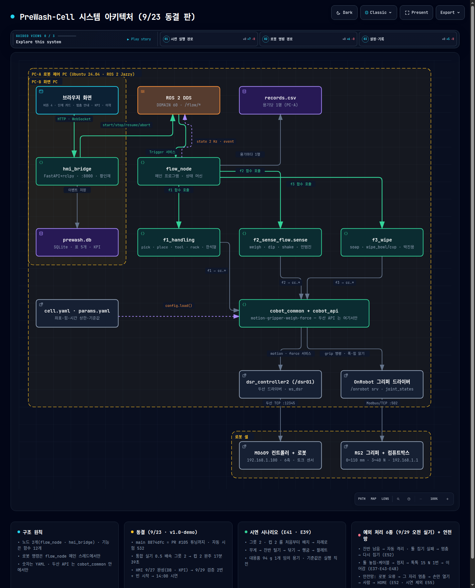
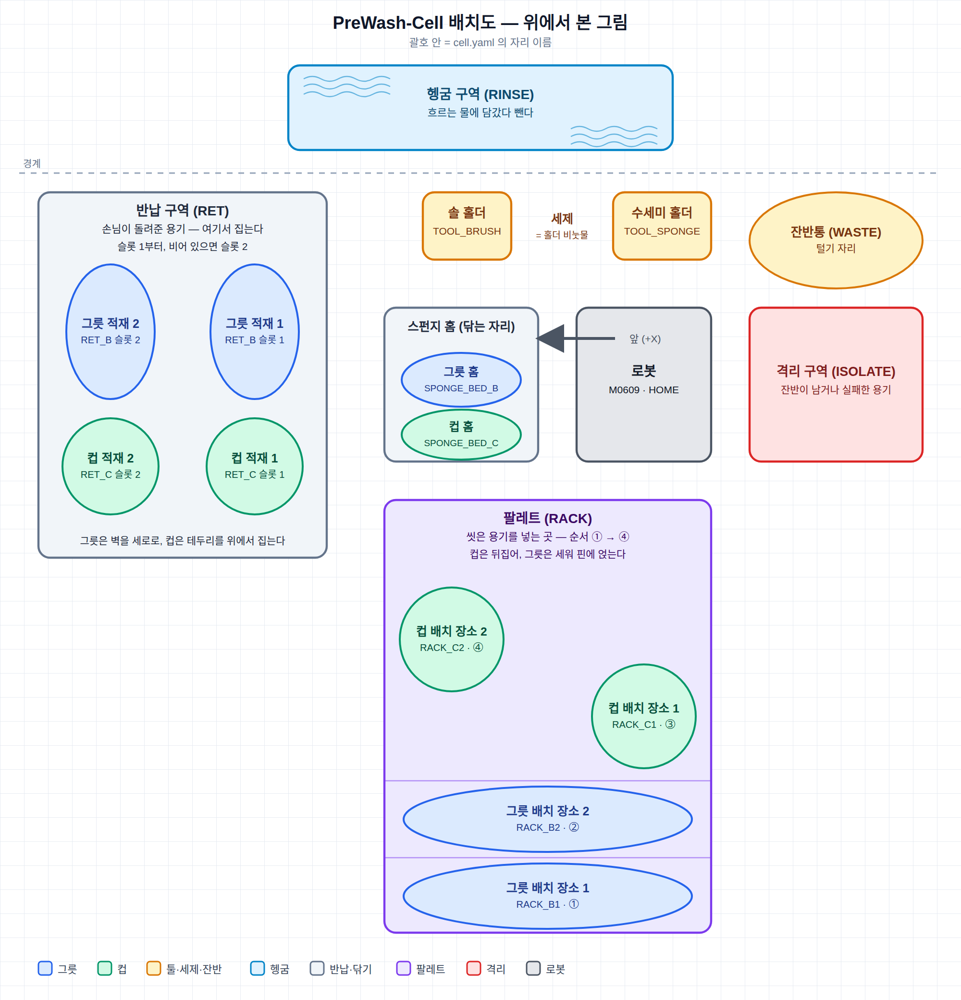
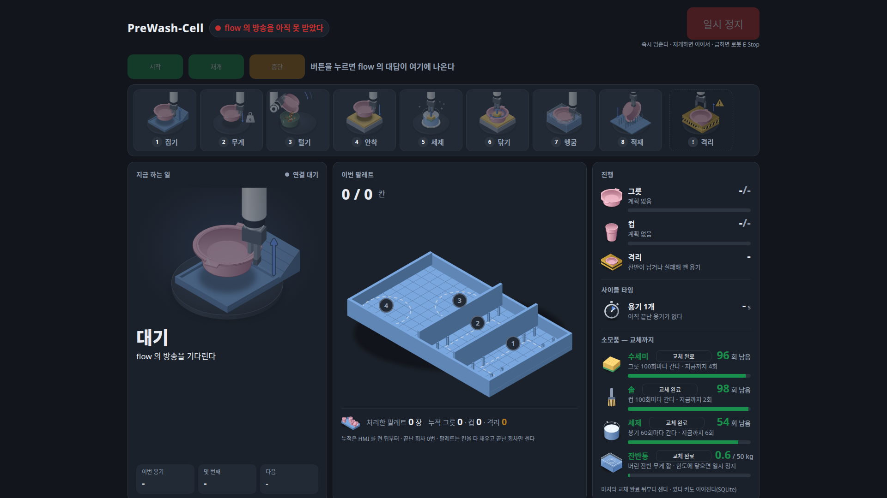
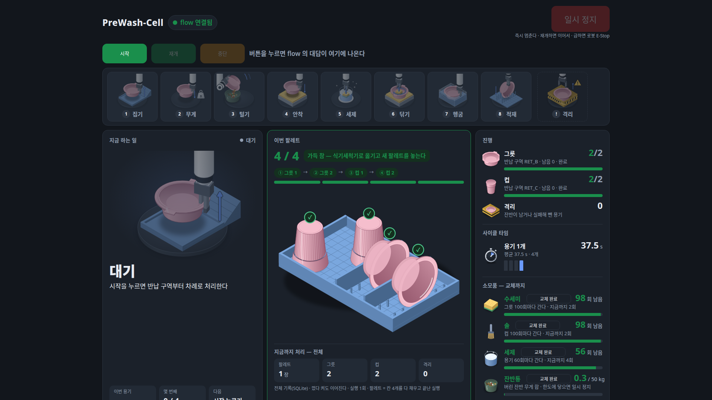

# PreWash-Cell — 경기장 다회용기 예비세척 · 식기세척기 팔레트 적재 자동화 셀

> 경기장에서 반납된 **다회용 그릇·컵**을 협동로봇이 집어 **잔반을 털고, 안쪽을 힘 제어로 닦고, 헹군 뒤 식기세척기 팔레트에 꽂는다.**
> 카메라 없이 **파지 폭 · 무게 · 힘**만으로 판단한다. 본세척은 식기세척기가 맡는다.

| 항목 | 내용 |
|---|---|
| 로봇 · 그리퍼 | Doosan **M0609** (6축 협동로봇) + OnRobot **RG2** (0~110 mm · 3~40 N) |
| 소프트웨어 | Ubuntu 24.04 · **ROS 2 Jazzy** · Python 3.12 · FastAPI + Next.js(운영 화면) · SQLite |
| 처리 대상 | 그릇 1규격 2개 + 컵 1규격 2개 → 팔레트 4칸(그릇 2 · 컵 2) |
| 판단 수단 | 파지 폭(빈손/용기/툴 구분) · 하중 측정(잔반 ≥ 50 g) · 툴 힘센서(닦기 힘 제어 · 넛지 재개) — **비전 없음** |
| 결과 | 시작 1회로 **그릇 2 → 컵 2 완주 3회**(9/23 실기 · 배속 0.5 · 사람 개입 0 · 튜닝 뒤 3회차 무정지 17분 39초) · 자동 시험 **532개** 통과(동결판) · 수락 기준 7개 중 5개 ✅(2개는 최종 검증 예정) |
| 팀 | ROKEY 9기 협동1 · D그룹 2조 — 한석형(팀장 · 파지·이송·적재) · 민범진(무게·털기·헹굼 · 흐름) · 박진용(접촉 닦기 · 공용 로봇 함수) · 황인재(PM · 운영 화면 · 통합) |
| 기간 | 2026-09-18 ~ 09-30 (개발 6일 · 기능 동결 9/23 · 최종 시연 9/29 · 제출 9/30) |

<p align="center">
  <br>
  <sub>시스템 아키텍처 — 대화형 판은 <a href="docs/images/system_architecture_pc.html">docs/images/system_architecture_pc.html</a></sub>
</p>

---

## 1. 무엇을 하는가 — 용기 1개가 도는 길

```
반납 구역 ──집기──▶ HOME 을 거쳐 저울 자세 ──무게──▶ (잔반 ≥ 50 g 이면 잔반통 위에서 기울여 털고 다시 잰다)
        ──▶ 스펀지 홈에 놓기 ──▶ 툴 집기(그릇 수세미 · 컵 솔) → 세제 → 안쪽 닦기(힘 제어) → 툴 반납
        ──▶ 다시 집기(컵은 옆면으로) ──▶ 헹굼 담금 2회 → 곧게 위로 → 털기 자세에서 손목 좌우 3회
        ──▶ 식기세척기 팔레트 칸에 꽂기(컵은 뒤집어) ──▶ HOME → 다음 용기
```

- 운영자는 화면에서 **시작 1번**만 누른다. 그릇 2개 → 컵 2개를 계획 순서대로 처리하고 용기마다 기록을 남긴다.
- 반납 구역은 내리막 공급 구조라 구역마다 집는 자리가 1개다. 그릇은 옆면(벽)을 세로로, 컵은 테두리를 위에서 집고 파지 폭으로 성공을 판정한다.
- 뒷면·바깥면은 닦지 않는다. "닦임"은 공정 완료이지 위생 판정이 아니다.

<p align="center">
  <br>
  <sub>워크셀 배치(위에서 본 그림 · 9/28 실제 배치 기준) — 맨 위 헹굼 구역(흐르는 물) · 왼쪽 반납 구역(그릇·컵 슬롯 1·2) · 가운데 툴 홀더·세제 통·스펀지 홈과 로봇(앞 +X 는 스펀지 홈 쪽) · 오른쪽 잔반통·격리 구역 · 아래 팔레트 4칸</sub>
</p>

## 2. 시스템 구성

**PC 2대 · 프로그램 2개.** 기능은 노드가 아니라 **파이썬 함수 모듈**이고, 메인 프로그램이 순서대로 부른다. 로봇 명령은 메인 프로그램의 메인 스레드에서만 나간다.

| 어디 | 프로그램 | 하는 일 |
|---|---|---|
| **PC-A** (로봇 옆) | `flow_node` (`f2_sense_flow`) | 메인 프로그램. 상태 머신으로 기능 함수를 차례로 부르고 실패 정책 · 정지/재개/중단 · 용기별 기록(`records.csv`)을 맡는다 |
| **PC-B** (화면) | `hmi_bridge` (`f4_hmi`) + 웹 화면 | 브라우저 운영 화면(시작·일시 정지·재개·중단 · 단계 카드 · 멈춤 원인별 안내 · 팔레트 · 소모품 · 누적 KPI · 이력) · 기록 DB(SQLite) |

| 패키지 | 담당 | 함수 | 한 줄 |
|---|---|---|---|
| `f1_handling` | 한석형 | `pick` `place` `move_to` `tool` `rack_place` | 집기 · 놓기 · 이동 · 툴 집기/반납 · 팔레트 꽂기 |
| `f2_sense_flow` | 민범진 · 황인재(통합) | `weigh` `leftover_loop` `shake` `dip` + `flow.py` `flow_node.py` | 무게 · 잔반 버리기 · 헹굼 담금 · 물 털기 + **흐름(상태 머신)** |
| `f3_wipe` | 박진용 | `soap` `wipe_bowl` `wipe_cup` | 세제 · 그릇 닦기(나선 + 벽면 힘 제어) · 컵 닦기(솔 회전) |
| `f4_hmi` | 황인재 | `hmi_bridge` · `web/`(Next.js) · `fake_state_pub` | 운영 화면 · 기록 DB · KPI · 가짜 흐름(로봇 없이 화면 시험) |
| `cobot_common` | 4명 분담 | `bootstrap` `motion` `gripper` `weigh` `force` | 두산 API·그리퍼를 감싼 **공용 로봇 함수** — 두산 함수는 여기서만 부른다 |
| `cobot_api` · `cobot_msgs` | 황인재 | `contracts.py` · `FlowState` `FlowEvent` | 함수 약속과 메시지(팀 계약) |
| `prewash_bringup` | 황인재 | `prewash.launch.py` · `prewash_mock.launch.py` | 실행 묶음(실기 · 로봇 없이) |

좌표·힘·횟수·시간 같은 숫자는 코드가 아니라 `src/cobot_common/config/cell.yaml`(좌표 · 프리셋 · 팔레트 칸 · 반납 슬롯)과 `params.yaml`(기능별 값 · 빈 용기 기준값 · 시간 상한 · 실패 정책)에 있다.

## 3. 핵심 설계

- **비전 없는 판단**: 집었는지는 파지 폭(그릇 벽 ≈ 2 mm · 컵 테두리 · 툴 25.6/18.9 mm)으로, 잔반은 하중 측정(항상 HOME 을 거쳐 같은 자세에서 · 빈 용기 기준값은 실행 직전 1회)으로, 닦기는 툴 힘센서로 판단한다.
- **힘 제어 닦기**: 그릇 바닥은 접촉 하강으로 찾고(수세미가 물러 깊이가 매번 다름) 벽은 치수로 계산한다. 누르는 힘 상한 · 옆 힘 상한 · 시간 상한을 넘으면 즉시 후퇴한다. 컵은 솔을 회전시켜 닦는다.
- **지정 좌표 하강은 곧게**: 물체가 항상 지정 좌표에 있으므로 놓기 · 팔레트 적재 · 툴 반납 · 재파지는 높은 접근점에서 자세를 맞춘 뒤 Z 만 곧게 내린다(마지막 15 mm 완충). 힘 감시는 접촉 동작(닦기 · 바닥 찾기)에만 쓴다.
- **예외 처리**: 빈 구역 → 건너뜀 / 잔반이 계속 남음 → 자동 격리 / 툴 집기 실패 · 툴 놓침 → 멈춤 → 홀더 확인 → 로봇을 가볍게 밀거나 화면 재개 → 다시 집기 / 케이블 당김(무게 떨림) → 멈춤 → 가볍게 밀기 → 재검증 → 안전정지 자동 해제 / 힘 상한 · 시간 초과 · 운영자 중단 → 곧게 위로 → HOME → 툴 반납 → 격리 → HOME(정리 순서 하나로 통일) / 로봇 오류 → 그 자리 멈춤, 쥔 것이 있으면 사람 신호 뒤 손만 열어 넘기고 HOME(안전망).
- **안전**: 접촉 동작마다 힘 상한 · 후퇴 · 타임아웃. 로봇 위치를 모르는 상태에서는 자동으로 움직이지 않는다. 수조 안에서는 먼저 곧게 위로. 빈손이면 털기·담금을 거부. 실행 전 툴·TCP 이름을 문지기가 확인.
- **공용 로봇 함수 · 메인 스레드**: 두산 API 는 `cobot_common` 안에서만, 로봇 함수는 메인 스레드에서만 부른다(콜백·타이머에서 부르면 실행기가 교착 — `docs/troubleshooting/TS-01`).
- **운영 화면 · 기록**: 상태 2 Hz · 이벤트를 WebSocket 으로 화면에, SQLite 5개 표(용기 · 실행 · 멈춤 · 명령 · 소모품 교체)에 기록. 누적 KPI(처리량 · 처리율 · 용기당 평균 · 멈춤 · 잔반)와 소모품(수세미 · 솔 · 세제 · 잔반통) 교체 관리는 로봇 코드를 바꾸지 않고 화면 쪽에서 한다.

<p align="center">
  
  <br>
  <sub>운영 화면(가짜 흐름으로 찍은 예시) — 진행 중 / 완료 · 소모품 · 누적 KPI</sub>
</p>

## 4. 결과

검증 수준: **자동** = pytest(로봇 없이) · **가상** = RViz 가상 로봇 · **실기** = 실제 로봇. 자세한 수치·근거는 [docs/04_결과_결과표.md](docs/04_결과_결과표.md).

| 수락 기준 | 현황 |
|---|---|
| AC-1 완전성 — 시작 1회로 그릇 2 · 컵 2 처리 → 팔레트 | ✅ 실기 3회 완주(9/23 · 배속 0.5 · 개입 0 · 앞 2회는 자동 재시도 1회 · 3회차 무정지 17분 39초) |
| AC-2 잔반 판정 — 대용품 감지 · 빈 용기 오판 0 | ✅ 98 g 대용품 4/4 감지 · 빈 용기 8/8 통과 |
| AC-3 파지·안착 ≥ 90 % | ✅ 슬롯 집기 12/12 · 스펀지 홈 놓기 12/12 · 컵 옆면 재파지 6/6 |
| AC-4 힘 안정성 — 닦기 힘 유지 · 상한 초과 후퇴 · 힘 로그 | ✅ 그릇 평균 2.6 N · 최대 6.9 N(상한 10 N) · 컵 최대 3.4 N · CSV 힘 로그 |
| AC-5 적재 — 낙하 0 · 칸·각도 | ✅ 팔레트 12/12 · 낙하 0 · 컵은 뒤집어 적재 |
| AC-6 지속성 — 실패 주입 뒤 정의대로 복구 | 🟡 단위 실기 통과(케이블 · 툴 놓침 · 격리 경로) · 흐름 안 예외 6종은 최종 검증(9/29)에서 |
| AC-7 입출력 — 화면 표시 · 기록 누락 0 | ✅ 화면 · 용기별 기록 · 이벤트 4/4 · 🟡 실제 연결 최종 확인(9/29) |

| 단계별 사이클 타임(초 · 배속 0.5) | 그릇 1 | 그릇 2 | 컵 1 | 컵 2 |
|---|---|---|---|---|
| 집기 → 무게(잔반 루프 포함) → 안착 → 세제 → 닦기 → 헹굼 → 적재 | 204 | 297(잔반 루프 1회) | 274 | 283 |

사고에서 배운 것(주요 실기 사고 4건 — TCP 선택 풀림 · 수조 안에서 HOME 이동 충돌 · 재파지 관절 이동 동선 · 1.0 배속 반납 하강 — 과 소프트웨어 크래시 1건)은 결과표 §6 과 [docs/troubleshooting/](docs/troubleshooting/)에 정리했다.

## 5. 실행 방법

### 요구 환경
- Ubuntu 24.04 · ROS 2 Jazzy · Python 3.12 · Node.js 20(화면 빌드) · 두산 ROS 2 드라이버 워크스페이스(`~/ws_cobot_pjt/ws_dsr` · 교육 과정 배포본)
- 실기: M0609 컨트롤러(192.168.1.100 · Dart Platform 2.12) · RG2(Modbus/TCP 192.168.1.1) · `ROS_DOMAIN_ID=60`

### 설치 · 빌드 · 자동 시험
```bash
git clone https://github.com/hwang-injae/rokey_9_pjt1_D2.git rokey_pjt01_ws && cd rokey_pjt01_ws
source ~/ws_cobot_pjt/ws_dsr/install/setup.bash        # 두산 드라이버(새 터미널마다 · 아래 명령 전부 이 뒤에)
colcon build --symlink-install && source install/setup.bash   # 패키지 8개
python3 -m pytest -q src                                # 자동 시험(로봇 없이)
cd src/f4_hmi/web && npm install && npm run build && cd -   # 운영 화면(PC-B 에서 한 번)
```

### 로봇 없이 — 화면과 흐름
```bash
ros2 launch prewash_bringup prewash_mock.launch.py      # 메인 프로그램 + 화면을 가짜 기능으로 → http://localhost:8000
```
```bash
ros2 run f4_hmi hmi_bridge                              # 터미널 1: 화면 서버
ros2 run f4_hmi fake_state_pub normal                   # 터미널 2: 가짜 흐름 대본(normal · paused · isolate · error · empty_zone · tool_lost · leftover_remain · cable · tool_fail)
ros2 run f4_hmi hmi_db kpi                              # 기록 DB 조회(tables · dump · usage · kpi · replace · export) — 기록 DB · KPI · tool_fail 대본은 9/29 통합 반영분
```

### 가상 로봇(RViz)
```bash
ros2 launch m0609_rg2_bringup bringup.launch.py mode:=virtual host:=127.0.0.1 port:=12345 model:=m0609   # 터미널 1
python3 src/cobot_common/test/rig_coords.py --from 1                                                    # 터미널 2: 전 좌표 순회
```
가상 로봇에는 힘·무게·접촉이 없다. 로직은 가상/mock 으로, 임계값은 실기로 맞춘다.

### 실제 로봇 — 담당자만 · 로봇 프로그램은 한 번에 하나
```bash
ros2 launch m0609_rg2_bringup bringup.launch.py mode:=real host:=192.168.1.100 port:=12345 model:=m0609   # 터미널 1: 실기 브링업
ros2 service call /dsr01/dsr_controller2/tcp/get_current_tcp dsr_msgs2/srv/GetCurrentTcp      # → GripperDA_v1 이 아니면 움직이지 않는다
PREWASH_VEL_SCALE=0.3 python3 src/f2_sense_flow/test/rig_f2.py empty --kind BOWL -n 1        # 빈 그릇 기준값(실행 직전 1회 · 컵도)
```
단독 기능 시험대(`src/*/test/rig_*.py`)는 용기를 손으로 시작 자리에 놓고 기능 하나만 돌린다. 볼 것과 통과 기준은 각 파일 머리말에 있다.

### 운영(시연) 실행
```bash
# PC-A
ros2 launch prewash_bringup prewash.launch.py vel_scale:=1.0 hmi:=true   # 메인 프로그램(문지기 통과 → IDLE)
ros2 service call /flow/start  std_srvs/srv/Trigger      # 시작 — 계획대로 그릇 2 → 컵 2 · 끝나면 IDLE
ros2 service call /flow/stop   std_srvs/srv/Trigger      # 즉시 일시 정지(이동 중에도)
ros2 service call /flow/resume std_srvs/srv/Trigger      # 재개 — 실패로 멈췄으면 그 단계부터
ros2 service call /flow/abort  std_srvs/srv/Trigger      # 멈춤 중에만: 이 용기를 격리하고 다음 용기로
ros2 topic echo /flow/state --once                       # 지금 단계 · 용기 · 잔반 · 메시지(2 Hz)
```
두 PC 로 나눠 돌릴 때는 양쪽 터미널에서 먼저(같은 스위치에 연결):
```bash
export ROS_DOMAIN_ID=60
export ROS_AUTOMATIC_DISCOVERY_RANGE=SUBNET      # 기본은 LOCALHOST(내 PC 밖으로 안 나감) — 통합 때만 SUBNET, 끝나면 되돌린다
```
```bash
# PC-B (화면 · 두 PC 가 같은 ROS 도메인)
ros2 run f4_hmi hmi_bridge                               # http://<PC-B>:8000 — 버튼이 위 서비스를 부른다
```
끝낼 때는 프로그램 Ctrl+C → 브링업 Ctrl+C → 랜선. 급하면 E-Stop.

## 6. 저장소 구조 · 문서 지도

```
rokey_pjt01_ws/                ← clone 폴더 = ROS 2 워크스페이스
├── README.md  CONTRIBUTING.md
├── docs/
│   ├── 01_요구사항_BR-SR.md    요구사항 · 수락 기준(BR · FR · NFR · SR)
│   ├── 02_인터페이스_IRD.md    함수 약속 · 메시지 · 실패 코드 · 실패 정책
│   ├── 03_설계_SDD.md          아키텍처 · 상태 머신 · 설정 양식 · 오류·안전 · 화면 · 테스트 계획
│   ├── 04_결과_결과표.md       수락 기준 현황 · 사이클 타임 · 무게·힘 · 사고와 교훈
│   ├── meetings/               결정 기록(E1~E59 · 왜 그렇게 했나)
│   ├── test_logs/              실기·가상 시험 기록(날짜_ID_내용_이름.md)
│   ├── troubleshooting/        TS-01 ~ TS-08(두산 API 초기화 · 정지 처리 · 수조 안 충돌 …)
│   ├── setup/                  PC 환경 설정
│   └── images/                 아키텍처(대화형 HTML · PNG) · 배치도(SVG · PNG) · 화면 캡처
├── src/                        ROS 2 패키지 8개 — cobot_api cobot_msgs cobot_common f1_handling f2_sense_flow f3_wipe f4_hmi prewash_bringup
│   └── */test/                 pytest(test_*.py) + 실기·가상 시험대(rig_*.py)
├── tools/pr_check.sh           PR 자동 검사(.github/workflows)
└── build/ install/ log/        (.gitignore)
```

| 무엇이 궁금하면 | 여기 |
|---|---|
| 요구사항 · 수락 기준 | [docs/01_요구사항_BR-SR.md](docs/01_요구사항_BR-SR.md) |
| 함수 · 메시지 약속(계약) | [docs/02_인터페이스_IRD.md](docs/02_인터페이스_IRD.md) · [`src/cobot_api/cobot_api/contracts.py`](src/cobot_api/cobot_api/contracts.py) |
| 설계 · 상태 머신 · 안전 · 화면 | [docs/03_설계_SDD.md](docs/03_설계_SDD.md) |
| 결과 · 수치 · 교훈 | [docs/04_결과_결과표.md](docs/04_결과_결과표.md) |
| 결정 기록(왜 그렇게 했나) | [docs/meetings/20260919_결정기록_DSN-03.md](docs/meetings/20260919_결정기록_DSN-03.md) · [구조·인터페이스 결정](docs/meetings/20260918_결정기록_구조_인터페이스.md) |
| 시험 기록 · 트러블슈팅 · 환경 설정 | [docs/test_logs/](docs/test_logs/) · [docs/troubleshooting/](docs/troubleshooting/) · [docs/setup/M0609_환경설정.md](docs/setup/M0609_환경설정.md) |
| 협업 규칙(브랜치 · PR · 검토) | [CONTRIBUTING.md](CONTRIBUTING.md) |

## 7. 팀 · 진행

| 이름 | 역할 |
|---|---|
| 한석형(팀장) | F1 파지 · 이송 · 적재 · 좌표 티칭 · 기구 · 영상 |
| 민범진 | F2 무게 · 잔반 털기 · 헹굼 · 흐름(상태 머신) · 케이블 이상 감지 |
| 박진용 | F3 세제 · 접촉 닦기(힘 제어) · 공용 힘 함수 · 안전 파라미터 |
| 황인재 | PM · F4 운영 화면 · 기록 DB · 인터페이스 정본 · 통합 · 문서 |

개발 6일(9/18~9/23) 동안 4명이 로봇 1대를 나눠 쓰며 단위 기능 → 단위 통합 → 셀 통합 → 전체 통합 순으로 올렸고, 9/23 저녁 기능을 동결한 뒤 예외 처리와 운영 화면을 다듬어 9/29 최종 시연, 9/30 제출했다. 결정은 모두 [결정 기록](docs/meetings/20260919_결정기록_DSN-03.md)에 번호(E1~E59)로 남겼다.
