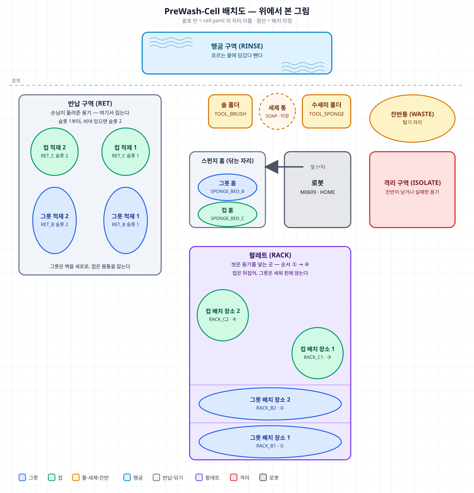
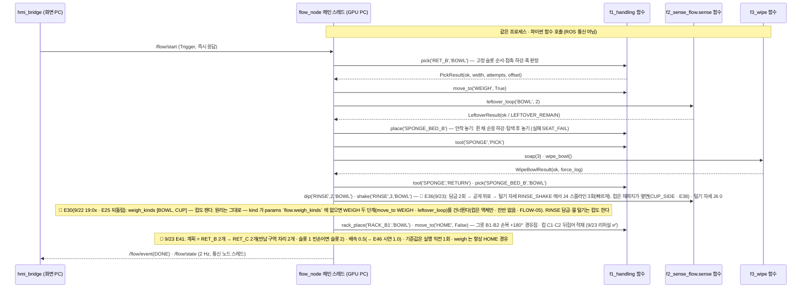
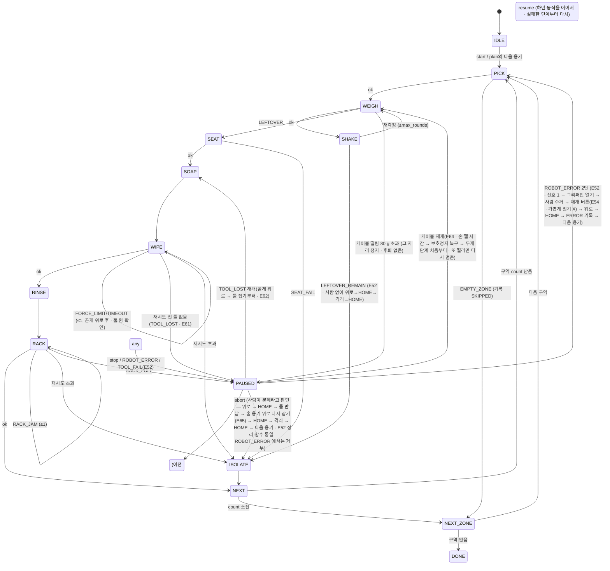

# 시스템 설계 문서 (SDD)
## PreWash-Cell — 다회용기 예비세척·식기세척기 팔레트 적재 자동화 셀

| 항목 | 내용 |
|---|---|
| 문서 ID | SDD-PREWASH-001 · **v3.2 제출판** (2026-09-29) — v3.0(9/18 스크립트형 구조 · [DSN-02b](meetings/20260918_결정기록_구조_인터페이스.md)) + 동결 뒤 반영: §3.1 공중 점검 5 N(E58) · §6 운영 화면 9/25~27(E57) · §7 예외 처리(E42~E55 · E60~E63) · 케이블 멈춤 바로 재개(E64) · 격리 한 곳·위에서 다시 잡기(E65) · 지정 좌표 하강 곧게(E44 · E50) · 시연 PC 2대(GPU PC · 화면 PC · Discovery Server — §1.1~1.2 · §10) · §14 향후 개선 |
| 상위 | [01_요구사항_BR-SR.md](01_요구사항_BR-SR.md) · [02_인터페이스_IRD.md](02_인터페이스_IRD.md) |
| 그림 | **[images/system_architecture_pc.html](images/system_architecture_pc.html)**(Archify 대화형 · 명세 `.archify.json` · 캡처 `.png`) |

이 문서는 요구사항을 "실제로 어떻게 만들 것인가"로 바꾼다. PC 배치, 노드·패키지, 통신, 워크셀 좌표, 상태 머신, 각 기능의 내부 절차, 오류 처리, 안전, 배포를 정한다. 강사 산출물(시스템 아키텍처·네트워크 구성도·동작 순서도·하드웨어 구성·인터페이스 정의서·노드 구조도·HMI 화면·예외/오류·위험요소/안전대책)은 §12 표에서 이 문서의 절로 연결한다.

---

## 1. 시스템 아키텍처 (PC 단위)


*그림 1. 시스템 아키텍처 — **GPU PC(로봇 제어)**: Fast DDS Discovery Server · 두산·그리퍼 드라이버(브링업) · `flow_node`(f1·f2·f3·`cobot_common`) · `records.csv` / **화면 PC**: `hmi_bridge` · 브라우저 · 기록 DB `prewash.db` / 두 PC 는 강의실 무선망에서 ROS 2 DDS(`/flow/*`)로, GPU PC 와 로봇 셀(컨트롤러 · RG2)은 유선으로 잇는다.*

대화형 그림: **[images/system_architecture_pc.html](images/system_architecture_pc.html)** — Archify 로 만든 대화형 HTML(브라우저에서 열기 · 확대 · 경로 추적 · "시연 실행 경로 / 로봇 명령 경로 / 설정·기록" 보기 전환). 위 PNG 는 그 화면 캡처. 원본 명세는 `images/system_architecture_pc.archify.json`(수정 뒤 `archify deliver` 로 다시 만든다).

그림 규칙(Archify 판): **초록 = 우리 프로그램·함수 모듈**(flow_node · hmi_bridge · f1/f2/f3 · cobot_common) · **주황 = ROS 2 DDS**(토픽·서비스) · **보라 = 기록**(records.csv · prewash.db) · **회색 = 드라이버·장비**(두산·그리퍼 드라이버 · 컨트롤러 · RG2) · **점선 상자 = PC 경계(GPU PC · 화면 PC)와 로봇 셀**. 굵은 초록 화살표가 시연 실행 경로(시작 → flow_node → 기능 함수), 회색이 로봇 명령 경로(cobot_common → 드라이버 → 장비), 점선이 상태·설정 흐름이다. 화살표 라벨은 실제 이름(`/flow/*` · `cc.*` · 서비스·포트)이다.

**구조 한 줄 요약(9/18 저녁 결정, [DSN-02b](meetings/20260918_결정기록_구조_인터페이스.md))**: `flow_node`가 **메인 프로그램**이다. f1·f2·f3는 노드가 아니라 **함수를 제공하는 파이썬 패키지**이고, `flow_node`의 메인 스레드가 그 함수를 차례로 부른다. 두산 API가 전제하는 "혼자 도는 스크립트" 방식 그대로다. ROS 통신은 flow ↔ HMI, 그리고 `cobot_common` ↔ 두산·그리퍼 드라이버뿐이다.

### 1.1 PC 배치 (시연: 2대 · 개발: 4대 각자)
| PC | 역할 | 실행하는 것 | 네트워크 |
|---|---|---|---|
| **GPU PC (로봇 제어)** (필수) | Discovery Server + 두산 드라이버 + 셀 프로그램 | Fast DDS **Discovery Server**(`fastdds discovery` · 시연 끝까지 켜 둔다) · `ws_dsr`: `m0609_rg2_bringup bringup.launch.py mode:=real host:=192.168.1.100 port:=12345 model:=m0609` → `dsr_controller2`(/dsr01) + 그리퍼 드라이버 · `rokey_pjt01_ws`: **`flow_node` 프로세스 1개**(안에서 f1·f2·f3·`cobot_common` 함수 실행 · `hmi:=true` 는 붙이지 않는다) · `records.csv`. 실기 로봇을 움직이는 PC 는 이것 하나뿐 | 컨트롤러와 유선 고정 192.168.1.60/24 · 강의실 무선망 172.18.0.101(= Discovery Server 주소 :11811) · `ROS_DOMAIN_ID=60` |
| **화면 PC** (권장) | 시스템 모니터 | `rokey_pjt01_ws`: `cobot_msgs` + `f4_hmi/hmi_bridge`(FastAPI + rclpy, :8000 · `hmi.host` 127.0.0.1 — 화면 PC 브라우저에서 `http://localhost:8000`) · 기록 DB `prewash.db`(SQLite) · 브라우저 · 웹 부품(`~/venvs/hmi` · 화면 빌드)은 화면 PC 에만. 브링업·flow 런치는 하지 않는다 | 강의실 무선망 172.18.0.x · 로봇에는 붙지 않는다 · `ROS_DOMAIN_ID=60` · Discovery Server 에 SUPER_CLIENT 로 붙는다 |
| 개발 PC 4대 | 각자 독립 개발 | 한석형: `sodvir` + `rig_f1.py` / 민범진: `sodvir` + `rig_f2.py`, mock으로 `flow_node` / 박진용: `sodvir` + `rig_f3.py` / 황인재: `fake_state_pub` + `hmi_bridge` + 브라우저(드라이버 불필요) | 각자 Virtual(127.0.0.1) |

로봇 동작을 GPU PC 한 프로세스에 두는 이유: 로봇 명령을 내는 곳이 하나여야 명령이 겹치지 않는다(TS-01 §7). HMI만 분리하면 화면을 따로 보여줄 수 있고 네트워크 구성도가 실제 내용이 된다. 두 PC 통신(V-09)이 안 되면 GPU PC 1대에서 전부 실행한다(`hmi:=true` · 기술적으로 동일). 'GPU PC' 는 로봇 제어 PC 의 이름일 뿐이고 셀 프로그램은 GPU 를 쓰지 않는다.

### 1.2 네트워크 구성도
```
[M0609 컨트롤러 192.168.1.100 :12345] ──유선── [스위치 192.168.1.0/24] ──유선── [GPU PC 유선 192.168.1.60]
[RG2 Compute Box 192.168.1.1 (설정 웹)]                                          [GPU PC 무선 172.18.0.101 · Discovery Server :11811]
                                                                                          │ 강의실 무선망 172.18.0.x
                                                                                          │ ROS 2 DDS · DOMAIN 60 · /flow/*
                                                                                 [화면 PC 무선 172.18.0.x] ── 브라우저 http://localhost:8000
```
GPU PC ↔ 컨트롤러는 두산 전용 TCP(DDS 아님 · 유선 고정 192.168.1.60/24). GPU PC ↔ 화면 PC 는 강의실 무선망에서 ROS 2 DDS 로 잇는다. 강의실 무선망은 ROS 2 기본 탐색(멀티캐스트)을 막으므로 **Fast DDS Discovery Server** 를 GPU PC 에 띄우고(172.18.0.101:11811), 두 PC 의 ROS 터미널이 모두 그 서버를 통해 서로를 찾는다 — `RMW_IMPLEMENTATION=rmw_fastrtps_cpp` · `ROS_DISCOVERY_SERVER=172.18.0.101:11811` · `ROS_SUPER_CLIENT=TRUE` · `ROS_DOMAIN_ID=60` · `ROS_AUTOMATIC_DISCOVERY_RANGE=SUBNET`(실행 순서는 §10). 손님용 무선망은 PC 끼리 ping 도 되지 않아 두 PC 모두 같은 강의실 무선망에 둔다. 무선이 끊기면 화면(일시 정지 버튼 포함)만 끊기고 로봇은 GPU PC 에서 계속 돈다 → 그때 멈추는 수단은 티치펜던트 E-Stop(§8).

### 1.3 통신 정의 (토픽·서비스·네트워크)
| 이름 | 타입 | 방향 | 구간 |
|---|---|---|---|
| `/flow/state` | `cobot_msgs/msg/FlowState` (2 Hz) | flow_node → hmi_bridge | GPU PC → 화면 PC (DDS · Discovery Server) |
| `/flow/event` | `cobot_msgs/msg/FlowEvent` | flow_node → hmi_bridge | GPU PC → 화면 PC (DDS · Discovery Server) |
| `/flow/weigh` | `cobot_msgs/msg/WeighLive` (무게를 재는 동안 표본마다 · E70) | flow_node → hmi_bridge | GPU PC → 화면 PC (DDS · Discovery Server) |
| ~~`/cell/force` · `/cell/gripping`~~ | — | — | ❌ **삭제(황인재 9/21 결정 E21)** — 발행한 적이 없고(HMI 가짜만), 힘제어는 몇 초뿐 · 컵은 파지 판정을 안 한다(E19). HMI 는 힘 그래프·파지 표시 대신 **셀 평면도에 로봇 위치·동작**을 그린다(새 인터페이스 없음) · IRD §6 |
| `/flow/start` `/flow/stop` `/flow/resume` `/flow/abort`(9/20 신설) | `std_srvs/srv/Trigger` | hmi_bridge → flow_node | 화면 PC → GPU PC (DDS · Discovery Server) |
| **기능 함수 13개** `f1.pick` `regrip_top`(E65) `place` `move_to` `tool` `rack_place` · `f2.weigh` `leftover_loop` `shake` `dip` · `f3.soap` `wipe_bowl` `wipe_cup` | **파이썬 함수 호출** (반환 타입 `cobot_api.*Result`) | flow_node 메인 스레드 → 기능 패키지 | GPU PC 같은 프로세스 (ROS 통신 아님) |
| `/dsr01/dsr_controller2/motion/move_joint` · `move_line` … | `dsr_msgs2/srv/MoveJoint` · `MoveLine` | cobot_common(DSR_ROBOT2) → dsr_controller2 | GPU PC 내부 |
| `/dsr01/dsr_controller2/force/task_compliance_ctrl` · `set_desired_force` · `release_force` · `get_workpiece_weight` | `dsr_msgs2/srv/…` | cobot_common → dsr_controller2 | GPU PC 내부 |
| `/onrobot/sendCommand` · `/onrobot_joint_states` | 그리퍼 드라이버의 srv (강사 배포 `onrobot_rg_control`). 현재 폭은 `/onrobot_joint_states`(JointState)의 `finger_joint` 관절각을 드라이버와 같은 식으로 폭(mm)으로 환산한다(§3.1 `grip`). `OnRobotRGInput` 토픽은 나오지 않는다(9/19 확인) | cobot_common ↔ 그리퍼 드라이버 (명령 / 현재 폭) | GPU PC 내부 |
| `/dsr01/joint_states` | `sensor_msgs/msg/JointState` | dsr_controller2 → 모니터링 | GPU PC |
| dsr_controller2 ↔ 컨트롤러 | 두산 전용 TCP, 포트 12345 | | GPU PC ↔ 컨트롤러 (유선) |
| 브라우저 ↔ hmi_bridge | HTTP `GET /` · `POST /api/start` · `/api/stop` · `/api/resume` · `/api/abort` · `GET /api/state` · `/api/history` · `/api/usage` · `/api/kpi` · `/api/db/{table}` · `POST /api/replace/{item}` · WS `/ws/state` (JSON · IRD §6) | | 화면 PC 내부(`hmi.host` 127.0.0.1 → `http://localhost:8000`) |
| hmi_bridge → prewash.db | SQLite 🔄 E57(9/27) 표 5개: `events`(용기 1줄 · 실행 번호 · 버린 잔반 g) · `runs` · `pauses`(원인 · 풀린 방법) · `commands` · `replacements`(소모품 교체) | | 화면 PC 내부 |

`/dsr01/*`·`/onrobot/*`의 정확한 이름·필드는 [두산 ROS 2 매뉴얼(jazzy)](https://doosanrobotics.github.io/doosan-robotics-ros-manual/jazzy/services/motion_services.html)과 설치본으로 확인한다. 우리 코드는 `cobot_common`을 통해서만 부르므로 이름이 달라도 한 곳만 고친다.

### 1.4 서브시스템 (패키지 8 · 노드 2)
| 패키지 | 종류 | 담당 | 소유 설정 | PC |
|---|---|---|---|---|
| `f2_sense_flow` | **노드 `flow_node`**(메인 프로그램: 통신 노드 + 순서 실행) + 함수 모듈 `sense.py` + `mock/` | 민범진(🔄 9/22 E33: 통합 기간 임시 주인 황인재) | `f2`·`flow` 절 | GPU PC |
| `f1_handling` | 함수 모듈 `handling.py` (노드 아님) + `test/rig_f1.py` | 한석형 | `config/cell.yaml`과 `params.yaml`의 `f1` 절 | GPU PC |
| `f3_wipe` | 함수 모듈 `wipe.py` (노드 아님) + `test/rig_f3.py` | 박진용 | `f3` 절 | GPU PC |
| `cobot_common` | 라이브러리: 두산 API를 감싼 공용 로봇 함수 + **초기화(`init`, §3.2)** + 설정 로더·`config/cell.yaml`·`params.yaml` | **네 사람 분담(9/19)**: 초기화·로더 황인재 · 이동·그리퍼 한석형 · `weigh` 민범진 · 힘 함수와 **패키지 정리·리뷰 박진용** · 좌표 값(`cell.yaml`)은 한석형 | 두 파일 | GPU PC |
| `cobot_api` | 라이브러리: **기능 함수의 약속**(ID·코드·반환 타입·함수 서명, IRD 정본). 로봇 코드 없음 | **황인재(PM)** | IRD | GPU PC · 화면 PC |
| `cobot_msgs` | 메시지 3개(`FlowState`·`FlowEvent`·`WeighLive`, IRD 정본) | **황인재(PM)** — `src/cobot_msgs/msg/`를 그대로 복사 | IRD | GPU PC · 화면 PC |
| `f4_hmi` | **노드 `hmi_bridge`** (+ `fake_state_pub` 개발용) | 황인재 | `hmi` 절 | 화면 PC |
| `prewash_bringup` | launch: `prewash.launch.py` · `prewash_mock.launch.py` | 황인재(PM) | — | GPU PC |

`ros2 node list`에는 우리 노드가 `flow_node`·`flow_node_dsr`·`hmi_bridge` 셋으로 보인다. `flow_node_dsr`는 `cobot_common.init()`이 자동으로 만드는 **두산 API 전용 보조 노드**다(서비스·토픽을 제공하지 않고 드라이버에 요청만 보낸다, §3.2).

### 1.5 설계 결정
| 결정 | 이유 |
|---|---|
| **스크립트형 실행 구조**: 기능은 함수, `flow_node` 메인 스레드가 차례로 호출 | 두산 API는 명령마다 자기가 실행기를 돌려 응답을 기다린다. 서비스 콜백 안에서 쓰면 교착하고, 우회해도 "두 번째 호출부터 멈춤"·"겹친 명령을 조용히 덮어씀" 같은 함정이 남는다([TS-01](troubleshooting/TS-01_두산API_초기화_실행기_교착.md)). 9/18 Virtual에서 구조 4종을 비교해 문제의 자리가 없는 이 구조를 골랐다 |
| 흐름 제어를 flow_node 하나로 집중 | 호출이 얽히면 통합이 불가. 기능 패키지는 함수 제공자로만, 서로 import하지 않는다 |
| 기능 단위 패키지 분할 + `cobot_api` 약속 | 4명 동시 개발. 각 기능을 단독 시험 스크립트(`rig_f*.py`)로 시험. 약속(이름·인자·반환·코드)이 파일로 있어 mock과 실제가 어긋나지 않는다 |
| 로봇 함수는 메인 스레드에서만 | 로봇은 하나. 명령을 내는 곳이 하나면 겹침이 구조상 불가능 |
| 정지는 "기능 함수 사이" + 비상정지는 E-Stop | 단순하고 안전. 동작 중 소프트 정지는 V-24(비동기 이동 + 폴링) 결과로 추가 |
| 종류 = 반납 구역, 위치는 탐색 | 비전 없이 종류 판별을 없애고, 위치·겹침은 **접촉 하강 + 파지 폭**으로 흡수 |
| 물리 인계 위치 고정 | F1이 놓은 자리에서 F3 시작 → 단독 시험은 손으로 놓기만 하면 됨 |
| 힘제어는 "힘 유지", 깊이 미사용 | 스펀지가 눌리므로 깊이 기준이 흔들림 |
| 안착 실패 탐색 = Move Periodic | 비전 없이 홈을 찾는 수단. 진폭·시간 한도로 안전 |
| Virtual + mock 2단 검증 | Virtual엔 힘·무게가 없어 mock이 흐름·HMI를, 실기가 임계값을 담당 |
| HMI = FastAPI 웹 + SQLite | 브라우저 어디서나, 화면 PC 로 분리 가능. SQLite는 파이썬 내장이라 설치 없음. MQTT는 ROS 토픽과 중복이라 안 씀 |
| PC 2대 | 로봇 동작은 GPU PC 한 대, 모니터만 화면 PC 로 분리. 강의실 무선망은 ROS 2 기본 탐색(멀티캐스트)을 막아 Fast DDS Discovery Server 로 서로 찾는다(§1.2). 실패 시 1대로 축소 |

---

## 2. 하드웨어·워크셀



| 스테이션 | 위치(확정 시 기입) | 좌표계 | 비고 |
|---|---|---|---|
| `RET_B` / `RET_C` 반납 구역 | 로봇 **왼쪽**(스펀지 홈 너머) — 그릇 슬롯 2·1 윗줄 · 컵 슬롯 2·1 아랫줄 · 슬롯 1 부터 집고 비면 슬롯 2(9/28 실제 배치 · `images/layout_workcell.png`) | UC1 `RETURN` | 기준점 1 + **고정 슬롯 2개의 오프셋**. 트레이에 슬롯 자리를 표시하고 용기는 겹치지 않게 하나씩 놓는다(9/19 결정) |
| `WEIGH` | 잔반통 상공 고정 자세 | base | 측정 자세 1개 |
| `WASTE` | 잔반통 — 로봇 오른쪽 위 | base | 털기 진폭 반경 확보 |
| `SPONGE_BED_B` / `_C` | 스펀지 고정틀 홈 — 로봇 **앞(+X)** 바로 옆(그릇 홈 · 컵 홈) | UC2 `BED` | 작업대 고정. 닦기 후 재파지 위치(고정) |
| `TOOL_SPONGE` / `TOOL_BRUSH` | 툴 홀더 — 반납 구역과 잔반통 사이 윗줄(솔 홀더 · 수세미 홀더) | UC2 | 손잡이 방향 고정 |
| `SOAP` / `RINSE` | 세제 = 툴 홀더 비눗물(E18 · 툴을 쥔 채 홀더 자리에서 비틀기·위아래 왕복) / **헹굼 구역 — 맨 위 경계 밖, 흐르는 물에 담갔다 뺀다(수조 아님)** | UC3 `TUB` | 시연은 물 없이 모션만(안전 규정) |
| `RACK_B1..2` / `RACK_C1..2` | 식기세척기용 팔레트 모형 — 로봇 **아래**쪽(컵 C2·C1 대각 · 그릇 B2 · B1 순 ①→④ · 그릇 2칸·컵 2칸 — 9/20 변경) | UC4 `RACK` | 기준점 1 + 오프셋(Pallet), 칸별 각도 |
| `ISOLATE` | 격리 구역 — 로봇 오른쪽(잔반통 아래) | joint | 🔄 E65(9/29): 그릇·컵 **한 자리**(같은 관절값) — 시작 전 비우고, 격리가 생기면 다음 격리 전에 사람이 치운다(§7) |
| `HOME` | 안전 자세 | joint | 모든 이동의 시작·끝 |

하드웨어 구성: M0609 + 컨트롤러 + RG2(Compute Box) + GPU PC(로봇 제어)·화면 PC + 스위치(GPU PC ↔ 컨트롤러 유선) + 강의실 무선망(두 PC 사이) + 워크셀 기구(반납 구역 트레이, 잔반통, 스펀지 고정틀, 툴 홀더 2(비눗물 컵 · E18 — 세제 수조 없음), 헹굼 구역, 팔레트 모형, 격리 구역). 용기 그릇 2·컵 2, 잔반 대용품(구슬·쌀).

---

## 3. 소프트웨어 구조
```
rokey_pjt01_ws/                ← 저장소 루트 (rokey_9_pjt1_D2)
├── docs/                      문서·메시지 정본·이미지·회의록·트러블슈팅
├── src/
│   ├── cobot_api/             contracts.py (ID·코드·반환 타입·함수 서명 — IRD 정본, PM)
│   ├── cobot_msgs/            msg/FlowState.msg · FlowEvent.msg · WeighLive.msg (IRD 정본, PM)
│   ├── cobot_common/          bootstrap.py (init — 두산 API 초기화·통신 노드, §3.2) · config.py (로더) · `__init__.py` (함수 재수출) [H] · motion.py (이동) [H] · gripper.py (그리퍼) [M] · weigh.py (무게) [M] · force.py (힘 함수) [P] · config/cell.yaml · config/params.yaml
│   ├── f1_handling/           handling.py (pick·regrip_top·place·move_to·tool·rack_place) · test/rig_f1.py
│   ├── f2_sense_flow/         sense.py (weigh·leftover_loop·shake·dip) · flow.py (상태 머신) · flow_node.py (메인 프로그램) · mock/mock_f1.py·mock_f2.py·mock_f3.py · logger.py · test/rig_f2.py
│   ├── f3_wipe/               wipe.py (soap·wipe_bowl·wipe_cup) · test/rig_f3.py
│   ├── f4_hmi/                hmi_bridge.py · app.py (FastAPI) · static/test.html(시험 페이지) · fake_state_pub.py · db.py (SQLite) · web/(운영 화면 Next.js)
│   └── prewash_bringup/       launch/prewash.launch.py · prewash_mock.launch.py
└── build/ install/ log/       (.gitignore)
```
두산 드라이버는 별도 워크스페이스 `~/ws_cobot_pjt/ws_dsr`(강사 배포, 수정 안 함)에 있고, 우리 워크스페이스(clone 위치 자유, `.bashrc`의 `PREWASH_WS`)가 그 위에 겹쳐진다(source 순서: ws_dsr → rokey_pjt01_ws). 상세는 [setup/M0609_환경설정.md](setup/M0609_환경설정.md).

### 3.1 `cobot_common` 공용 로봇 함수 (9/19 오후 분담 — **사람별 파일**: `bootstrap.py`·`config.py`·`__init__.py`·`motion.py` 황인재 / `gripper.py`·`weigh.py` 민범진 / `force.py` + 패키지 정리·리뷰 박진용. 좌표 값은 한석형의 `cell.yaml`. 부르는 쪽은 그대로 `cc.함수()`. 🟡 표시는 DSN-03에서 확인)
| 함수 | [담당] 내용 (H 황인재 · S 한석형 · M 민범진 · P 박진용) |
|---|---|
| **`init(name, robot=True)`** | [H] 프로그램 **맨 앞에서 한 번**(§3.2). ① DSR 전용 노드(`<name>_dsr`, ns `dsr01`)를 만들어 `DR_init.__dsr__node`에 넣은 **뒤에** `DSR_ROBOT2`를 import ② 통신 노드(`<name>`)를 만들어 **백그라운드 실행기 스레드**로 돌림(그리퍼 폭 구독·그리퍼 명령 클라이언트 포함) ③ 설정 로드. `robot=False`면 ①을 건너뛴다(전부 mock일 때 드라이버 없이 실행) |
| `cfg()` | [H] `init`이 읽어 둔 설정(`config.load()` 결과: `cfg['cell']`, `cfg['f3']` …)을 돌려준다 |
| `io_node()` | [H] 통신 노드를 돌려준다. flow가 여기에 `/flow/*` 서비스·발행기·타이머를 단다 |
| `bootstrap.dsr()` · `setup_io(node)` | [H] **`cobot_common` 안에서만 쓰는 약속**. 사람별 파일은 함수 **안에서** `from .bootstrap import dsr` → `dsr().movej(...)`로 두산 API를 얻는다(`init()` 전이거나 메인 스레드 밖이면 `RuntimeError` — §3.2 규칙 ②를 코드로 강제). 통신 노드에 구독·클라이언트가 필요하면 자기 파일에 `setup_io(node)`를 만든다 — `init()`이 실행기를 돌리기 전에 한 번 불러 준다(콜백은 값 저장만). 새 함수는 자기 파일의 `__all__`에 이름을 넣으면 `cc.함수()`로 보인다(`__init__.py`는 고치지 않는다). 기능 패키지(f1·f2·f3)는 `dsr()`를 쓰지 않는다 |
| `shutdown()` | [H] 동작 정지 명령(**최선 시도**) → 실행기 종료 → `rclpy.shutdown()`. 설치된 `DSR_ROBOT2.py`에는 정지 함수가 없어(`stop`·`move_stop` 없음, 9/19 확인) `motion/move_stop` 서비스(`dsr_msgs2/srv/MoveStop`)를 직접 부른다. **Virtual에서는 모션 중에도 먹는 것을 확인**(9/19 INF-02a: 모션 중 Ctrl+C → 0.08 s에 중단, `move_stop` 0.16 s, 브링업 재시작 없이 재실행 정상). 실기 확인은 V-24. 응답이 없으면 "브링업 재시작 필요"를 로그로 남긴다. 정지 방식은 `DR_QSTOP`(Stop Category 2) — 🟡 안전 담당(박진용) 확인, DSN-03 |
| Ctrl+C(SIGINT) | [H] **`init()`이 단독으로 맡는다.** rclpy의 기본 SIGINT 처리기는 Ctrl+C 때 컨텍스트를 먼저 닫아 버려 `finally`의 정지 명령을 보낼 수 없으므로, `init()`이 그 처리기를 끈다. `flow_node`·`rig_f*.py`는 **`try/finally: cc.shutdown()`만** 쓰고 `signal.signal`을 따로 걸지 않는다 |
| `move_to(station, carrying, kind=None, point=None) → 남은 높이 mm` | [H] station 의 티칭 자세로 **곧장** 간다(✅ **9/20 결정 E7 — 안전 높이 경유 삭제**: 한석형 요청 · 황인재 승인. 팔레트 적재처럼 그리퍼를 눕혀 들어가는 자세는 안전 높이에서 자세가 안 나왔다). **자세 고르기**: `kind` = `'BOWL'`·`'CUP'` — 종류별 자리(WEIGH·WASTE·SOAP·RINSE·ISOLATE) / `point` = 한 자리에 자세가 여러 개일 때(툴 홀더 `'pick'`·`'return'` · 스펀지 홈 `'place'`·`'regrip'`·`'wash'` · 반납 구역은 **번호 1부터** — 9/20 E9 로 구역마다 1개). 골라야 하는데 안 주거나 틀리면 **움직이지 않고 ValueError**, 안 찍은 자세는 KeyError. **경로**: posj 면 관절 이동, posx 면 직선 이동 — 지금 자세에서 목표로 바로. 접근점(`approach_posx`)이 있으면 **접근점까지만** 가고 **끝점까지 남은 높이(접근점 z − 끝점 z)를 돌려준다**(접근점이 없으면 끝점까지 가고 0.0). 내려가는 것은 부르는 쪽이 `move_rel(0, 0, -up, 'BASE')`(자유 공간) 또는 `contact_down`(접촉)으로. 🚨 **경로의 안전은 자세를 부르는 순서(F1·flow)와 티칭(접근점)이 책임진다** — 실기에서 흐름 순서대로 구간마다 확인한다(V-22). 🚨 **도착 확인 `MoveIncomplete`**: 이동이 끝났는데 목표에서 2 mm(관절은 1°) 넘게 떨어져 있으면 올린다 — 받은 쪽은 **힘·순응만 끄고 움직이지 않는다**(§7) — 컨트롤러가 이동을 도중에 세워도(속도·관절 한계의 안전 정지, 특이점) 비동기 이동은 '끝남'으로만 보이기 때문(9/20 Virtual: HOME → RACK_C1 이 122 mm 앞에서 섬). 이 오류 뒤에는 **로봇이 어디 있는지 모른다** → 기능 함수는 잡지 말고 위로, flow 는 `ROBOT_ERROR`(그 자리 정지 → PAUSED, 이어 내려가거나 재시도하지 않는다). `move_rel`·`move_joint_rel` 에는 걸지 않는다(힘제어 중에는 일부러 덜 간다). 이름은 `cell.stations`·`cell.beds`·`cell.zones`(`RET_*`)·`cell.rack.slots`(`RACK_*`)를 받는다(좌표는 전부 **BASE 절대 자세**). carrying이면 느린 속도. 속도 = `cell.motion.*_max_*`(100 % 기준) × `cell.limits.vel_*_pct` × `cfg()['run']['vel_scale']`. 값이 비어 있으면 **움직이지 않고 KeyError**. `cell.limits.safe_z_mm` 은 이동에 쓰지 않는다 — **접촉 동작 뒤 후퇴 높이**(`safe_retreat`)로만 남았다(✅ 황인재 확인 9/20 17:10) |
| `move_rel(dx, dy, dz, frame, *, vel_mm_s=None, acc_mm_s2=None)` | [H] 상대 이동(슬롯 간 이동·하강·접촉 하강의 한 단계·후퇴), 자세(방향)는 그대로. `frame`은 `'BASE'`·`'TOOL'`. 속도 선택 인자는 [이슈 #7](https://github.com/hwang-injae/rokey_9_pjt1_D2/issues/7) 요청(✅ 9/19 PM 수락) — 없으면 `vel_carry_pct`(느린 쪽), 주면 그 값(`vel_scale`은 부르는 쪽이 곱한다)을 쓰되 100 % 기준 × `vel_scale`을 넘지 못한다. 접촉 하강은 아주 느리게 줘야 한다. 회전을 포함한 상대 이동은 두지 않았다 — 컵 닦기의 툴 축 회전은 `move_periodic`(§5.4), 팔레트 칸의 기울임은 칸마다 티칭한 자세(§4.3 `rack`)로 해결 |
| `move_joint_rel(joint, delta_deg, *, time_s=None, carrying=True)` | [H] 관절 하나(1~6)만 지금 각도에서 상대 이동 — 털기·물 털기의 J5/J6 왕복(민범진 요청 B11). `time_s`를 주면 그 시간에 맞춘다(`vel_scale` < 1이면 그만큼 늘어난다, 실측: 요청보다 약 0.13 s 길다). 🚨 순응·힘제어가 켜져 있으면 안 된다 → `force_off()` 뒤에. **평균 속도(\|delta_deg\| / 시간)가 `cell.motion.vel_joint_max_deg_s` × `vel_scale`을 넘으면 시간을 늘리고 경고**한다 — 순간 최고 속도는 평균보다 높으므로 기준값은 여유 있게 |
| `pause()` · `resume()` · `is_paused()` / `halt()` · `clear_halt()` · `is_halted()` · 예외 `MotionHalted` · `MoveTimeout` · `MoveIncomplete`(도착 확인 — 위 move_to 행) | [H] **이동 도중 즉시 일시 정지·재개·강제정지**(V-24). 세 이동 함수는 속이 **비동기 이동(`amovej`/`amovel`) + `check_motion` 0.05 s 폴링**이다 — 부르는 쪽에서는 달라진 것이 없다(이동이 끝나야 돌아온다, 일시 정지 중에는 재개를 기다린다). `pause()·resume()·halt()`는 **깃발만** 세우므로 통신 노드 콜백에서 불러도 된다(실제 `move_pause`·`move_resume`·`move_stop` 요청은 메인 스레드의 폴링 루프가 보낸다). 일시 정지 = 그 자리에서 멈춤 → 재개하면 **같은 이동을 이어서**. 강제정지 = 하던 이동은 `MotionHalted`로 끝나고, `clear_halt()` 전까지 새 이동도 `MotionHalted`(정지 뒤 다음 명령이 다시 움직이게 하는 것을 막는다). 이동 1번이 `cell.motion.move_timeout_s`(일시 정지 시간 제외)를 넘으면 정지 명령 + `MoveTimeout`. 기능 함수는 두 예외를 **잡지 말고 위로 올린다**. 🚨 먹는 범위: 이동 함수를 거치는 모든 이동 — 접촉 하강·닦기의 걸음(`move_rel`)도 걸음 도중에 멈춘다(순응·힘제어는 켜진 채). 먹지 않는 것: `move_periodic`(안착 탐색)·그리퍼·무게 대기 — 그 동작이 끝난 뒤 다음 이동에서 멈춘다. 가상 rig_pause 10/10 · 실기 V-24 빈손 통과(9/22 21:49) · 툴을 든 채 정지 → 재개 ✅ · 용기를 든 채 정지 → 중단 ✅(9/29 실기) |
| `grip(width, force) → width` | [M] RG2 파지(목표 폭·힘) + 완료 대기 + 폭 피드백. 강사 배포 `onrobot_rg_control`은 명령을 서비스(`/onrobot/sendCommand`)로 받는다. 현재 폭: 드라이버(`OnRobotRGControllerServer`)는 `OnRobotRGInput`을 **발행하지 않는다**(9/19 소스 확인: 나가는 것은 `/joint_states`→`/onrobot_joint_states` remap의 `JointState`뿐, 서비스는 `/onrobot/sendCommand`·`/onrobot/pose`·`/onrobot/restartPower`) → `/onrobot_joint_states`의 `finger_joint` 관절각을 드라이버와 같은 식으로 폭(mm)으로 되돌린다(드라이버가 장치의 0.1 mm 단위 폭을 관절각으로 바꿔 내보내므로 장치가 읽은 폭과 같다) · 힘은 절대값을 못 줘서 2.5 N 계단(`'i'`/`'d'`)으로 맞추고 처음에 0 N으로 기준을 잡는다 · 완료는 `effort`(busy)로 판정. 구독은 `gripper.py`의 `setup_io(node)`가 통신 노드에 달아 값을 저장하고, `grip`은 그 값을 읽는다 |
| `grip_level(kind, level)` | [M] 파지 힘 2단계 전환: `NORMAL`(집기·이송) ↔ `HOLD`(털기·담금·물 털기, 더 꽉). 같은 폭 목표로 힘만 바꿔 다시 파지, 전환 후 폭 재확인(방법은 V-23) |
| `release()` | [M] 그리퍼 열기 |
| `grip_width() → mm` | [M] 현재 폭 읽기(박진용 F3 요청 — 닦는 중 툴이 밀렸는지 감시, ✅ 9/19 PM 결정). 경로: **강사 드라이버의 관절각 → 폭 환산이 먼저**(V-05에서 오차 ≤ 2 mm 확인 — 🚨 그릇 벽 파지가 ≈ 2 mm라 **닫힌 쪽(0~5 mm)에서는 반복 흔들림이 그릇 ↔ 빈손 간격의 절반 이하**여야 한다, V-01과 같이 확인), 안 되면 Compute Box XML-RPC를 읽기부터(박진용 제안서 · git 이력). 그리퍼 함수는 새 파일 `gripper.py` |
| `weigh(n, reset=False) → g` | [M] 정지 → `get_workpiece_weight` n회의 **중앙값**(튄 값에 끌려가지 않게 — V-02 폭 40.8 g) · 실패값(음수 -1)은 버리고, 전부 실패면 예외(기능 함수가 `ROBOT_ERROR`로 변환). `reset`(0점 재설정)은 **선택 동작**: 응답 상한 3 s, 실패하면 다시 부르지 않고 계속 진행([TS-03](troubleshooting/TS-03_하중_reset_제어권_교착.md)) |
| `force_on(axis, target, limit)` / `force_off()` | [P] 순응 ON(`cell.force.compliance_stx`) → 목표 힘 ON(−axis 방향, **절대값** `DR_FC_MOD_ABS` — 보통 `contact_down`으로 닿은 뒤 켠다). target < limit ≤ `cell.force.force_max_n` 검사. 끄는 순서는 힘 → 순응. 닦는 동안의 상한 감시는 `wipe.py` 가 `read_force()` 로 직접 읽어 본다(`_Log.watch`). 🔄 9/23: 예전의 `force_check(axis, baseline)` 는 아무도 안 불러 삭제 |
| `force_reached(axis, min, max) → bool` | [P] `check_force_condition(...) == 0`을 감싼 것. 🚨 실제 두산 함수는 **만족 `0` / 아니면 `-1`**을 돌려준다(DRL 매뉴얼의 True/False와 다름). `if check_force_condition():`으로 쓰면 판정이 뒤집힌다(TS-01 D) |
| `read_force() → [fx, fy, fz, mx, my, mz]` · 예외 `ForceLimitError` · `MotionTimeout` | [P] 이슈 #7 요청(✅ 9/19 PM 수락). 힘 로그·상한 판정용 원시 힘 값(`/cell/force` 발행은 E21 로 삭제). **공용 힘 함수는 실패를 예외로 알리고, 기능 함수(f1·f3)가 받아서 `FORCE_LIMIT`·`TIMEOUT` 코드로 바꾼다**(flow까지 새어 나오면 `ROBOT_ERROR`). 힘 함수가 읽는 공용 값은 `cell.yaml`의 `cell.force` 절(순응 강성·접촉 하강 단계·속도·후퇴 속도·절대 상한 `force_max_n` 등 8개 키 — 골격은 황인재, 값은 박진용이 그 절만 PR) |
| `contact_down(max_depth, limit) → depth, force` | [P] **순응 ON 상태로 `contact_step_mm`씩 내려가며** **내려가기 직전보다 Z 힘이 limit만큼 커지거나**(접촉) max_depth에 이를 때까지(슬롯 파지·안착·삽입 공용 — 이전 설명 "amovel + stop" 대신 단계 하강). 🚨 절대 힘이 아니라 **시작 대비 변화량**으로 본다: 툴·용기를 쥐면 공중에서도 Fz가 2 N쯤 나와 절대값으로는 내려가기도 전에 "접촉"이 된다(9/20 실기). 돌려주는 `force`도 변화량. `depth < max_depth`면 접촉. 힘이 `force_max_n`을 넘으면 `ForceLimitError`, `cell.limits.timeout_s`를 넘으면 `MotionTimeout`, 끝나면 항상 순응 해제. 하강 속도 = `contact_vel_mm_s` × `vel_scale` |
| `periodic_search(amp, period, duration)` | [P] Move Periodic으로 TOOL X·Y 왕복 탐색(Y 주기 = X 주기 × `search_y_period_ratio`), `duration`이 시간 한도, `vel_scale` < 1이면 주기를 늘린다. 🟡 동기 호출이라 도는 동안 힘을 보지 않는다 — V-04 전에 구간 나누기 또는 비동기 + 폴링으로 정한다 |
| `safe_retreat()` | [P] 켜져 있는 힘·순응을 끄고 → X·Y는 그대로 Z만 `cell.limits.safe_z_mm`까지 올린다(이미 위면 안 움직임). 🚨 두산 `DR_Error`가 난 프로세스에서는 `rclpy.shutdown()`이 불려 더 이상 명령이 안 나간다 → 그때는 새 프로세스의 복구 도구 `src/cobot_common/test/release_force.py`([TS-05](troubleshooting/TS-05_DR_Error_rclpy_shutdown_복구.md)) |
| `compliance_on(stx=None)` · `compliance_off()` · `force_release()` · `where()` · `motion_done()` · `move_spiral(rev, rmax_mm, time_s)` · `move_arc(mid, end, vel_mm_s, vel_deg_s, radius_mm)` · `move_periodic(amp, period, repeat)` | [P] **닦기 접촉 모션** — 순응·힘제어를 켠 채 도는 동작이라 힘 함수와 같이 둔다(f3 는 `cc.*` 만 부른다 — 두산 호출은 cobot_common 과 preflight 문지기에만). `compliance_on` = 순응만 ON(힘 방향과 같은 축으로 움직이는 나선 구간용) · `force_release` = 힘제어만 OFF(순응 유지) · `move_spiral`·`move_periodic` 은 **비동기로 시작**하고 부르는 쪽이 `motion_done()` 으로 기다리며 힘을 본다. 🚨 `move_spiral` 은 **속도로 부르면 드라이버가 통째로 멈춘다**(브링업 재시작) → `vel·acc 0 + time` 으로만. 반경 대비 회전 수가 많으면 **시작조차 하지 않는다**(반경 14 mm 에 7바퀴·1.5 s 는 안 돌고 2.8바퀴·3 s 는 돈다) → `where()` 로 확인. 🚨 `move_periodic` 은 진폭을 준 축에 **주기도 함께** 줘야 한다(두산 2.1218). 🚨 이 셋에는 **일시정지 폴링이 없다** → 구간이 끝난 뒤 다음 이동에서 먹는다 |

### 3.2 실행 뼈대 규약 (9/18 [TS-01](troubleshooting/TS-01_두산API_초기화_실행기_교착.md) → [DSN-02b](meetings/20260918_결정기록_구조_인터페이스.md))
두산 API(`DSR_ROBOT2`)는 **혼자 위에서 아래로 도는 스크립트**를 전제로 만들어졌다. 로봇 명령마다 자기가 실행기를 돌려 응답을 기다리므로, 서비스 콜백 안에서 부르면 교착한다. 그래서 우리는 로봇을 움직이는 코드를 **전부 메인 스레드에서 차례로** 실행한다.

```
flow_node 프로세스 (GPU PC)
├─ 메인 스레드      : flow 순서 실행 → f1.pick() → f2.leftover_loop() → … (두산 함수는 여기서만)
├─ 통신 노드 스레드 : /flow/start·stop·resume 서비스, /flow/state 2 Hz 타이머, 그리퍼 폭 구독
│                     (콜백은 값 저장·깃발 세우기만. 로봇 함수 호출 금지)
└─ DSR 전용 노드    : 두산 API가 필요할 때만 잠깐 실행기에 넣었다 뺀다 (우리는 건드리지 않음)
```

**기능 함수 모듈** (f1·f2·f3 공통) — 노드도 클래스도 필요 없다. 평범한 함수다.
```python
# src/f3_wipe/f3_wipe/wipe.py
import cobot_common as cc                     # 🚨 DSR_ROBOT2 를 직접 import 하지 않는다
from cobot_api import WipeBowlResult, FORCE_LIMIT, TIMEOUT

def wipe_bowl() -> WipeBowlResult:            # 이름·인자·반환은 cobot_api 의 약속 그대로
    p = cc.cfg()['f3']['wipe_bowl']           # 숫자는 YAML 에서
    ...
    if over_limit:
        cc.safe_retreat()
        return WipeBowlResult.fail(FORCE_LIMIT)   # 실패는 예외가 아니라 code
    return WipeBowlResult(force_log_path=path, duration_s=t, force_mean_n=f)
```

**단독 시험 스크립트** — 각자 자기 함수만 직접 부른다.
```python
# src/f3_wipe/test/rig_f3.py
import cobot_common as cc
from f3_wipe import wipe

def main():
    cc.init('rig_f3')                          # ① 맨 앞에서 한 번
    try:
        for i in range(3):                     # ② 연속 3회 이상
            print(i + 1, wipe.wipe_bowl())
    finally:
        cc.shutdown()                          # ③ 끝낼 때 (Ctrl+C 포함)
```

**메인 프로그램** `flow_node.py`(민범진)는 `cc.init('flow_node')` → `cc.io_node()`에 서비스·발행기·타이머 등록 → 메인 스레드에서 `start` 깃발을 기다렸다가 순서 실행(§5.1).

| 규칙 | 이유 |
|---|---|
| ① `cobot_common.init()`을 프로그램 맨 앞에서 한 번 | 두산 API는 import되는 순간 노드를 읽어 고정한다. 모듈 맨 위에서 `from DSR_ROBOT2 import …`를 쓰지 않는다(`cobot_common` 내부도 `init` 안에서 import) |
| ② 두산 함수(=`cobot_common`의 로봇 함수)는 **메인 스레드에서만** | 두산 API가 전역 실행기를 직접 돌린다. 콜백·타이머·다른 스레드에서 부르면 교착하거나 명령이 겹친다 |
| ③ 통신 노드의 콜백은 **값 저장·깃발 세우기만** | 콜백에서 로봇을 움직이면 TS-01 B가 그대로 되살아난다 |
| ④ 기능 함수 안에서 노드를 만들거나 `rclpy.spin*`·`rclpy.init`을 부르지 않는다 | 실행기는 `init()`이 만든 것 하나뿐이어야 한다 |
| ⑤ 기능 패키지는 `DSR_ROBOT2`를 직접 import하지 않는다 | 초기화 순서·반환값 함정(TS-01 A·D)을 `cobot_common` 한 곳에서만 다룬다 |
| ⑥ 실패는 `Result.fail(code)`로 돌려주고, flow는 모든 기능 함수 호출을 **예외 보호**로 감싼다 | 프로세스가 하나라 함수 하나의 예외가 셀 전체를 멈춘다. flow가 `ROBOT_ERROR`로 바꾸고 안전 자세로 보낸다 |
| ⑦ 끝낼 때 `cobot_common.shutdown()`(Ctrl+C 포함) | 움직이는 중에 그냥 죽이면 드라이버가 그 요청에 갇혀 브링업부터 다시 해야 한다 |
| ⑧ 시험은 같은 함수를 **연속 3회 이상** | "첫 번째만 되는" 결함은 한 번 호출로는 보이지 않는다(TS-01 B′) |

이 뼈대는 9/18 저녁 Virtual의 실제 드라이버에서 확인했다(연속 6회 성공, 모션 중 상태 2.000 Hz, 모션 중 stop 수락 — `docs/troubleshooting/ts01_repro/virtual/s4_script.py`). 팀 코드로의 재확인은 V-20.

---

## 4. 데이터 흐름

### 4.1 동작 순서도 (그릇 1개)


### 4.2 데이터 사전
- 기능 함수·메시지: IRD §3~7 (정본 `src/cobot_api/cobot_api/contracts.py` · `src/cobot_msgs/msg/*.msg`)
- `records.csv`(GPU PC) 열: `ts, kind, zone_id, attempts, rack_slot, weight_before_g, weight_after_g, leftover_rounds, seat_offset_mm, wipe_duration_s, force_log_path, result, code, duration_s`
- 기록 DB `prewash.db`(화면 PC, SQLite · **워크스페이스 루트 `<ws>/prewash.db`** · 어디서 켜도 같은 파일): 🔄 E57(9/27 · F4-04) 표 5개 — `events`(용기 1줄 · 실행 번호 · 버린 잔반 g) · `runs` · `pauses`(원인 · 풀린 방법) · `commands` · `replacements`. 소모품 사용량 = 마지막 교체 뒤 events. CLI `ros2 run f4_hmi hmi_db tables|dump|usage|kpi|replace|export`(export = CSV 5개) · GUI `sqlitebrowser prewash.db`
- 힘 로그 `force_YYYYMMDD_HHMMSS.csv`: `t, fx, fy, fz, target`

### 4.3 설정 파일 스키마 — `config/cell.yaml`(공용) + `config/params.yaml`(기능별 절)
설정 파일은 **2개**다(9/18 최종 결정). **`cell.yaml`**은 여러 기능이 같이 쓰는 값(좌표·속도·힘 상한·프리셋)을 한 곳에만 두고 한석형 혼자 고친다. **`params.yaml`**은 기능별 절(`f1 f2 f3 flow hmi`)을 한 파일에 모아 한눈에 보고, 각자 자기 절만 고친다(절이 떨어져 있어 git이 자동으로 합친다). 로더 `cobot_common/config.py`의 `load()`가 두 파일을 읽어 하나의 설정으로 합치므로 코드에서는 `cfg['cell']['beds']['SPONGE_BED_B']`, `cfg['f3']['wipe_bowl']`처럼 쓴다(경로는 패키지 share 상대경로, 환경변수 `PREWASH_CONFIG_DIR`로 대체 가능).
```yaml
# src/cobot_common/config/ — 파일 2개. cobot_common.config.load() 가 둘을 읽어 하나의 dict(cfg['cell'], cfg['f3'] …)로 합친다.
# ===== cell.yaml (공용 · 주인 한석형 혼자) =====
cell:                                   # 여러 기능이 같이 쓰는 값. 여기 한 곳에만 둔다
  limits: {vel_free_pct: 60, vel_carry_pct: 30, safe_z_mm: 235, contact_limit_n: 2.0, insert_limit_n: 15, timeout_s: 10}
  motion: {vel_tcp_max_mm_s: 400, acc_tcp_max_mm_s2: 800, vel_joint_max_deg_s: 100, acc_joint_max_deg_s2: 200, move_timeout_s: 30}   # 100 % 기준 속도 = **우리 셀에서 허용하는 최대**(로봇 사양 최대 아님). 실제 속도 = 기준 × limits.vel_*_pct/100 × vel_scale. 예시는 Virtual 시험 값, 실제 값은 한석형
  presets:                              # 종류·툴별 파지
    BOWL:   {grip_width_mm: 2.0, grip_zero_mm: ~10.7, grip_force_n: 20, hold_force_n: 35, width_tol_mm: 0.8, approach_z_mm: 40}   # 옆면(벽) 세로 파지 — 폭 ≈ 2 mm(9/19 확인), tol 은 V-01 에서 · hold = 털기·헹굼용 강한 파지
    CUP:    {grip_width_mm: 75.0, grip_zero_mm: ~10.7, grip_force_n: 15, hold_force_n: 30, width_tol_mm: 3.0, approach_z_mm: 40}  # 몸통을 통째로 파지(지름 방향, 9/18 V-17 확인) — 벽을 집는 그릇(≈ 2 mm)과 다르다
    SPONGE: {grip_width_mm: 30.0, grip_zero_mm: ~10.7, grip_force_n: 30, width_tol_mm: 2.0}
    BRUSH:  {grip_width_mm: 22.0, grip_zero_mm: ~10.7, grip_force_n: 30, width_tol_mm: 2.0}
    # 🆕 grip_zero_mm (9/21 결정 E16 · D-A ㉠) = **빈손으로 꽉 닫았을 때 읽히는 폭**. 0 이 아니다 — 드라이버가 알루미늄 손가락 사이를
    #   재서 고무 핑거팁 두께가 빠지지 않는다(민범진 9/21 실측 10.5~10.9 mm). 값은 V-01 에서 종류별 파지 힘으로 재서 넣는다
  # ── 자세 적는 법(9/20 CELL-04 · 결정 E4) — 정본은 cell.yaml 의 stations 위 설명. 좌표는 전부 BASE 절대 자세 ──
  #   자세 1개 = {posj: [...]} 또는 {posx: [...]} 또는 {approach_posx: [...], posx: [...]}  (접근점 = 끝점 바로 위·같은 방향, test_config 가 검사)
  stations:
    HOME: {posj: [...]}
    WEIGH: {BOWL: {posx: [...]}, CUP: {posx: [...]}}          # 종류별 → cc.move_to('WEIGH', True, 'BOWL').  WASTE·SOAP·RINSE·ISOLATE 도 같다
    TOOL_SPONGE: {pick: {posj: [...]}, return: {posx: [...]}}  # 용도별 → cc.move_to('TOOL_SPONGE', False, point='pick').  TOOL_BRUSH 도 같다
  zones:                                # 반납 구역 — 고정 슬롯(9/19 결정). 슬롯마다 집는 자세 → cc.move_to('RET_B', False, point=1)
    RET_B: {slots: [{approach_posx: [...], posx: [...]}, {approach_posx: [...], posx: [...]}]}   # 🔄 E41: 구역마다 고정 슬롯 2개(접근 자세 + 그립 자세) — 슬롯 1 부터, 비면 슬롯 2
    RET_C: {slots: [{approach_posx: [...], posx: [...]}, {approach_posx: [...], posx: [...]}]}   #   (E9 "내리막 공급 · 집는 자리 1개" 를 대체)
  beds:                                 # 스펀지 홈 — place 놓는 자리 · regrip 다시 잡는 자리(컵) · wash 닦기 시작하는 자리(끝점 z = **닦는 높이**, 결정 E6)
    SPONGE_BED_B: {place: {approach_posx: [...], posx: [...]}, wash: {approach_posx: [...], posx: [...]},
                   seat: {contact_limit_n: 15, search_amp_mm: 3, search_period_s: 0.8, search_max_s: 6}}
    SPONGE_BED_C: {place: {...}, regrip: {posj: [...]}, wash: {...}, seat: {...}}
  rack:                                 # 식기세척기 팔레트 — 칸마다 절대 자세 · 컵 칸 4 → 2 (황인재 9/20)
    via: {posx: [...]}                  # 🆕 9/21 E15: 칸으로 가기 **전에 반드시 거치는 자세**(HOME 의 x·y·방향 그대로 z 만 338).
                                        #   곧장 가면 올라가며 손목(J4)이 휘둘려 몸통에 부딪힌다(황인재 실기 2회 실패). f1.rack_place 가 쓴다
    slots:
      RACK_B1: {posx: [...], exit_rel_mm: [[0, -25, 0], [0, 0, 100]]}   # 🆕 9/21 E15: 꽂고 놓은 뒤 **이 순서대로** 빠져나온다(BASE 상대 이동).
      RACK_B2: {posx: [...], exit_rel_mm: [[0, -25, 0], [0, 0, 100]]}   #   곧장 HOME 으로 가면 그리퍼가 팔레트에 걸린다(황인재 9/21 실기)
      RACK_C1: {approach_posx: [...], posx: [...]}                      #   컵 칸은 접근점으로 수직 복귀하므로 exit_rel_mm 이 없다
      RACK_C2: {approach_posx: [...], posx: [...]}
# ===== params.yaml (기능별 절 · 자기 절만 수정) =====
f1: {insert_approach_mm: 30, tool_return_contact_n: 8}            # ── f1 절 (한석형) ──
f2:                                                                 # ── f2 절 (민범진) ──
  empty_weight_g: {BOWL: 180, CUP: 120}
  leftover_threshold_g: 50
  weigh_samples: 5
  shake: {WASTE: {amp_deg: 15, cycles: 4, period_s: 0.6}, RINSE: {amp_deg: 10, cycles: 3, period_s: 0.5}}
  dip: {RINSE: {depth_mm: 60, hold_s: 1.0}}
f3:                                                                 # ── f3 절 (박진용) ──
  soap: {depth_mm: 40, hold_s: 0.5, vel_mm_s: 80}
  wipe_bowl: {tool: {clean_h_mm: 35, d_mm: 90}, fast_down_mm: 140, find_max_mm: 40, target_force_n: 1.5, limit_n: 10.0, lateral_max_n: 25.0,
              bowl_inner_d_mm: 110, wall_press_mm: 4, spiral_pitch_mm: 5, spiral_time_s: 3, turns: 3, wall_arc_deg: 90, twist_deg: 18, …}   # 9/20 E13 · 9/21 E17(HOME 에서 fast_down_mm 만큼 빠르게 — 끝점 기준 find_gap_mm 은 없앴다). 전체 키는 params.yaml 주석
  wipe_cup:  {tool: {clean_h_mm: 95, d_mm: 55}, over_cup_up_mm: 40, over_cup_dy_mm: 140, fast_down_mm: 120, find_max_mm: 40, find_limit_n: 5.0,
              lift_mm: 3, stroke_mm: 15, spin_deg: 180, period_s: 3.0, cycles: 5, ramp_s: 1.5, rot_vel_limit_deg_s: 225, joint_guard_deg: 1.0, j6_limit_deg: 360, j6_margin_deg: 10}
              # ✅ 9/21 V-10 실기 확정 — 세척 속도는 vel_scale 예외(E17). spin_deg 180 = 6번 관절 ±90°
flow:                                                               # ── flow 절 (민범진) ──
  plan: [{zone: RET_B, kind: BOWL, count: 2}, {zone: RET_C, kind: CUP, count: 2}]
  rack_order: {BOWL: [RACK_B1, RACK_B2], CUP: [RACK_C1, RACK_C2]}
  policy: {EMPTY_ZONE: next_zone, LEFTOVER_REMAIN: isolate, SEAT_FAIL: isolate,      # 🔄 E52(9/25): LEFTOVER_REMAIN isolate · TOOL_FAIL pause (전에는 pause · retry:1->isolate)
           FORCE_LIMIT: retry:1->isolate, TIMEOUT: retry:1->isolate, RACK_JAM: retry:1->isolate, TOOL_FAIL: pause,
           RACK_FULL: pause, ROBOT_ERROR: pause}
  consumables: {sponge_max_uses: 100, soap_max_dips: 60}
  use_mock: []                       # 가짜 모듈로 바꿀 기능. 예: [f1, f3] · 전부 mock 이면 드라이버 없이 돈다 (런치 인자 use_mock 이 덮어씀)
  mock: {fail_on: []}                # 실패 주입. 예: ["place:SEAT_FAIL", "rack_place:RACK_JAM"]
hmi: {host: 127.0.0.1, port: 8000, state_rate_hz: 2, disconnect_after_s: 2.0, db_path: prewash.db, waste_bin_limit_g: 50000}   # ── hmi 절 (황인재) · E57 잔반통 한도 50 kg ──
```
좌표·힘·횟수는 전부 여기에 둔다. 코드에 숫자를 쓰지 않는다. 경로는 항상 패키지 기준 상대경로.

**실제 파일(INF-04)**: `cell.yaml`은 처음에 위 키 골격만 있고 **값이 비어 있었다(null)** — 티칭·실기 결과로 채웠다(비어 있는 키는 `cobot_common.config.unfilled(cc.cfg())`, `init()`이 개수를 경고로 알린다). `params.yaml`은 처음에 `f1`·`f2`·`flow` 절이 위 예시 값, **`f3` 절이 박진용 실측 초안**(CELL-02a 기록(과정 기록 · git 이력))으로 들어갔고, 이후 실기 값으로 바뀌었다(현재 값은 파일 주석이 정본). 값의 주인은 각 절 주인이다.

**추가된 키(민범진 — 자기 절)**: `f2.weigh_settle_s`(재기 전 정지 대기) · `f2.weigh_reset_timeout_s`(0점 재설정 응답 상한 3 s, TS-03) · `flow.leftover_max_rounds`(`f2.leftover_loop(kind, N)`의 N, 기본 2 — flow가 넘기는 인자라 flow 절) · `flow.counts.soap_dips`·`rinse_dips`·`rinse_shakes`(용기 1개당 `soap`·`dip`·`shake`에 넘기는 횟수 3·1·3 — 코드에 있던 숫자를 뺐다) · `flow.done_hold_s`(plan 완료 뒤 `DONE`을 유지하는 시간, 발행 주기보다 길어야 HMI가 완료를 본다) · `flow.state_pub_hz`(`/flow/state` 발행 주기 2 Hz — 화면 갱신 주기 `hmi.state_rate_hz`와 **다른 값**) · `flow.step_delay_s`(기능 함수 사이 대기, 시험용·운전은 0) · `flow.records_path`(기록 CSV, 상대경로).

**실행 인자(YAML에 없는 값)** — 런치 인자가 **환경변수**로 넘어와 `cc.cfg()`에 얹힌다. flow가 `init()` **전에** `use_mock`을 보고 `init(robot=False)`를 정해야 해서 ROS 파라미터가 아니다(`cc.cfg()`는 `init()` 전에도 읽힌다).
| 런치 인자 | 환경변수 | 읽는 곳 | 규칙 |
|---|---|---|---|
| `use_mock:="f1,f3"` | `PREWASH_USE_MOCK` | `cc.cfg()['flow']['use_mock']` (YAML 값을 덮어씀) | 빈 값 = `[]` 전부 실제 · 변수가 없으면 YAML 그대로 · 이름은 `f1 f2 f3`만 |
| `vel_scale:=1.0`(실기·mock 런치 기본 · E67) | `PREWASH_VEL_SCALE` | `cc.cfg()['run']['vel_scale']` | **0 초과 1 이하**(속도를 낮추는 쪽으로만, 1 초과는 거부) · 없으면 1.0 · 이동 함수(`motion.py`)가 `cell.limits.vel_*_pct`에 곱한다 · rig를 손으로 돌릴 때는 `PREWASH_VEL_SCALE=0.3 python3 …/rig_f1.py` · 🔄 **예외 1개 (9/21 결정 E17)**: **F3 세척 동작(`wipe_bowl`·`wipe_cup`)은 vel_scale 을 따르지 않고 F3 가 `params.yaml` `f3` 절의 자기 속도로 관리한다** — 세척은 빠르기가 닦이는 정도를 정하는데 낮춘 배속(0.3 등)으로는 안 닦인다(박진용 요청 · 황인재 승인). ⚠️ 그래서 **0.3 으로 띄워도 F3 닦기는 감속되지 않는다** → F3 첫 실기는 `f3` 절의 속도 값을 직접 낮춰 시작한다 |

**YAML 소유·키 이름 규칙 (PM 제안 — 9/19 DSN-03 B8 에서 이 제안을 기본값으로 쓰기로 함)**
| 규칙 | 내용 | 예 |
|---|---|---|
| 소유 | `cell.yaml`은 **한석형 혼자**. `params.yaml`은 **절마다** 주인 1명(IRD §9): `f1` 한석형 · `f2`·`flow` 민범진 · `f3` 박진용 · `hmi` 황인재 | 남의 절 값이 필요하면 주인에게 요청 |
| 위치 | `src/cobot_common/config/cell.yaml` + `params.yaml`. 최상위 키 = `cell`(파일 1) / `f1 f2 f3 flow hmi`(파일 2의 절) | `cobot_common.config.load()['f3']['wipe_bowl']` |
| 키 이름 | 영문 소문자 `snake_case`, 약어 금지 | `grip_width`, `max_attempts` |
| 단위 접미사 | 숫자 키는 단위를 이름에 붙인다: `_mm` `_deg` `_n`(힘) `_g` `_s` `_hz` `_pct`(속도 %) | `descend_max_mm`, `contact_limit_n`, `period_s` |
| ID 값 | 종류·구역·칸·스테이션·코드는 IRD §2 **대문자 문자열 그대로** 키나 값으로 쓴다 | `zones: {RET_B: …}`, `policy: {SEAT_FAIL: isolate}` |
| 공용이냐 전용이냐 | 두 기능 이상이 읽으면 `cell.yaml`(복사 금지, 한 곳에만), 한 기능만 읽으면 `params.yaml`의 자기 절 | 속도 상한·프리셋·좌표 → `cell` / 나선 반지름 → `f3` |
| 좌표 | `posj`(관절 6개, deg) 또는 `posx`(x y z rx ry rz, mm·deg) 중 하나를 키 이름으로 명시 | `HOME: {posj: [...]}` |
| 기본값·범위 | 값 옆 주석에 단위·허용 범위·바꾼 이유(날짜) | `wall_press_mm: 3   # 벽을 누르는 양, 9/20 실기(E6)` |
| 변경 공유 | **키 이름** 추가·변경은 팀 공유(채널), **값** 변경은 주인 재량 + 커밋 본문에 이유 | `fix(f3): wipe 상한 10→8 N (스펀지 밀림)` |

---

## 5. 상세 설계

### 5.1 flow_node 상태 머신 (민범진)

- 각 전이에서 `/flow/state` 발행(2 Hz 타이머 + 전이 즉시), 용기 종료 시 `/flow/event` + CSV 1행.
- **회차마다 0 부터 센다**(E71 · 9/29): 시작할 때 완료 수(`done_bowl`·`done_cup`) · 격리 수 · 팔레트 칸 · 마지막 코드를 지운다 — 팔레트 칸 배정과 화면의 팔레트 그림이 지난 회차에 머물지 않게. 소모품 횟수는 교체할 때까지 이어 센다. 운영: 시작 전에 팔레트와 격리 구역을 비운다.
- **무게**(E70 · 9/29): 표본 30개 × 0.5 s(약 15 s 창)의 중앙값. 표본을 읽을 때마다 `/flow/weigh` 로 내보내 화면에 재는 값을 보여 준다.
- ✅ **정지 방식(황인재 9/20)** — 목적: 문제가 생겼을 때 **바로 멈췄다가, 사람이 보고 문제없으면 이어서** 하기. ① **일시 정지**(`/flow/stop`): 통신 노드가 두산 `move_pause`를 불러 **이동 도중 즉시** 멈춘다 — 이동 함수(`motion.py`)를 비동기 이동(`amovej`/`amovel`) + `check_motion` 폴링으로 바꿔야 성립한다(V-24a 시험: 동기 이동 중에는 `move_pause`가 이동이 끝난 뒤에야 처리된다 · 비동기에서는 0.13 s에 멈추고 `move_resume`으로 같은 동작이 이어진다). 호출하는 쪽(F1·F2·F3)의 코드는 바뀌지 않는다. ② **재개**(`/flow/resume`): 하던 이동을 이어서 — 🔄 9/29: 재개 때 `stop` 깃발도 내린다. 이동 도중 멈춘 것을 재개하면 다음 단계 앞에서 또 멈추지 않는다(**재개 한 번이면 이어 간다** · 전에는 두 번 눌러야 했다 · ✅ 실기 11:44: 닦기 중 정지 → 재개 → 다시 안 멈춤). ③ **중단**(`/flow/abort`): 그 용기를 접고(곧게 위로 → HOME → 툴 반납 → 홈 용기 위로 다시 잡기 → 격리 → HOME · §7 격리 마무리 순서) 다음 용기. ④ 🚨 **먹는 범위(V-24 구현 기준으로 정정)**: 이동 함수를 거치는 모든 이동에서 즉시 멈춘다 — **접촉 하강·닦기의 걸음(`move_rel`)도 걸음 도중에 멈춘다**(순응·힘제어는 켜진 채 그 자리에 선다). 끝난 뒤에야 멈추는 것은 `move_periodic`(안착 탐색)·그리퍼·무게 대기와 닦기의 나선·원호·주기 운동(아래 알려진 제한)이다. 힘이 걸린 채 멈추는 동작은 Virtual에서 시험할 수 없어 실기로 넘겼다 — 실기: V-24 빈손 통과(9/22) · 툴을 든 채 세제 단계·닦기 중 정지 → 재개 ✅(9/29). ⑤ 되돌아갈 자리(쓰지 않았다): 실기 확인이 안 되면 아래의 "단계 사이 정지"만으로 시연하기로 했었다(서비스 이름이 같아 HMI는 그대로).
- (기반 — 9/20 오전 구현 완료) `stop`은 현재 기능 함수가 끝난 뒤 다음 호출을 보류 — **용기 사이뿐 아니라 `process_one()`의 단계 사이마다** `stop` 깃발을 본다(9/20 V-20에서 발견한 결함의 기준, 재검증은 `rig_v20.py probe`). 용기·툴을 든 채 멈출 수 있다: 그때 **파지는 `NORMAL` 그대로**(기능 함수는 끝날 때 `HOLD` → `NORMAL`로 되돌리므로 단계 사이는 이미 `NORMAL`이다) — 🚨 멈추는 시점에 **그리퍼 명령을 새로 보내지 않는다**(힘을 바꾸면 다시 파지하므로 놓칠 수 있다), 놓지도 않는다. `resume`하면 다음 단계부터 이어 간다. 하드웨어 비상정지는 로봇 E-Stop.
- **실행 구조**(§3.2): `flow_node.py`의 `main()`이 ① `cobot_common.init('flow_node')` ② 통신 노드(`io_node()`)에 `/flow/start·stop·resume` 서비스, `/flow/state` 2 Hz 타이머, `/flow/event` 발행기를 단다 — **콜백은 깃발(`start`·`stop`·`resume`)만 세운다** ③ 메인 스레드는 `start` 깃발을 기다렸다가 plan대로 기능 함수를 차례로 부르고, **호출 사이마다 `stop` 깃발을 본다.**
- **예외 보호**: 모든 기능 함수 호출은 한 곳(`Flow.call(fn, *args)`)을 지난다. 예외가 나면 로그를 남기고 `Result.fail(ROBOT_ERROR)`로 바꾼 뒤 `safe_retreat()` → `PAUSED`. 프로세스가 하나라 이 보호가 없으면 함수 하나의 오류가 셀 전체를 멈춘다.
- **mock 전환**: `params.yaml`의 `flow.use_mock: [f1, f3]`에 있는 기능은 `f2_sense_flow.mock.mock_f1`처럼 같은 함수 이름의 가짜 모듈을 import한다. 전부 mock이면 `cobot_common.init(robot=False)`로 드라이버 없이 돈다.
- **종료**: Ctrl+C 처리는 `cobot_common.init()`이 맡는다(§3.1). `flow_node`는 메인 루프를 `try/finally`로 감싸 `cc.shutdown()`만 부르고, 신호 처리기를 따로 걸지 않는다.
- **실패했을 때 툴 반납은 격리 정리(재시도 소진 · 중단)에서만** 한다(정상 흐름은 WIPE 단계가 매번 툴을 반납한다) — flow가 곧게 위로 → HOME → `tool(RETURN)`(쥔 툴을 홀더에). 멈춤(PAUSED)에서는 쥔 것을 그대로 두고 그 자리에 선다: 로봇 오류는 곧게 위로 한 번만 시도하고(위치를 모르는 `MoveIncomplete` 면 그것도 안 함) 사람 신호 뒤 그리퍼만 열며, 케이블 이상은 후퇴 없이 그 자리에서 멈춘다(§7).
- **넛지로 재개할 때는 먼저 기다린다**(`flow._after_nudge` · E69 · 9/29): 밀기를 알아챈 순간에는 손이 아직 팔에 있어, 곧바로 이동을 보내면 제어기가 외력으로 그 이동을 세운다. 넛지로 풀리는 멈춤 전부(케이블 · 툴 놓침 · 툴 집기 실패 · 로봇 오류 신호 1)에서 손을 뗄 시간(`f2.nudge.settle_s` 1.5 s)을 기다린 뒤 아래 복구를 한다. 재개 버튼은 기다리지 않는다. 자동 시험 ✅ · 실기 확인 전.
- **넛지·재개 뒤 로봇 복구**(`flow._recover_robot` — 넛지 재개 · 케이블 멈춤 재개 · 로봇 오류 신호 뒤에 부른다): 보호정지(SAFE_STOP)면 자동 복구(`set_robot_control` · E43) → STANDBY 가 될 때까지 본다(최대 `cell.limits.nudge_resume_settle_s` 3 s). 🔄 9/29: 복구 전 STANDBY 가 아니었으면(보호정지를 풀었으면) 이동 전 `cell.limits.nudge_after_reset_s`(**2 s**) 더 기다린다 — 풀린 직후 보낸 이동을 제어기가 곧 세웠다(실기: 복구 3 ms 뒤 HOME 이동 → 0.4 s 뒤 경고 7056 → `MoveIncomplete`). ✅ 리허설 12:26 실기: 케이블 멈춤에서 밀기 1번 → 보호정지 해제 로그 '이동 전 2 s 더 기다린다' → HOME 경유 무게 다시 통과.
- ⚠️ **알려진 제한(9/29 · 이번에는 고치지 않음)**: 닦기 동작 중 일시 정지는 **그 동작이 끝난 뒤** 멈춘다 — 컵 주기 운동 ≈13 s · 그릇 나선 ≈3 s(그 동작을 기다리는 루프가 정지 깃발을 보지 않는다 · §5.4). 개선 방향은 §14 향후 개선: 즉시 정지(`stop_now`) + 재개 때 닦기를 처음부터.

### 5.2 f1_handling — `handling.py` (한석형)
**pick (고정 슬롯 파지 — 9/19 PM 결정 · 🔄 E41 로 슬롯 2개)** — ✅ **반납 구역은 구역마다 고정 슬롯 2개**다(E41 · E9 "내리막 공급 · 집는 자리 1개" 를 대체): 그릇 2·컵 2 를 처음부터 슬롯에 겹치지 않게 놓아 두고, **슬롯 1 부터 집고 비면 슬롯 2** 를 집는다(설정 `cell.zones.RET_B/RET_C.slots` 2개 · 슬롯 2 는 슬롯 1 에서 BASE x 만 옮긴 자리). 두 슬롯이 다 빈손이면 `EMPTY_ZONE`. 🚨 조건: 용기가 티칭한 슬롯 자리에 놓여야 한다(그릇은 벽 2 mm 를 집는다 — 목표 ±3 mm). (옛 안 E9: 내리막 공급으로 같은 자리에서 `count` 번 집기 · 그 전 안 "구역 + 탐색 파지: 겹침·어긋남 허용"은 일정 방어로 제외):
```
for i in 1..len(cell.zones[zone_id].slots):                  # 슬롯 순서 (슬롯마다 집는 자세 posj — 9/20 CELL-04)
    release(); 그리퍼 열기(프리셋 폭 + 여유)                   # 🚨 move_to 전에 연다 — posj 자세는 물체 옆까지 바로 들어간다
    move_to(zone_id, carrying=False, point=i)                # 슬롯의 집는 자세까지 관절 이동 (V-22 에서 경로 확인)
    w = grip(닫는 목표 폭 < preset.grip_width, preset.grip_force)  # 파지 — 목표는 기대 폭보다 작게(아래 🚨)
    if |w - preset.grip_width| <= width_tol:  성공 → 상승 → return ok, w, attempts=i
    else: release(); 상승                                     # 빈 슬롯·헛잡음 → 다음 슬롯
return EMPTY_ZONE (attempts = 슬롯 수)
```
- 슬롯 위치는 **슬롯마다 티칭한 집는 자세**(`config/cell.yaml`의 `zones.*.slots[i].posj` — 9/20 CELL-04 에서 "기준점 + 오프셋" 양식을 버렸다). **`pick` 서명·`EMPTY_ZONE` 코드는 그대로**라 `cobot_api`·flow·mock은 바뀌지 않는다.
- **그릇은 옆면(벽)을 세로로 파지**한다(외경 114 mm > RG2 최대 폭 110 mm — 지름 파지 불가): 그리퍼를 아래로 향하고 핑거가 그릇 벽의 안팎을 집는다. 슬롯 중심이 아니라 **벽 위**로 가야 하므로 슬롯 오프셋에 벽까지의 거리(반지름 ≈ 55 mm)를 더한 위치를 쓴다(값은 한석형이 `cell.yaml`에). 컵은 **몸통을 통째로 파지**(지름 방향 — 벽을 집지 않는다, 폭 ≈ 컵 지름이라 빈손·그릇과 간격이 충분)(V-17).
- 🆕 **폭은 영점을 빼고 판정한다 (9/21 결정 E16 · D-A ㉠)**: `실폭 = cc.grip_width() − cell.presets.<kind>.grip_zero_mm` 를 `grip_width_mm ± width_tol_mm` 와 비교한다.
  `cc.grip_width()` 가 돌려주는 값 **자체는 바뀌지 않는다**(드라이버 값 그대로) — 바뀌는 것은 **판정식뿐**이다. 부르는 쪽 둘 다 같은 식을 쓴다: 한석형 `f1.pick`(집었나) · 민범진 `f2.shake`·`dip`(미끄러졌나).
  - **명령으로 주는 목표 폭은 드라이버 값 그대로**(영점 포함)다 → 닫는 목표 = `grip_zero_mm + max(0, grip_width_mm − 2 × width_tol_mm)`.
  - 🔄 ~~영점은 힘에 따라 0.2~0.4 mm 달라진다~~ → **정정(9/21 V-01 · 민범진): 영점은 힘과 무관하다** — 앞의 값은 타임아웃(3 s)에 걸려 닫는 중간을 읽은 것이었다. 8 s 로 재니 20 N·35 N 모두 10.50. → **영점은 하나(10.58 · 빈손 10회 평균)**, 용기와도 무관하다.
  - 미끄러짐 판정은 전·후 폭을 **서로 비교**하는 것이라 영점이 상쇄된다(영점은 힘과 무관 — 위 정정).
- ~~🆕 **컵은 폭으로 판정하지 않는다 — 고정 폭 파지 · 파지 확인 생략 (9/21 결정 E19 · 황인재)**~~ 🔄 **E29(9/22 19:0x · 황인재): 컵도 그릇처럼 테두리 벽을 위에서 집어 폭 판정한다(프리셋 `grip_target_mm` 유무로 방식 선택 · 폭 2.0 🟡 · 20 N) — 아래는 E19 당시 기록**: 컵이 너무 물러 RG2 최저 힘(5 N)으로도 눈에 보이게 눌리고, 힘으로 닫으면 "잡았음" 을 알 때는 이미 찌그러져 있다(민범진 V-01 실측). 그래서 컵은 **정해진 폭(`presets.CUP.grip_target_mm` · 드라이버 값)까지만 닫고 멈춘다.** 대가(알고 감수): ① **빈손과 구분이 안 된다** — 컵 77.90 vs 빈손 77.80 → `pick` 의 폭 판정·`EMPTY_ZONE` 은 컵에 쓰지 않는다(컵이 있다는 것은 **HMI 개수 + 내리막 공급 구조**로 보장) ② **HOLD 가 안 먹는다** — 목표 폭에 이미 있어 '다시 잡기' 가 일어나지 않는다 → 털기·물 털기는 NORMAL 힘으로 버틴다(V-07 에서 확인) ③ 털다 놓친 것은 **무게로만** 안다(`f2.weigh` — 잔반 무게 < `min_net_g` −30 g) → **컵이 30 g 보다 가벼우면 놓쳐도 모른다**(컵 무게로 확인). 🚨 고정 폭은 **잡는 높이의 컵 지름보다 몇 mm 작게** 줘야 컵의 반발력으로 붙잡힌다 — 컵은 아래로 갈수록 좁다(상단 75 · 하단 55). 들어 올려 당겨 보는 실기로 값을 정한다.
  - 근거: 민범진 9/21 실측 — 빈손 10.5~10.9 · 그릇 ≈ 12.7(영점 빼면 2.0 = 실측 벽 두께) · 컵 ≈ 85.7(영점 빼면 75.0 = 실측 상단 지름). 영점을 빼지 않으면 `BOWL.grip_width_mm: 2.0` 은 **도달할 수 없는 값**이다.
- 폭 판정(✅ 9/19 PM 결정 — **그릇도 파지 폭으로 가른다, 무게로 가르지 않는다**): 그릇을 옆면(벽)으로 세로 파지하면 파지 폭이 **≈ 2 mm**로 읽히고 **빈손(완전히 닫힘)과 구분되는 것까지 검증했다**(9/19 황인재) → 폭으로 구분한다. 그릇의 기대 폭(`presets.BOWL.grip_width_mm` ≈ 2)과 허용 오차(`width_tol_mm`)는 V-01에서 재서 `cell.yaml`에 넣는다 — 그릇의 허용 오차는 그릇 폭과 빈손 폭의 간격보다 작아야 한다(컵의 3 mm를 그대로 쓰면 빈손도 성공으로 읽힌다).
- 🚨 **`grip`에 주는 닫는 목표 폭은 기대 폭보다 작아야 한다**(그릇은 0 mm 쪽). 목표를 기대 폭과 같게 주면 빈손도 그 폭에서 멈춰 "성공"으로 읽힌다. 새 키 없이 하려면 닫는 목표 = `grip_width_mm − 2 × width_tol_mm`(0보다 작으면 0)를 권장한다 — 용기가 있으면 용기 폭에서 멈추고(힘 도달), 없으면 목표까지 닫혀 허용 오차 밖이 된다.
- 하강은 항상 힘 상한·최대 깊이·타임아웃과 함께(NFR-01).
- `zone_id`가 `SPONGE_BED_*`면 슬롯 1개(고정 위치 재파지).
- 🆕 **`regrip_top(bed, kind)`**(E65 · 9/29) — 격리 정리 전용: 스펀지 홈의 용기를 **놓았던 자세에서 위로** 다시 잡는다(반납 구역에서 집을 때와 같은 파지 · 컵은 테두리 벽). 헹굼 앞 재파지(`pick(SPONGE_BED_C)`)는 컵을 옆면으로 잡는데, 그 파지로 격리하면 컵이 격리 구역에 옆으로 놓였다(실기). 빈손이면 놓고 되올라와 `GRIP_FAIL` — 격리 정리는 이때 멈추지 않고 용기를 홈에 남긴다(§7).

> 🔄 **as-built(E44 · 9/23)**: 아래 안착 놓기·삽입 감시는 설계안이다. 시연 코드는 스펀지 홈·팔레트 칸 모두 접근점에서 곧게 내려 놓고 마지막 15 mm 만 30 mm/s 로 완충한다(`SEAT_FAIL`·`RACK_JAM` 은 나지 않는다).

**place (안착 놓기)** — `station`이 `SPONGE_BED_B/C`일 때: 용기를 쥔 채 홈 상공(`cell.beds.*.seat.approach_z_mm`) → `force_on(z)` 순응 하강 → `contact_down`으로 접촉·깊이 판정 → 깊이 미달이면 `periodic_search(amp, period, max_s)` 중 접촉 조건 감시 → 들어가면 `release` → 후퇴(`OK`, `offset_mm`) / 한도 초과면 들고 후퇴(`SEAT_FAIL`). 그 외 station은 상공 → 하강 → 놓기 → 후퇴.

**rack_place**: **`cell.rack.via` 경유**(🆕 9/21 E15 — 이것 없이 칸으로 곧장 가면 손목이 휘둘려 몸통에 부딪힌다) → 칸 접근점(있으면) → 끝점 → `force_on(z)` 하강 → `contact_down`으로 삽입력 감시 → 도달 시 `release` → **`cell.rack.slots.*.exit_rel_mm` 이 있으면 그 순서대로 빠져나온다**(그릇 칸: y −25 로 칸에서 뺀 뒤 z +100 — 곧장 올라가면 그리퍼가 팔레트에 걸린다) → 없으면 접근점으로 수직 복귀. 걸림(힘 > limit, 깊이 미달) → 후퇴 → `RACK_JAM`.

**🚨 경로 제약 (9/21 E15 — 실기에서 사고로 확인한 것)**: ① **잔반통(로봇 뒤) ↔ 앞쪽 자리(스펀지 홈·저울·반납 구역) 사이는 반드시 `HOME` 을 거친다** — 곧장 가면 로봇 몸통을 가로지른다. `f2.leftover_loop`(털기 반복)·`f1.place`·`f1.move_to` 를 부르는 순서에 넣는다. ② **팔레트 칸은 `cell.rack.via` 를 거친다**(위). ③ **팔이 쭉 펴지는 자세(J3 ≈ 0°)를 티칭하지 않는다** — 9/21 08:40 사고의 원인은 손목(J6)이 아니라 **팔꿈치 특이점(J3 = 1.7°)** 이었다(잔반통 그릇 자세). 그 자리에 직선으로 들어가면 6 mm 앞에서 멈추고, 빠져나올 때 손목이 요동쳐 케이블이 꼬인다. → 잔반통 그릇 자세를 로봇 뒤쪽 `posj [-180, 0, 90, 0, 90, 0]`(J3 90°·J6 0°)로 다시 찍었다. 도구는 도착마다 J3·J6 를 찍어 경고한다(`rig_coords.py`). ④ 🆕 **팔레트에서 다른 구역으로 갈 때는 `HOME` 을 거친다**(9/21 오후 실기 사고 — 팔레트 그릇 칸 → 컵 반납 구역을 곧장 가다가 **로봇이 팔레트에 부딪혔다**: 팔레트 자세만 J4 101°·J6 −118° 로 크게 비틀려 있어, 다음 자리로 가는 관절 이동에서 손목이 풀리며 팔이 팔레트 위에서 휜다). 팔레트 칸끼리는 곧장 가도 된다(실기 확인). `f1.rack_place` 뒤 · flow 의 RACK 다음 단계에 넣는다. 🔓 **기본 규칙이되 뺄 수 있다**(황인재): 구현하면서 필요 없다고 판단되면 **실기로 확인한 근거와 함께** 빼고 PM 에 알린다.

**tool**: 홀더 방향 고정, 픽업 후 폭 확인(범위 밖 → `TOOL_FAIL`), 반납 시 홀더 상공 → 하강 → 힘 접촉으로 바닥 확인 → release.

좌표는 전부 `config/cell.yaml`. 티칭: Dart Platform으로 자세 → 좌표 읽기 → YAML → ROS 재현 → 🚨 제어권 해제.

### 5.3 f2_sense_flow — `sense.py` (민범진)
> ✅ **스테이션 티칭 자세와 `move_to`의 "남은 높이" 규칙 (황인재 확정 9/20 — 민범진 질문에 대한 답)**: 티칭 자세는 그 기능이 동작을 시작하는 자세로 잡는다. 기능을 만들어 시험했을 때 맞지 않으면 **좌표를 다시 찍지 않고 파라미터(`depth_mm` 등)를 고친다**.
> - **스테이션의 티칭 자세 = 그 기능이 동작을 시작하는 자세**다(바닥·수면이 아니다). `WEIGH` = 무게를 재는 자세, `WASTE` = 잔반통 **위에서 터는 자세**, `RINSE`·`SOAP` = 수조 **위에서 담그기를 시작하는 자세**.
> - `up = cc.move_to(station, carrying, kind)`의 `up`은 "끝점까지 남은 높이"다 — **접근점이 있는 자리에서만 0 보다 크다**(9/20 결정 E7: 안전 높이 경유 삭제). 기능 함수는 `up > 0`이면 `cc.move_rel(0, 0, -up, 'BASE')`로 **먼저 티칭 자세까지 내려간 뒤**, 자기 값(`depth_mm` 등)을 **티칭 자세 기준**으로 쓴다 → `safe_z_mm`을 바꿔도 동작이 달라지지 않는다.
> - 가능하면 `WEIGH`·`WASTE`·`RINSE`·`SOAP`은 **안전 높이 이상에서 티칭**한다(`up = 0`이 되어 코드가 단순해진다). 무게는 높이와 무관하므로 `WEIGH`는 내려갈 이유가 없다 — 다만 빈 용기 기준값과 **같은 자세**여야 옵셋이 상쇄된다.
> - 끝난 뒤 올라오는 것은 다음 `move_to`가 한다(안전 높이보다 낮으면 먼저 곧게 위로). 물·용기가 걸릴 수 있는 `dip`만 내려간 만큼 직접 올라온 뒤 다음으로 간다.
- `weigh`: `up = move_to(WEIGH)`(`up > 0`이면 그만큼 하강) → 0.5 s 정지 → `cobot_common.weigh(n)`. 0점 재설정은 선택 동작(TS-03) — 판정은 `측정값 − 빈 용기 기준값`이라 고정 옵셋이 상쇄된다.
- `leftover_loop`: `weigh` → 판정(임계 50 g, 미만은 OK) → `move_to(WASTE)` → `shake(WASTE)` → `weigh` … 최대 `max_rounds`.
- **강한 파지**: `shake`·`dip`(과 이를 부르는 `leftover_loop`)는 시작할 때 `grip_level(kind,'HOLD')`, 끝날 때 `grip_level(kind,'NORMAL')`. 동작 전후 폭을 비교해 변했으면(미끄러짐) `GRIP_FAIL`.
- `shake`: 🔄 **E24(9/22) — `mode` 마다 다른 동작이다**: `WASTE` = **잔반 버리기** — ✅ 흔들기 **전에** J5 를 `f2.shake.WASTE.tilt_deg`(−90 · V-07 실기)만큼 기울여 입을 잔반통 쪽으로 → 그 자세를 가운데로 ±amp 흔들고 → 되돌린다(실패하면 finally 가 되돌림 · 상한 `f2.limits.max_tilt_deg` 100) · 잔반통 자세 J6 180(그릇이 잔반통 위로 · 케이블 주의) · 🟡 컵은 V-07 미확인 / `RINSE` = **물기 털기** — ✅ **J5 관절 왕복 · 종류별**(`f2.shake.RINSE.BOWL: {joint: 5, amp_deg: 10, period_s: 0.5}` · `.CUP: {joint: 5, amp_deg: 6, period_s: 0.6}` — 🟡 시작값, V-07 에서 확정 · 기울이기 없음 · 입은 위). `sense.shake_params(conf, mode, kind)` 가 종류별 묶음(BOWL/CUP)이 있으면 그것을, 없으면 공용 묶음을 쓴다(한쪽만 있으면 KeyError). 직선 왕복(`axis · amp_mm · acc_mm_s2` · 상한 `max_amp_mm` 60 · `tilt_deg` 불가)은 옵션으로 남아 있다. 서명은 그대로. — 관절 왕복: 티칭 자세(수조 **위**)에서 J5/J6 관절 왕복 — `cc.move_joint_rel(joint, ±amp, time_s=…)`. 🚨 `time_s`는 **한 번 움직이는 구간의 시간**이다(가운데 → 끝 = `period_s/4`, 끝 → 반대쪽 끝 = `period_s/2`) — `period_s`를 그대로 넘기면 4배 느려진다. 평균 속도가 `cell.motion.vel_joint_max_deg_s × vel_scale`을 넘으면 자동으로 느려진다. 충돌 감지 오작동 시 진폭 축소(V-07).
- 🔄 **9/23 06:14 E36(황인재)**: 헹굼 = `f2.dip('RINSE', 2)`(그대로) → **위로 곧게 빼서**(수조 접근 높이 z 235) → `f2.shake('RINSE', 3)` = **4번 관절 좌우 3회 털기**(수조 위 접근 높이 z 235 · PM 구현 9/23 · 그 전의 수조 안 J5 왕복은 버림). 구현: params `f2.shake.RINSE.{BOWL,CUP}` 에 `joint: 4 · amp_deg · period_s · at: approach · fast: true` — `at: approach` 는 접근점까지만 가서(수조 안이면 같은 x·y 라 곧게 위로) 내려가지 않고 턴다, `fast` 는 vel_scale 예외(`cc.move_joint_rel(scale=False)` · E17 취지 · 상한 100 % 기준 100 °/s 유지). 털기가 수조 위에서 끝나 헹굼 뒤 로봇이 높은 자세로 남는다(TS-08 위험 감소) · `dip` 은 그대로(수조 안에서 끝) → 다음 `shake` 가 올라온다.
- `dip`: 티칭 자세(수조 위, 담그기 시작 자세)까지 → **그 자세에서** `depth_mm` 하강 → `hold_s` → `depth_mm` 상승. `depth_mm`은 수조 깊이 − 용기 높이보다 작아야 한다(값은 V-07에서, 물 없이 모션만).

### 5.4 f3_wipe — `wipe.py` (박진용)
- 🔄 **9/21 결정 E18 — 세제 수조를 따로 두지 않는다**(황인재): **툴 홀더(비눗물이 담긴 컵) 자리에서 위아래로 담근다.** `cell.stations.SOAP.BOWL/CUP` = 툴 홀더 좌표 + `f3.soap.depth_mm`(40) 로 **계산한 값**(🟡 BOWL z 105.24 · CUP z 167.27). 🚨 **`depth_mm` 을 바꾸면 `SOAP` 의 z 도 같이 바꿔야 한다**(cell.yaml 주석에 적음).
- `soap(count, kind=None)`: 🔄 **9/22(박진용)** — SOAP 자리로 가지 않고 **툴을 집은 자리에서** J6 ±`twist_deg`(20°) 비틀기 `twist_cycles`(3)회 → Z ±`updown_mm`(5) 왕복 `updown_cycles`(2)회(`move_periodic(scale=False)` · E17 속도 예외) → HOME 실측 z(`cell.stations.HOME.posx_z_mm`)까지 곧게 상승 → 관절 이동 HOME. `count` 는 이제 쓰지 않는다(횟수는 `f3.soap` 설정). 전용 상한 `f3.soap.duration_s` 60 s. E18(홀더 비눗물 컵에서 담금)과는 E35 로 맞췄다 — `f1.tool(PICK)` 이 툴을 홀더 안에서 쥔 채(빼내지 않고) 끝나고, soap 가 그 자리에서 비틀기·왕복해 세제를 묻힌다(아래). (옛 방식) 툴 든 채 SOAP 수조 담금 `count`회 — `cc.move_to('SOAP', True, kind)` → 남은 높이만큼 하강 → [`depth_mm` 하강 → `hold_s` → 상승] × count. **접촉 동작이 아니다**(수조 안은 비어 있다) → 순응·힘제어를 켜지 않는다. `cell.limits.timeout_s` 는 지키고(TIMEOUT), 담금 사이에서 강제정지를 본다.
- 🔄 **9/22 밤 E35(황인재 · 박진용 요청)**: `f1.tool(PICK)` 은 잡은 자리(홀더 안)에서 끝나고 빼내지 않는다 — `soap` 이 그 자리에서 비틀기·왕복 뒤 **스스로** 작업 위치(수세미 = HOME x·y·z / 솔 = HOME + z40·y140)로 z→x·y 직선 이동. `f1.tool(RETURN)` 은 같은 프로그램이 집었으면 집은 자리 위 +100 → 곧게 내려 놓기 → 올라오기(역순 · 🟡 힘 감시 없음), 아니면 return 자세 + contact_down(옛 방식).
- `wipe_bowl()` — ✅ **9/20 실기 확정 절차(결정기록 E6 → E13) · 9/21 E17 · 9/22 E35 로 시작·끝 변경**: **soap 가 옮겨 준 자리**(HOME 좌표 · 툴 집기 자세의 손목 유지)에서 곧게 `fast_down_mm` 만큼 빠르게 → **`cc.contact_down` 으로 바닥 찾기**(시작 힘 대비 `f3.wipe_bowl.find_limit_n` 3 N · 최대 `find_max_mm`) → **순응만 ON**(`cc.compliance_on` — 찾은 자리 그대로, 더 누르지 않는다) → **바닥 나선 1회**(`cc.move_spiral` 2.8바퀴 · 반지름 = 벽 반지름 · `spiral_time_s` · 비틀기 없음) → **힘제어 ON**(`cc.force_on` `target_force_n` 1.5 N, 공중 기준값 보정) → **벽면 원호**(`cc.move_arc` 를 이어 붙여 나선과 **반대 방향** `turns`바퀴 + 손목 ±`twist_deg`) → `cc.force_release()`(힘제어만 끄고 순응 유지) → 그 높이에서 중심 복귀 → 순응 OFF → **호출 높이로 곧게 복귀**. 힘 로그 저장. (`SPONGE_BED_B.wash` 좌표는 쓰지 않는다)
  - **바닥은 찾고, 벽은 찾지 않는다**: 수세미가 물러 접촉 깊이가 실행마다 **12~17 mm 로 달라**(V-03 §G) 티칭 높이 하나로는 못 맞춘다 → 바닥은 `contact_down`. 반면 벽은 힘으로 잡히지 않아(로봇 순응보다 훨씬 무르고, 바닥 마찰 5~14 N 이 벽 신호 1~2 N 을 덮는다 · V-03 §3-C) **치수로 계산**한다: 벽 반지름 = (`bowl_inner_d_mm` − `tool.d_mm`) / 2 + `wall_press_mm`.
  - **감시**(NFR-01): 시작 전 공중 기준값을 재고(공중 \|Fz\| > `air_force_max_n` **5 N** 이면 오류 → 로봇 오류 멈춤 · 🔄 E58 9/27: 3 → 5 N — 9/23 그릇 1 이 2.99 N · 점검값이지 힘 상한 아님), 누르는 힘(기준 대비) > `limit_n`(10 N) 또는 옆 힘 > `lateral_max_n`(25 N) 이면 남은 나선·주기 운동을 즉시 멈추고(E60) 힘을 끈 뒤 곧게 올라온다 → `FORCE_LIMIT`. 시간 상한 `duration_s` → `TIMEOUT`(같은 방식으로 멈춘다). 나선이 도는 동안에도 힘을 본다.
  - 🚨 **나선 구간에는 힘제어를 켜지 않는다** — 나선은 툴 Z 축 모션이라 Z 힘제어와 **같은 방향**이고, 중급2 "힘 방향과 같은 방향의 모션 불가"에 걸려 9/20 실기에서 시작조차 하지 않았다. 벽면 원호는 X·Y 이동이라 함께 쓸 수 있다(폴리싱 예시).
  - 🚨 **나선은 TOOL 기준, 원호는 BASE 기준**이고 닦는 자세는 툴 Z 가 아래를 향한다(b≈180°) → **툴에서 반시계 = 베이스에서 시계**. 벽면을 "반대 방향"으로 돌리려면 나선이 실제로 돈 각도를 재서 그 반대로 준다. TOOL·BASE 를 섞는 다른 동작(팔레트 기울임 등)에도 같은 함정이 있다.
  - 두산 이동(`move_spiral` · `move_arc` · `move_periodic` · `compliance_on` · `force_release`)은 `cobot_common/force.py`(박진용)에 공용 함수로 있고 `wipe.py` 는 `cc.*` 만 부른다(두산 호출은 cobot_common 과 preflight 문지기에만). 이 셋에는 **일시정지 폴링이 없다**(`move_periodic` 과 같은 취급) → 일시정지는 구간이 끝난 뒤 다음 이동에서 먹고, 구간 사이에서 `cc.is_halted()` 를 본다(§5.1 알려진 제한 — 컵 주기 운동 ≈13 s · 그릇 나선 ≈3 s 뒤에 멈춘다).
- 🔄 **9/21 결정 E17 — F3 닦기 동작 변경(박진용 가상 검증)** — ✅ **main 에 들어왔다**(9/21): ① 🔄 **닦기는 호출된 자리에서 시작해 그 높이로 끝난다**(E35 이후 · 작업 위치 이동은 soap). ② (9/21 당시 — 🔄 E35 뒤로는 작업 위치까지 옮기는 것은 soap, 거리는 `params.yaml` `f3` 절 · 지금 그릇 `fast_down_mm` 140 · 컵 120 · 컵의 z −40 없음) **그릇**: HOME 바로 아래 → 135 mm 빠르게 → 3 mm 씩 바닥 찾기. **컵**: HOME → z +40 → y +140 → z −40 → 80 mm 빠르게 → 바닥 찾기(돌아올 때 반대로). ③ 그래서 **`cell.beds.SPONGE_BED_B/C.wash` 좌표는 F3 가 쓰지 않는다**(티칭 불필요) — 대신 🚨 **닦는 자리가 `HOME` 기준 상대 위치로 정해진다 → `HOME` 을 다시 찍으면 닦는 자리가 같이 움직인다.** ④ 바닥 높이는 미리 정하지 않고 **힘으로만** 찾는다(E13 유지). ⑤ **`wipe_cup` 은 `move_periodic` 한 명령 · `ref=TOOL` · 회전은 TOOL rz(= 6번 관절)** — 🚨 TOOL rx 는 4번 관절을 돌린다(실기에서 부딪힐 뻔함) · Virtual 은 rx↔rz 를 뒤바꿔 움직이므로 Periodic 회전은 Virtual 결과를 믿지 않는다. 도는 동안 메인 스레드가 **1·4번 관절을 감시해 1° 넘으면 즉시 정지**(`cc.stop_now()` · QSTOP). 회전 속도는 움직이기 전에 컨트롤러 한계 225 °/s 와 비교(`check_spin_speed`), 6번 관절 한계(±360°)도 먼저 본다(`spin_room`). ⑥ **V-10 값(9/21 실기 확정)**: 위아래 TOOL z ±15 mm(총 30 mm) + **6번 관절 ±90°** · 주기 3.0 s × 5 회 · 가장 낮은 곳 = 바닥 + 3 mm · 컵 바닥 찾는 힘 **컵 전용 5 N**(`f3.wipe_cup.find_limit_n` — 공용 15 N 이면 컵이 스펀지 홈에 눌렸다) · 6번 관절 최고 188 °/s. SR-09 의 각도 = ±90°. ⑦ **세척 속도는 vel_scale 예외**(§4.3 실행 인자 표). ②의 거리는 코드가 아니라 `params.yaml` `f3` 절에 둔다(숫자는 코드가 아니라 설정 파일에)
- `wipe_cup()` — ✅ **9/21 V-10 실기 확정**: **soap 가 옮겨 준 컵 위**(HOME + z `over_cup_up_mm` 40 · y `over_cup_dy_mm` 140 — HOME 높이에서 옆으로 가면 솔이 컵 테두리에 걸린다)에서 곧게 내려가 `fast_down_mm` 만큼 빠르게 → `cc.contact_down` 으로 바닥 찾기(**컵 전용 `find_limit_n` 5 N**) → 힘 풀고 (`lift_mm` 3 + `stroke_mm` 15) 만큼 띄워 **왕복의 가운데**로 → **`cc.move_periodic` 한 명령 · `ref=TOOL` · 위아래 z ±15 mm + 6번 관절 rz ±90°** · 주기 3.0 s × 5 (`scale=False` — vel_scale 예외 E17) — 도는 동안 **1·4번 관절 감시, 1° 넘으면 즉시 정지하고 자동으로 움직이지 않는다**(`JointGuardStop` → 힘만 끔 → `ROBOT_ERROR` → 사람이 확인) → 가장 낮은 곳(바닥 + 3)으로 내려 끝 → 곧게 뽑아 **호출 높이로 복귀**. 움직이기 전에 회전 최고 속도 ≤ 225 °/s(컨트롤러 한계 · 알람 1212)·6번 관절 한계 여유를 계산해 넘으면 시작하지 않는다.
  - 🚨 `amp`·`period` 는 `[x, y, z, rx, ry, rz]` 6개이고 **어떤 축에 진폭을 주면 같은 축의 주기도 줘야 한다**(빠지면 두산 오류 2.1218 — 중급1 p.71~72). 진폭은 **편진폭**이라 한 번 왕복의 총 이동은 2배다.
  - 삽입 깊이 = `tool.clean_h_mm − (fast_gap_mm − 실제로 찾은 거리)` — "접근점에서 내려온 거리"에는 컵 위 빈 공간이 섞여 있어 솔이 들어간 길이와 무관하다(그래서 위 식으로 고쳤다). `insert_min_mm` 보다 얕으면 바닥 전에 막힌 것 · `keep_in_mm` 은 왕복 꼭대기에서도 솔이 컵 안에 남아 있어야 하는 길이.
  - 값 4개(`stroke_mm` · `twist_deg` · `period_s` · `lift_mm`)는 ✅ **V-10(9/21 실기)에서 확정**했다(위 E17 ⑥ · SR-09 는 각도를 정하지 않는다).

### 5.5 hmi_bridge (황인재) — 시스템 모니터
- 구조: FastAPI(uvicorn) + rclpy 스레드. rclpy는 별도 스레드에서 `spin`, `/flow/*` 서비스 호출은 요청 스레드를 막지 않게 실행(HMI는 두산 API를 쓰지 않으므로 TS-01과 무관). WebSocket이 `/flow/state`·`/flow/event`를 브라우저에 밀어준다.
- SQLite(`db.py`): `/flow/event` 수신마다 `events` INSERT · 실행 시작/끝 `runs` · 멈춤 `pauses`(원인 · 풀린 방법) · 버튼 `commands` · 교체 완료 `replacements`(🔄 E57 9/27). `GET /api/history`가 최근 N건 반환. **잔반통 한도**: 마지막 교체 뒤 버린 잔반 합 ≥ `hmi.waste_bin_limit_g`(50 kg) 이면 브리지가 `/flow/stop` → "잔반통 교체" 카드 → 교체 완료 버튼 → 재개(로봇 코드 무변경).
- 화면 구성(강의 HMI 요소 반영):
  | 영역 | 내용 |
  |---|---|
  | 제어 | 시작 · **일시 정지**(항상 보임 — 누르면 **즉시** 그 자리에서 멈춤) · **재개**(하던 동작을 이어서) · **중단**(그 용기를 격리하고 다음 용기). 활성 조건은 §6. 멈추면 화면에 **"일시 정지됨 — 어느 단계"** 를 크게 띄운다(한계 문구는 넣지 않는다). 🚨 이 버튼을 **"E-STOP"이라 부르지 않는다** — 비상정지는 로봇(티치펜던트)의 E-Stop 버튼뿐이다 |
  | 상태 | 모드/단계(step), 현재 용기·구역, 진행률(done/target), 사이클 타임 |
  | 구역·팔레트 | 반납 구역 2칸(대기/처리중/완료), 팔레트 칸 4개(그릇 2·컵 2 — 비어 있음/적재) |
  | 수량·소모품 | 그릇·컵 성공/격리, 소모품 바(수세미 · 솔 · 세제 · 잔반통 — 임계 도달 시 색 · E56 · E57, §6) |
  | 통신 | ROS 연결 점(초록/빨강, `/flow/state` 2 s 이상 없으면 빨강), 마지막 수신 시각 |
  | 오류·알람 | 마지막 코드 + 메시지, 오류 로그 목록(붉은 경고 우선) |
  | 이력 | 최근 이벤트 표(SQLite), 무게 전/후, 시도 횟수, 결과 |
- `fake_state_pub.py`: 시나리오(yaml)대로 정상·격리·오류·PAUSED를 발행 → 로봇·팀원 코드 없이 개발.

---

## 6. 휴먼 인터페이스
🔄 9/25 화면 완성 · 9/27 기록 DB(F4-04) · 누적 KPI(F4-05) · 소모품 4줄 · 잔반통 한도 추가(E57)(F4 · UT-F4 TC-11 항목 1~18 · `docs/test_logs/20260925_UT-F4_TC-11_HMI_황인재.md`) · ✅ F4 검증 완료(9/29 실제 flow 실행 · 소리 확인). 화면 구성 표는 `src/f4_hmi/README.md`.
| 요소 | 동작 |
|---|---|
| 연결 표시 | 맨 위 점: `flow 연결됨` / `flow 연결 끊김 — 마지막 값`(2 s 이상 `/flow/state` 없음 · 버튼 전부 비활성 · 마지막 화면 유지) / `HMI 서버에 닿지 않는다` |
| 시작 | IDLE 에서만 활성. plan 순서대로 처리 |
| 일시 정지 | 항상 표시 · 운전 중에만 활성 = 즉시 멈춤 → PAUSED(닦기의 나선·주기 운동은 그 동작을 마친 뒤 — 컵 ≈13 s · 그릇 ≈3 s · §5.1 알려진 제한) |
| 재개 · 중단 | PAUSED 에서만. **재개** = 멈춘 단계부터 이어서(이동 도중 멈춘 것도 재개 한 번 · 9/29 · ✅ 실기 11:44) · **중단** = 그 용기를 접고(곧게 위로 → HOME → 툴 반납 → 홈 용기 위로 다시 잡기 → 격리 → HOME · E11 · E65) 다음 용기. 로봇 오류(ROBOT_ERROR) 멈춤에서는 flow_node 가 중단을 거절한다 — **케이블 이상**도 코드가 ROBOT_ERROR 라 같다(화면 버튼은 켜지지만 누르면 거절 문구) → 케이블 멈춤은 가볍게 밀기·재개로만 푼다. 🔄 E52(9/25): 로봇 오류 멈춤은 **2단 안내** — 신호 1(가볍게 밀기 15 N 1번 또는 재개) → 그리퍼만 열림 → 사람이 받음 → **화면 재개 버튼**(E54 9/27 · 두 번째 신호는 밀기 아님) → 위로 → HOME → 이 용기 오류 기록 · 빈손이면 신호 1번(가볍게 밀기 또는 재개) · 로봇 오류도 첫 신호는 넛지 허용 · 갈래 `tool_fail` 추가(홀더 확인 → 가볍게 밀기 → 다시 집기). 누르면 flow 의 대답 문구를 그대로 보여 준다(응답 ≤ 1 s · TC-11) |
| 멈춤 안내(알람 상자) | PAUSED 면 **원인별** 제목 + 무슨 일 + 할 일 1~3 + 코드(§7 문구): 운영자 정지 · 케이블 이상(주황 · 붉지 않음) · 툴 놓침(홀더에 다시 꽂고 넛지/재개) · 잔반 남음(E42 · 덜고 재개 / 중단) · 집기 실패 · 팔레트 가득 · 로봇 오류(🔄 E55 9/27: 별도 붉은 카드 없이 일반 멈춤 카드 주황 `멈춤 — 로봇 확인` · 중단 비활성) · 툴 집기 실패(E52 · 홀더 확인) · 안내는 모두 짧게(제목 + 할 일 2~3줄 · 9/27) · HTML no-store |
| 단계 표시줄 | 8단계 그림 카드 + 격리 · 지금 = 파랑 · 멈춤(로봇 오류 포함) = 주황(멈춘 단계를 기억 · E55) |
| 지금 하는 일 | 큰 그림 · 한 줄 설명 · 이번 용기 경과 · 몇 번째 · 다음 할 일 · 상태 알약(`진행 중` · `일시 정지` · `멈춤 — 툴 놓침` …) |
| 팔레트 | 4칸 입체 그림(넣는 순서 ① 그릇 1 → ④ 컵 2 · `flow.rack_order`) · 가득 차면 교체 안내(RACK_FULL → PAUSED → 교체 후 재개 / 중단) · 누적 · 컵은 **뒤집혀 얹힌** 그림(E38 · 9/27) |
| 진행 · 사이클 · 소모품 | 그릇/컵 수량 막대 · 반납 구역 남은 수·상태(`비었음`) · 격리 수 · 용기 1개 시간 · 수세미/세제 교체까지(임계 도달 시 색) · 🔄 E56(9/27): 소모품 칸 = **수세미(그릇 완료 수 / 100) · 솔(컵 완료 수 / 100) · 세제(세제 묻힌 용기 수 / 60)** — 교체 주기 `flow.consumables.sponge_max_uses 100` · 헹굼 담금 행은 제거 · 한도 초과는 표시만(멈추지 않음) |
| 이력 | 끝난 용기마다 한 줄(완료 · 격리 · 오류 · 건너뜀 · 원인 · 시도 수) · 문제만 보기 필터 · 중단 격리는 원인 '관리자 격리'(E68) · 무게 전 → 후 는 0 g 아래(빈 용기의 힘 센서 오차)를 0 g 로 표시(판정·DB 는 읽은 값 그대로) |
| 소리 | 한 가지 음으로 두 경우만 — 멈추면(PAUSED 진입) 1번 · 다시 움직이면(PAUSED → 운전) 2번 · 케이블이 아직 떨려 다시 멈추는 것도 새 멈춤이라 1번(E64 · 세 번째 경우가 아니다) · 빈 구역(건너뜀)은 소리 없이 알림만 · 실제 소리 확인 ✅(9/29) |
| 로봇 없이 확인 | `hmi_bridge` + 가짜 flow `fake_state_pub`(대본 9종: normal · paused · isolate · error · empty_zone · 🆕 tool_lost · leftover_remain · cable · tool_fail — 예외 ③④①⑨ 화면) 또는 9/23 실제 실행을 녹화한 ros bag 재생(저장소 밖 로컬 파일 · 명령은 `src/f4_hmi/README.md`) · 한 번에 하나만(같은 토픽) |
| 누적 KPI(F4-05 · 🔄 E57 9/27) | 이번 실행 / 오늘 / 전체 — 처리량 · 처리율 · 용기당 평균 시간 · 시간당 · 멈춤 수 · 잔반 g. 근거는 `prewash.db`(F4-04). 가짜 검증 ✅ · 실제 flow 연결 ✅(9/29 · F4 검증 완료) |
| 잔반통 교체(🔄 E57) | 마지막 교체 뒤 버린 잔반 합 ≥ 50 kg → 브리지가 정지 → "잔반통 교체" 카드 → **교체 완료** 버튼 → 재개. 소모품 4줄(수세미 · 솔 · 세제 · 잔반통)마다 교체 완료 버튼 · 시연 중엔 한도에 닿지 않음 |
| 미구현(§14 향후 개선) | 격리 구역 비움 확인 버튼 — F4-04 · F4-05 는 9/27 구현(E57) |

## 7. 예외·오류 처리
| 코드 | 발생 | 처리 | 표시 |
|---|---|---|---|
| `EMPTY_ZONE` | 탐색 최대 횟수까지 파지 실패 | 구역 종료, 다음 구역 (SKIPPED 기록) | 정보 |
| `LEFTOVER_REMAIN` | 털기 후에도 임계 초과 | 🔄 E52(9/25 · ✅ 9/29 ④ 실기 — 그릇 2 사람 없이 격리): **격리(isolate)** — 사람 없이 위로 → HOME → 격리 → HOME → 다음 용기(정리 함수 통일). E42(9/23)의 pause 는 정책 isolate 가 기록만 남기던 빈틈 때문이었고 E52 로 닫힘 | 경고 |
| `SEAT_FAIL` | 탐색 한도 초과 | 격리 | 경고 |
| `TOOL_FAIL` | 툴 폭 범위 밖(툴 없음) | 🔄 E52(9/25): **멈춤(PAUSED)** — 격리 없이 홀더 확인 → 가볍게 밀기 15 N 1번(또는 재개) → 툴 집기부터 다시(툴 놓침 뒤 재PICK 실패도 같음 · 전에는 재시도 1회 → 격리). ✅ 9/29 ⑨ 실기: 빈 홀더 15.90 mm → `TOOL_FAIL` → 솔 꽂기 → 밀기 → 다시 집기 18.90 mm · 격리 0 | 경고 |
| `GRIP_FAIL` | f2: 털기·담금 전후 그리퍼 폭이 `slip_tol_mm` 넘게 변함(미끄러짐) · 무게가 `min_net_g` 아래(빈손) | ✅ **PAUSED + 알림 → 사람이 확인**(황인재 9/20 — `params.yaml` `flow.policy.GRIP_FAIL: pause`). pick 안의 헛잡음은 지금처럼 F1 이 다음 시도로 소화 | 오류 |
| `FORCE_LIMIT` / `TIMEOUT` | 닦기·삽입·하강 | 남은 나선·주기 운동 즉시 정지(`stop_now`) → 힘·순응 끄고 곧게 위로(E60) → 닦기는 툴을 쥐었을 때만 그 자리(`safe_z`)에서 재시도 1회, 툴이 없으면 `TOOL_LOST` 멈춤(E61 · 정정: HOME 이동 없음 · 바닥을 못 찾으면 로봇 오류로 그 자리 정지) → 또 실패하면 격리 — 🔄 E52(9/25): 격리는 **정리 함수 하나**(위로 → HOME → 툴 반납 → 스펀지 홈에 용기가 있으면 위에서 다시 잡고(`regrip_top` · E65 · 못 잡으면 홈에 남기고 격리 놓기 건너뜀) HOME → 격리 → HOME · 중단 버튼과 같은 길 · 기록 코드는 원인 유지) — E42 가 지적한 "기록만" 빈틈 닫힘 · 🟡 E60(닦기 힘 상한 → 즉시 정지)은 자동 시험만(실기 미실시) | 경고 |
| `RACK_JAM` | 삽입 걸림 | 후퇴 → 재시도 1회 → 격리 — 🔄 E44(9/23): 적재를 감시 없이 곧게 놓으므로 **시연 코드에서는 발생하지 않는다**(걸리면 컨트롤러 충돌 감지 → `ROBOT_ERROR`) | 경고 |
| `RACK_FULL` | 칸 소진 | PAUSED + 알림 | 오류 |
| `TOOL_LOST` 🆕 E37(9/23) | 닦는 중(soap · wipe) 그리퍼 폭이 기준에서 `slip_tol_mm` 넘게 벗어남(툴 놓침 · f3 감시 스레드가 `halt`) | **그 자리 정지 → PAUSED + 알림** → 사람이 툴을 홀더에 넣고 **넛지(15 N · 1번 · E48) 또는 HMI 재개** → 로봇 STANDBY 확인 → 곧게 위로 → **툴 집기 단계부터 다시**(툴 집기 → 세제 → 닦기 · E62 · 세제가 닦는 자리로 옮겨 준다) · 다시 집기 실패는 `TOOL_FAIL` 정책 · 후퇴 실패는 로봇 오류 절차. 격리 아님. ✅ 9/29 ③ 실기: 컵 1 세제 중 솔을 뽑음 → 밀기 → 툴 집기부터 다시(솔 18.90 mm) → 닦기 → C1 완료 · 수세미·나선 중 놓침(E60·E61 경로)은 자동 시험만 | 경고 |
| 케이블 이상(코드 아님 · 🆕) | 무게 재기 표본의 떨림이 `f2.limits.max_weigh_spread_g`(**80 g** · E47) 초과 → `CableTightError` | **그 자리 정지(후퇴 없음) → PAUSED + 알림**(케이블 확인 요청) → 사람이 케이블 정리 → 가볍게 밀기(넛지) 또는 HMI 재개 → 🔄 **E64(9/29 · E63 정정): 바로 재개** — 제자리 재측정(E63 방식)은 하지 않는다. 밀기로 알아챘으면 손 뗄 시간(`f2.nudge.settle_s` 1.5 s) → 보호정지 복구·STANDBY 확인(`_recover_robot` · `set_robot_control` · E43 — 복구 전 STANDBY 가 아니었으면 이동 전 `cell.limits.nudge_after_reset_s` 2 s 더) → **무게 단계를 처음부터 다시**(HOME 경유) — 그 무게 재기가 케이블을 다시 본다 → 아직 떨리면 **같은 케이블 멈춤이 다시 걸리고**(알림창·소리) 새 신호를 기다린다(E63 취지 · 남은 신호로 혼자 다시 재지 않음). 근거(9/29 실기): 제자리 재측정 중 손이 닿아 떨림이 수천 g 으로 튀어 다섯 번 밀어야 재개 · 밀기 감지 직후 보낸 이동이 외력 경고와 함께 붙잡혀 멈춤. ✅ 새 방식 실기(리허설 12:26): 떨림 156 g → 밀기 1번 → 2 s 더 대기 → HOME 경유 무게 다시 −3.9 g 통과 · 멈춤 약 8 s | 경고 |
| `ROBOT_ERROR` | dsr 오류·충돌 정지·기능 함수에서 새어 나온 예외 | ✅ **그 자리 정지 → PAUSED + 알림, 사람이 복구**(황인재 9/20). 🔄 **E52(9/25)**: 격리 구역으로 가지 않는다(위치를 모를 수 있다). 쥔 것이 있으면 **2단** — 신호 1(가볍게 밀기 15 N 1번 또는 재개 버튼) → 그리퍼만 열기(팔 안 움직임) → 사람이 받아 처리(툴은 홀더에 · 스펀지 홈 용기도) → **신호 2 = 화면 재개 버튼만**(E54 9/27 · 가볍게 밀기 아님 — 손이 로봇에 닿은 채 팔이 움직이지 않게 · 받는 사람이 물러난 뒤 누른다) → 곧게 위로 → HOME → 이 용기 ERROR 기록 → 다음 용기. 빈손이면 신호 1번(가볍게 밀기 또는 재개) — 기록이 빈손이라도 그리퍼 폭 ≤ 100 mm 면 쥔 것으로 본다. 힘을 못 읽으면 첫 신호도 재개 버튼만 기다린다. 🔄 **E55(9/27)**: 이 2단 절차는 9/29 실기 시험·발표에서 **제외** — 코드는 안전망으로 유지. 신호 2 뒤의 이동은 사람이 로봇 상태를 보고 주는 것이므로 아래 MoveIncomplete 규칙과 어긋나지 않는다. 명령이 아직 나가면 `safe_retreat()`를 한 번만 시도한다. 🚨 **단 `cc.MoveIncomplete` 는 예외다 — 후퇴(`safe_retreat`)도 하지 않는다**(9/21 추가): 그 오류는 "로봇이 어디 있는지 모른다"는 뜻이라 어떤 자동 이동도 위험하다(9/21 08:40 실기: 6번 관절 163° 회전으로 **케이블이 꼬인 채** 멈췄는데 도구가 자동으로 HOME 으로 가려 했다). 힘·순응은 끄되(모션이 아니다) **움직이지 않고** 사람에게 넘긴다. 힘 상한(`ForceLimitError`)은 로봇이 정상이라는 뜻이므로 설계대로 후퇴한다 — 구분해서 처리한다. 🚨 두산 `DR_Error`(우리 코드가 두산 함수에 잘못된 인자를 넘긴 경우 — 설치된 `DSR_ROBOT2.py`의 896곳이 전부 인자 타입·값 오류)가 나면 두산 코드가 그 프로세스의 `rclpy.shutdown()`을 불러 **같은 프로그램에서는 더 이상 명령을 못 보낸다** → 운영자가 새 프로세스로 `src/cobot_common/test/release_force.py`(남은 힘·순응 끄기)를 실행 → 셀 재시작. 예방은 Virtual 연속 3회 시험(§3.2 ⑧) | 오류 |
| 통신 끊김 | `/flow/state` 2 s 이상 없음 | HMI 버튼 비활성, 빨간 표시 | 오류 |

공통: 실패했을 때 툴 반납은 격리 정리(재시도 소진 · 중단)에서만 한다(정상 흐름은 WIPE 단계가 매번 반납) — 곧게 위로 → HOME → 쥔 툴을 홀더에 반납. 멈춤(PAUSED)에서는 쥔 것을 그대로 두고 그 자리에 선다. 로봇 오류는 기능 함수에서 예외가 새어 나오면 곧게 위로 한 번만 시도하고(위치를 모르는 `MoveIncomplete` 면 그것도 안 함), 사람 신호 뒤 그리퍼만 연다. 케이블 이상은 후퇴 없이 그 자리에서 멈춘다. 반납 구역 `pick` 의 헛잡음은 내부 재탐색(슬롯 1 → 슬롯 2)으로 소화하고, 스펀지 홈 재파지가 빈손이면 `GRIP_FAIL` → 멈춤(격리 정리 중의 `regrip_top` 은 멈추지 않고 용기를 홈에 남긴다).
🔄 **E44(9/23 · 황인재)**: 놓기·팔레트 적재·툴 반납은 **힘 감시 없이** 티칭/집은 자리로 곧게 내려가 놓고 마지막 15 mm 만 30 mm/s 로 완충한다(`f1.insert_approach_mm 0` · `tool_return_depth_mm 0` · `land_slow_mm 15`) — 삽입 걸림·홀더 밀림 판정이 없고 컨트롤러 충돌 감지가 마지막 보호. 값을 양수로 두면 예전 감시 갈래로 돌아간다. 위 예외 중 흐름 안 실기가 없던 것(빈 구역 · 잔반 과다 멈춤 · 툴 놓침 · 케이블 · 버튼)은 **9/29 오전 INT-4b** 에서 확인했고 통과한 것만 시연에 넣었다(E45 · 결과는 [결과표 §7](04_결과_결과표.md)). → 9/29 오전 결과: 빈 구역 ✅ · 잔반 자동 격리 ✅ · 툴 놓침 ✅ · 툴 집기 실패 ✅ · 정지·재개 ✅(재개 두 번 필요 → 고침 → 재개 한 번 ✅ 11:44) · 중단 ✅ · 케이블 ✅(옛 방식 → E64 새 방식도 ✅ 리허설 12:26 · 밀기 1번 · 멈춤 약 8 s) · 로봇 오류 2단은 제외(E55) · 🟡 E60(닦기 힘 상한 → 즉시 정지) 단독 확인은 실기 미실시 · 자동 시험만. → 리허설 ✅(12:22~12:31 · 약 9분 · 1.0 배속): 그릇 1 · 컵 2 · 격리 0(B2 는 용기 없어 건너뜀) · 새 C1·C2 자세로 흐름 안 적재 ✅(곧게 앉음).

**격리 마무리 순서(✅ 황인재 9/20 · 🔄 E52 9/25 · E65 9/29)** — "격리"는 처리하다 실패한 **용기**를 팔레트 대신 격리 구역(`ISOLATE`)에 내려놓고 다음 용기로 넘어가는 것이다. 중단(`/flow/abort`)과 정책 격리(재시도 소진 등)가 같은 정리 함수(`flow._cleanup_and_isolate`)를 쓴다. 실패한 순간 로봇이 툴을 쥐고 있고 용기는 스펀지 홈에 있을 수 있으므로 순서는 **① 곧게 위로(`safe_retreat`) → HOME → ② 쥔 툴이 있으면 홀더에 반납(`tool(…, RETURN)`) → ③ 용기가 스펀지 홈에 있으면 놓았던 자세에서 위로 다시 잡기(`f1.regrip_top` · 반납 구역에서 집을 때와 같은 파지 · 컵은 테두리 벽) → HOME (이미 쥐고 있으면 그대로) → ④ `place(ISOLATE)` → ⑤ HOME**. 다시 잡지 못하면 용기는 홈에 남기고 격리 구역에 가지 않는다(빈손) → HOME · 사람이 치운다. 치우는 중이라 한 단계가 실패해도 멈추지 않고 로그에 남긴 채 다음 단계로 간다(기록 코드는 실패 원인 그대로). 🚨 **격리 자리는 그릇·컵 한 곳**(`cell.stations.ISOLATE.BOWL` = `CUP` 관절값 · 그릇 전용 J1 단독 회전 경로와 `f1.isolate_drop_mm` 는 없앴다 · E65) — 한 실행에서 격리가 두 번 생기면 두 번째가 첫 번째 위로 내려간다 → **운영 주의: 시작 전 격리 구역을 비우고, 격리가 생기면 다음 격리 전에 사람이 치운다.** 실기: 9/29 닦기 중 중단 → 솔 반납 → 홈 컵 위로 다시 잡기 → 격리 ✅ · 헹굼 담금 중 중단 → 쥔 채 격리 ✅.

## 8. 위험요소·안전대책
| 위험(강의 "협동로봇 운용 시 주의사항" + 우리 셀) | 대책 |
|---|---|
| J3–J4, J1·J2–J5·J6 사이 신체 끼임 | 작업 반경 안에 사람 없음, 첫 실기 속도 20~30%, E-Stop에 손 닿는 사람 1명 상시 |
| 툴(수세미 툴·솔) 날카로운 부분, 볼트 풀림 | 툴 손잡이 모서리 처리, 매 실기 전 그리퍼·툴 볼트 확인 |
| 잘못된 그립·전원 차단으로 물체 낙하 | 파지 폭 판정, 들고 있을 때 저속, 낙하 구역에 사람 없음 |
| 접촉 동작 중 과도한 힘 | 힘 상한 + 후퇴 + 타임아웃(코드 리뷰에서 강제), 순응은 접촉 구간만 |
| 털기·물 털기 진폭 | 진폭·속도 YAML 상한, 충돌 감지 유지 |
| 비상정지 버튼 혼동 | 로봇 E-Stop 위치를 브리핑에서 매일 확인, 공식 정지 수단은 둘: **웹의 일시 정지**(소프트웨어 — PC·네트워크·프로그램이 살아 있어야 먹는다)와 **티치펜던트의 E-Stop**(안전장치는 이것뿐). Ctrl+C는 개발용이라 정지 수단으로 말하지 않는다(9/20 결정) |
| 안전 매개변수 무단 변경 | 안전 암호는 강사 관리, 충돌 감도·속도 한계 변경은 박진용(안전 담당) 승인 |
| 티치펜던트·ROS 동시 제어 | 티칭 후 제어권 해제 확인 후 브링업 |
| 액체 | 수조에 물 없음(모션만), 잔반 대용품은 고형물 |

## 9. 테스트·검증 계획
원칙: **구현 → 사전 검증(V) → L1 단위기능 테스트(녹화) → L2 단위기능 통합 → L3 셀 통합 → L4 전체 통합**. 이전 단계 통과 없이 다음 단계 금지. 날짜·담당·로봇 슬롯은 팀 내부 일정표(§13)에서 관리하고 여기서는 **무엇을 어떻게 통과시키는가**만 정한다.


### 9.1 단계와 책임
| 단계 | 내용 | 주도 | 로봇 | 시기 |
|---|---|---|---|---|
| **L1 단위기능 테스트** | 각 기능 함수를 단독 시험 스크립트(`rig_f*.py`)에서 함수별 10회, **녹화** | 각 담당 | 실기(F1·F2·F3) / 없음(F4·flow) | 함수별 TC는 구현 직후 바로 · 마무리 9/22 오전(UT-F2·FLOW)~오후(UT-F1·F3) — **G2 9/22 오후** · UT-F4는 9/22 저녁 |
| **L2 단위기능 통합** | 시나리오 단계 = 기능 2개 조합, flow_node에서 호출하고 나머지 기능은 `use_mock`으로 가짜(예: INT-12a는 `use_mock=[f3]`) | 조합별 주도 | 실기 | 9/22 저녁~9/23 오전(G3) |
| **L3 셀 통합** | 그릇 1·컵 1 end-to-end + 실제 HMI(화면 PC) | 민범진 | 실기 | 9/23 오전~오후(G4) |
| **L4 전체 통합** | 4개 연속 + 실패 주입 4종 + 측정 + 영상 + 동결 | 민범진 | 실기 | 9/23 오후~저녁 |

### 9.2 사전 검증 (V) — "우리 하드웨어로 되는가"를 TC 전에 확인
언제 칸의 A·B·C = 오전·오후·저녁. 🚨 **주말(9/19·20)은 교육장이 18시에 닫아 C(저녁)가 없다.**
| ID | 검증 | 담당 | 언제 | 기준 | 안 되면 |
|---|---|---|---|---|---|
| V-01 | 파지 폭으로 그릇·컵·빈손 3상태 구분 — **그릇은 옆면(벽) 세로 파지 ≈ 2 mm**(9/19 확인 — 빈손과 구분됨), 컵은 몸통을 통째로 파지(폭 ≈ 컵 지름)라 간격이 충분하다 | M | 9/20 A (그리퍼 세션: V-05·V-23과 함께) | 상태마다 10회 — 세 범위가 겹치지 않고, 가장 가까운 두 상태(그릇 ≈ 2 mm ↔ 빈손)의 간격이 흔들림(최대 − 최소)의 2배 이상 | 핑거 패드를 두껍게(그릇 폭 ↑)·프리셋 폭·허용 오차 조정 |
| V-02 | 하중 측정 정밀도(100/200 g 추 10회) | M | 9/20 A (weigh 이식과 함께) | ±20 g | 임계 100 g, 대용품 무겁게 |
| V-03 | 힘제어 켠 채 XY 나선 이동 | P | 9/19 B 착수 → **9/20 A** | ✅ **가능**(9/19 4회차 실기) · 9/20 15회차까지 닦기 절차 확정 — 기록 `docs/test_logs/20260919_V-03_힘제어중_XY이동.md` · rig `src/cobot_common/test/rig_v03.py` | 수세미로는 **벽**을 힘으로 못 찾는다 → 벽 반지름은 치수로 계산(E6) · 바닥은 접촉 깊이가 실행마다 12~17 mm 로 달라 `contact_down` 으로 찾는다(E13) |
| V-04 | Move Periodic 탐색으로 홈 안착(2 mm 오프셋) | S(+P) | 9/21 C (F1-05 첫 단계) | 5회 중 4회 | 홈 여유 늘리기, 챔퍼 |
| V-05 | **그리퍼 드라이버 연결** — 강사 배포 `onrobot_rg_control`의 `/onrobot/sendCommand` 응답 + **현재 폭을 읽을 경로 확정**(드라이버는 `OnRobotRGInput`을 발행하지 않는다 → `/onrobot_joint_states` 관절각 환산 등. DO/DI 배선 방식은 예비) | M | 9/20 A (제안서 §5의 30분 절차) | 명령 → 동작 → 폭 값(mm) 갱신이 코드에서 읽힘 | 폭 피드백만으로 판정 |
| V-06 | 팔레트 칸 삽입 각도·걸림 힘 판정 | S | 9/22 B (F1-04 첫 단계) | 걸림 시 힘 상승 식별 | 각도 삽입 → 수직 놓기 |
| V-07 | 털기 진폭·속도에서 충돌 감지 오작동 | M | 9/20 B (F2-01 첫 단계) | 10회 정지 0 | 진폭 축소, 관절 왕복 |
| V-08 | 툴 홀더 픽업·반납 10회 — 🆕 **시작 때 툴 프리셋(SPONGE·BRUSH 폭·힘·허용 오차 · 영점 10.58)을 `rig_gripper.py` 로 잰다**(9/21 E23) | H(S) — 9/21 F1-03 이 황인재로 옮겨 감 | 9/22 오후 (F1-03 첫 단계) | ≥9/10 | 홀더 깊이·방향 고정 보강 |
| V-09 | GPU PC↔화면 PC DDS 통신(두 PC만 `team60`, 나머지는 `solo`) · 🔄 시연 구성은 강의실 무선망 + Discovery Server(§1.2) | H(+M) | 9/21 C (INT-4와 한 세션) | 토픽·서비스 왕복 | Discovery Server → 안 되면 PC 1대 |
| V-10 | 컵 안쪽 솔 삽입 깊이·충돌 + **닦기 값 4개 확정**(위아래 진폭 `stroke_mm` · 좌우 비틀기 각 `twist_deg` · 주기 `period_s` · 바닥에서 띄우는 양 `lift_mm`) | P | 9/22 A (F3-03 첫 단계) | 정지 0 · 솔이 컵 밖으로 나오지 않음(`keep_in_mm`) · 컵이 딸려 올라오지 않음 · 10회 정상 | 스트로크·비틀기 각 축소 |
| V-11 | 잔반 대용품 선정(구슬·쌀, ≥100 g, 털면 떨어짐) | 전원 | 9/18 | 확정 | — |
| V-12 | 스펀지 홈 치수 vs 용기 외경(여유 1~2 mm) | P | 9/19 B (기구 제작 직후) | 둘 다 들어감 | 재커팅 |
| V-13 | 브라우저 start → mock flow 반응 | H | 9/21 C (INT-4와 한 세션) | PAUSED/재개 반영 | 브리지 스레드 구조 수정 |
| V-14 | **고정 슬롯 파지** 성공률 — 그릇 슬롯 2·컵 슬롯 2, 빈 슬롯 포함(이전: 겹친·어긋난 용기 탐색 파지) | S | 9/20 B (F1-02의 TC) | ≥9/10, 낙하 0, 빈 슬롯은 다음 슬롯으로 | 슬롯 표시·하강 깊이·폭 허용치 조정 |
| V-15 | **재파지 파지 폭 인식** — 스펀지 홈에 안착된 그릇·컵을 다시 잡을 때 폭으로 정상·빈손·비스듬히 잡힘이 구분되는가 | S(+P) | 9/21 C (F1-05 첫 단계) | 3상태 간격 ≥ 6 mm | 재파지 위치에 가이드 추가, 또는 폭 대신 하중으로 확인 |
| V-16 | **강한 파지(HOLD) 값 찾기** — 그릇·컵을 `HOLD` 힘으로 쥐고 털기·물 털기를 할 때 낙하·밀림이 없는 최소 힘(용기가 찌그러지지 않는 범위) | M(+S) | 9/20 B (V-23·gripper.py 뒤, F2-01 shake 첫 단계) | 10회 낙하 0, 전후 폭 변화 ≤ 2 mm | 핑거 패드, 진폭·속도 축소 |
| V-17 | **컵 옆면 파지** — ✅ **9/18 검증 완료**: 옆면 파지로 집기·이송 가능. 단, 털기·헹굼처럼 흔드는 동작에서는 더 강한 파지가 필요 → 파지 힘 2단계(`NORMAL`/`HOLD`) 도입 | S | 완료 | 집기·이송 안정 | — |
| V-18 | **툴 파지 안정성** — 닦는 동안(바닥에 닿은 자리에서 · 벽면은 1.5 N 유지 · 9/20 E13) 수세미 툴·솔이 그리퍼 안에서 밀리거나 돌지 않는가 | P | 9/20 A (F3-02 첫 단계) | 닦기 1회 후 툴 자세 변화 없음 | 손잡이 형상(각·홈) 보강, 파지력 상향 |
| V-19 | **도달 범위·특이점** — 모든 스테이션(반납 구역·WEIGH·WASTE·스펀지 홈·홀더·수조·팔레트 4칸·격리)에 안전 높이 경유로 도달 가능한가 | S | 9/19 A(티칭과 함께) | 전 지점 도달, 특이점·관절 한계 경고 0 | 워크셀 재배치 |
| V-20 | **실행 뼈대 확인(§3.2)** — `cobot_common.init` + 통신 노드 + 메인 스레드 순서 실행. 9/18 PM이 시험 코드로 Virtual 확인 완료(TS-01 §7) → **팀 코드(`cobot_common` + `flow_node` 뼈대 + 세 모듈의 빈 함수)로 재확인** | M(+H) | 9/19 B (Virtual) | 세 모듈 함수를 번갈아 2바퀴(각 함수 안에서 movej 1회), 모션 중 `/flow/state` 2 Hz, stop 수락, Ctrl+C 뒤 재실행 정상 | 구조 ③(한 프로세스에 노드 3개) — DSN-02b 표 |
| V-21 | ~~서비스 콜백 안 장시간 모션~~ — **종료.** 구조 변경(DSN-02b)으로 서비스 콜백 안에서 로봇을 움직이지 않는다. 원인·재현은 TS-01 | P | 9/18 종료 | — | — |
| V-23 | **파지 힘 전환 방법** — 쥔 상태에서 힘만 올려 다시 파지(`grip_level`)가 되는가. `onrobot_rg_control`(Modbus)로 힘 지정이 되는지, DO1/DO2 방식이면 RG2 웹의 프리셋 2종으로 나눌지 | M | 9/20 A (V-05와 한 세션) | 쥔 채 NORMAL→HOLD→NORMAL 전환 10회, 낙하 0 | 처음부터 HOLD 힘으로만 파지(힘 1단계) |
| V-22 | **티칭 좌표 재현 오차** — YAML 좌표를 ROS에서 재현했을 때 티칭 위치와의 차이 | S | 9/20 A (티칭 2차 세션 안, `move_to`가 생긴 뒤) | ≤ 2 mm | 사용자 좌표계·TCP 설정 재확인 |
| V-24 | **(선택) 동작 중 소프트 정지·타임아웃** — `move_to`를 비동기 이동(`amovej`/`amovel`) + 짧은 폴링(`check_motion`)으로 만들고, 폴링 중 stop 깃발·타임아웃이면 정지(`motion/move_stop` 서비스 — 설치된 `DSR_ROBOT2.py`에는 `stop()`이 없다). `shutdown()`의 정지 명령이 모션 중에 먹는지도 여기서 확인. 전부 메인 스레드 | H | 구현 · 실기 빈손 통과(9/22) | 이동 중 stop → 1 s 안에 정지, 이어서 다음 명령 정상 | 정지는 "기능 함수 사이"로만(현재 기본) |

### 9.3 L1 단위기능 테스트 케이스
**공통 규칙(TS-01)**: 함수는 한 번이 아니라 **연속 3회 이상** 불러서 시험한다. "첫 번째만 되는" 결함은 한 번 호출로는 보이지 않는다.

| TC | 기능 | SR | 리그(손으로 준비) | 절차 | 통과 기준 | 담당 |
|---|---|---|---|---|---|---|
| TC-01 | F1 고정 슬롯 파지 | SR-01·02 | 반납 구역의 **고정 슬롯**에 그릇 2개·컵 2개 배치(빈 슬롯 포함), 빈 구역 1회 | `pick(RET_B)` 10회, `pick(RET_C)` 10회, 빈 구역 5회 | 각 ≥9/10, 빈 구역 `EMPTY_ZONE` 5/5, 낙하 0, 두 개 파지 0 | 한석형 |
| TC-02 | F1 툴·이송 | SR-03 | 툴 홀더 2종 | `tool PICK/RETURN` 각 10회, `move_to` 전 스테이션 | ≥9/10, 안전 높이 준수 | 한석형 |
| TC-09 | F1 팔레트 적재 | SR-12·13 | 팔레트 모형, 그릇·컵 | `rack_place` 4칸(그릇 2·컵 2) 각 5회, 걸림 유도 2회 | ≥9/10, 낙하 0, 걸림 → `RACK_JAM` 후퇴 | 한석형 |
| TC-03 | F2 무게 | SR-04 | 100 g·200 g 추 | `weigh` 각 10회 | ±20 g | 민범진 |
| TC-04 | F2 잔반 폐루프 | SR-05·06 | 대용품 용기 4, 빈 용기 4 | `leftover_loop` | 검출 100%, 오판 0, 재측정 로그 | 민범진 |
| TC-08 | F2 헹굼·물털기 | SR-11 | 수조(빈) | `dip` + `shake(RINSE)` 10회 | 충돌 정지 0 | 민범진 |
| TC-05 | F1 안착 놓기 | SR-07 | 스펀지 홈, 용기를 그리퍼에 쥐여줌 | `place(SPONGE_BED_B/C)` 정위치 5 + 2 mm 오프셋 5 | ≥9/10, 한도 초과 → `SEAT_FAIL` | 한석형 |
| TC-06 | F3 그릇 닦기 | SR-08·10 | 홈에 그릇, 툴을 손으로 쥐여줌 | `soap(3, 'BOWL')` → `wipe_bowl` 10회, 힘 로그 | 벽면 구간의 누르는 힘 평균이 목표 ±1 N · 회차끼리 ±2 N, 상한 초과 0, 강제 초과 시 후퇴, 바닥을 10회 다 찾음 | 박진용 |
| TC-07 | F3 컵 닦기 | SR-09 | 홈에 컵, 솔 쥐여줌 | `wipe_cup` 10회 | 정상 10, 이탈 0(솔이 컵 밖으로 나오지 않음 · 컵이 딸려 올라오지 않음) | 박진용 |
| TC-10 | flow 정책 | SR-14 | mock 모듈(`mock_f1`·`mock_f3`) + 실패 주입 | 코드 5종 주입 + **기능 함수 예외 주입** + Ctrl+C | 정책대로 재시도/격리/정지/재개, EMPTY_ZONE → 다음 구역, 예외에도 flow_node가 죽지 않고 `ROBOT_ERROR`→PAUSED, 종료 뒤 재실행 정상 | 민범진 |
| TC-11 | HMI | SR-15 | fake_state_pub | 버튼 3종, 상태·연결·오류·이력 표시 | `/flow/*` 서비스 호출 ≤1 s, 표시 지연 ≤1 s, 끊김 표시 | 황인재 |
| TC-12 | 기록 | SR-16 | mock 흐름 4개 | CSV·SQLite 확인 | 4행, 필드 누락 0 | 민범진·황인재 |

### 9.4 L2 단위기능 통합
| INT | 조합 | 시나리오 단계 | 절차 | 통과 기준 | 주도 |
|---|---|---|---|---|---|
| INT-12a | F1 + F2 | 고정 슬롯 파지 → 무게 → 털기 | `pick→move_to(WEIGH)→leftover_loop` 5회 | 5회 무개입, 판정 정확 | 민범진 |
| INT-13 | F1 + F3 | 안착 놓기 → 툴 → 세제 → 닦기 → 반납 | `place(안착)→tool→soap→wipe_bowl/wipe_cup→tool` 5회(그릇·컵) | 5회 무개입, 힘 로그 | 박진용 |
| INT-12b | F1 + F2 | 재파지 → 헹굼 → 물털기 → 적재 | `pick(BED)→dip→shake→rack_place` 5회 | 5회, 낙하 0 | 한석형 |
| INT-4 | flow + HMI | 시작·정지·재개 | mock에서 실제 HMI(화면 PC) 연결 | 버튼 동작·상태 표시 | 황인재 |

### 9.5 L3 셀 통합
| INT | 내용 | 통과 기준 |
|---|---|---|
| INT-3a | 그릇 1개 end-to-end (실제 기능 3 + flow + HMI, mock 없음) | 무개입 3회 연속 |
| INT-3b | 컵 1개 end-to-end | 무개입 3회 연속 |

### 9.6 L4 전체 통합 (수락)
| INT | 내용 | 기준 |
|---|---|---|
| INT-4a | 시작 1회 → 그릇 2·컵 2 연속 | AC-1, AC-7 |
| INT-4b | 실패 주입: 빈 구역 / 잔반 과다 / 툴 미배치 / 팔레트 걸림 + 정지·재개 | AC-6 |
| INT-4c | 성공률·사이클 타임·잔반 검출률 측정 ×3 | AC-2~5 수치 |
| INT-4d | 시연 영상 원본 촬영 · `v1.0-demo` 태그 · 기능 동결 | 영상 확보 |

### 9.7 실패 주입 방법
| 주입 | 방법 |
|---|---|
| 빈 구역 | RET_C를 비워둠 → `EMPTY_ZONE` → 다음 구역/DONE |
| 잔반 과다 | 대용품 200 g → 털어도 남게 고정 → 격리 |
| 툴 미배치 | 수세미 툴을 홀더에서 빼둠 → `TOOL_FAIL` |
| 팔레트 걸림 | 칸에 방해물 → `RACK_JAM` → 후퇴·재시도 → 격리 |
| 정지·재개 | 실행 중 HMI 정지 → PAUSED → 재개 |

### 9.8 기록·녹화 규칙
- 시험 기록: `docs/test_logs/YYYYMMDD_TCxx.md` — 일시·담당·모드(Virtual/Real)·속도·결과표·로그 경로·영상 파일명·이슈 번호.
- **단위기능 테스트마다 녹화.** 영상 파일명 `YYYYMMDD_TCxx_기능_담당_시도N.mp4` (예: `20260920_TC01_pick_한석형_시도1.mp4`). 통합은 `YYYYMMDD_INTxx_…`. 영상은 저장소에 넣지 않고 드라이브·노션 링크를 기록에 적는다.
- 사전 검증(V)도 같은 양식으로 `YYYYMMDD_Vxx_…`.

### 9.9 범위 방어 (지연 시)
| 시점 | 조건 | 조치 |
|---|---|---|
| 9/19 오후 | V-02 무게 정밀도 미달 | 잔반 임계 100 g, 대용품 무겁게 |
| 9/19 저녁 | V-03 힘제어 중 이동 불가 | 닦기를 "순응 + 위치 2~3 mm 누르기"로 |
| 9/20 오전 | V-09 PC 통신 불가 | GPU PC 1대로 통합 |
| 9/20 오후 | V-14 고정 슬롯 파지 미달 | 슬롯을 구역당 1개로(용기 1개씩 시연) · 그릇 폭 판정이 흔들리면 핑거 패드를 두껍게·허용 오차 재조정 |
| 9/22 오전 | UT-F1 적재 미통과 | 각도 삽입 → 수직 놓기 |
| 9/22 오전 | UT-F3 컵 미통과 | 컵 닦기 도전 과제, 그릇만 MVP |
| 9/22 저녁 | L2 하나라도 미통과 | L3를 9/23 오전 안에 끝내지 못하면 4개 연속 → 2개(그릇1·컵1), 실패 주입 4종 → 2종 |
| 9/19 오후 | V-20 실행 뼈대 미통과 | 구조 ③(한 프로세스에 노드 3개) — 결정 기록 표 |
| 9/23 이후 | 신규 기능 | 금지. 버그·파라미터만 |

## 10. 배포·실행
시연은 **PC 2대**다(§1.1~1.2): GPU PC 에서 Discovery Server → 브링업 → flow 순서로 터미널 3개, 화면 PC 에서 `hmi_bridge` 터미널 1개. 두 PC 의 ROS 터미널(서버 터미널 제외)은 **먼저 같은 Discovery Server 설정**을 넣는다 — 브링업 터미널에도 넣는다(flow 만 서버를 쓰면 같은 PC 안에서도 두산 드라이버를 못 찾는다). 이 설정은 그 터미널에만 먹고, 새 터미널은 기본(`LOCALHOST` 격리)으로 돌아간다.
```bash
# ── 공통: 두 PC 의 ROS 터미널마다 먼저 (GPU PC 의 서버 터미널 A 는 제외)
export RMW_IMPLEMENTATION=rmw_fastrtps_cpp ROS_DISCOVERY_SERVER=172.18.0.101:11811 ROS_SUPER_CLIENT=TRUE \
       ROS_DOMAIN_ID=60 ROS_AUTOMATIC_DISCOVERY_RANGE=SUBNET && unset ROS_STATIC_PEERS
ros2 daemon stop && ros2 daemon start               # 옛 설정으로 떠 있던 ros2 데몬을 새로

# ── GPU PC (로봇 제어) — 터미널 3개 · 순서 A → B → C
# A. Discovery Server — 시연 끝까지 켜 둔다 (fastdds 명령은 ROS 2 Jazzy 설치에 들어 있다)
source /opt/ros/jazzy/setup.bash && fastdds discovery --server-id 0 --udp-address 172.18.0.101 --udp-port 11811
# B. 실기 브링업 (공통 설정 뒤)
sod && sodreal                                      # = ros2 launch m0609_rg2_bringup bringup.launch.py mode:=real host:=192.168.1.100 port:=12345 model:=m0609 (Virtual은 sodvir)
# C. flow (공통 설정 뒤) — flow_node 프로세스 1개 · 기본 배속 1.0(E67) · hmi:=true 는 붙이지 않는다
soc && ros2 launch prewash_bringup prewash.launch.py   # 볼 것: 문지기 통과 → 케이블 확인 ✅ → IDLE

# ── 화면 PC — 터미널 1개 (공통 설정 뒤)
soc && ros2 run f4_hmi hmi_bridge                   # 화면 PC 브라우저 http://localhost:8000 (hmi.host 127.0.0.1) · 기록 DB prewash.db 는 화면 PC 에 쌓인다

# ── 로봇·드라이버 없이 (한 PC) — 기능 전부 mock
soc && ros2 launch prewash_bringup prewash_mock.launch.py
# ── 내 기능만 단독 시험 (브링업 뒤)
soc && python3 src/f3_wipe/test/rig_f3.py bowl -n 3     # soap | bowl | cup
```
- **연결 확인**(화면 PC 의 설정한 터미널): `ros2 topic list` 에 `/flow/state` · `/flow/event` · `/dsr01/joint_states`, `ros2 node list` 에 `/flow_node` · `/dsr01/flow_node_dsr` · `/dsr01/dsr_controller2` 가 보이고 `ros2 topic hz /flow/state` ≈ 2 Hz. GPU PC 쪽에 `/hmi_bridge` 는 없어야 한다. 브라우저의 연결 점이 초록이고 시작·정지·재개가 1 s 안에 응답하면 통과. 로봇 PC 의 워크스페이스는 `colcon build --symlink-install` 로 빌드한다(복사 빌드면 코드를 받은 뒤에도 옛 코드로 돈다).
- **끝낼 때**: 화면 PC `hmi_bridge` Ctrl+C → GPU PC C(flow · 로봇이 멈춘 뒤) → B(브링업) → A(서버). 급하면 E-Stop.
- **흔한 실패**: 화면이 '연결 끊김'인데 토픽은 보인다 → `hmi_bridge` 를 설정 없는 새 터미널에서 켰다(설정한 터미널에서 다시) · `ros2 topic list` 가 비었거나 설정을 바꿔도 그대로 → 옛 ros2 데몬(`ros2 daemon stop && ros2 daemon start` · `ROS_SUPER_CLIENT=TRUE` 확인) · PC 끼리 ping 이 안 된다 → 손님용 무선망(두 PC 모두 강의실 무선망으로) · flow 가 '두산 드라이버가 안 보인다' → B·C 중 설정 빠짐 또는 서버(A) 꺼짐 → 서버 → 브링업 → flow 순서로 다시 · 8000 포트 사용 중 → 먼저 켠 `hmi_bridge` 가 남아 있다 · GPU PC 에 `hmi:=true` → 웹 서버·DB 가 두 곳이 된다.

런치 인자: `use_mock:="f1,f3"`(빈 값이면 전부 실제), `vel_scale:=1.0`(실기·mock 런치 기본 1.0 · E67 — 9/29 1.0 무정지 확인), `hmi:=true`(PC 1대로 돌릴 때 hmi_bridge도 같이 — 두 PC 시연에서는 붙이지 않는다). 인자는 환경변수로 프로그램에 간다(§4.3 실행 인자). 처음 켜는 셀·재티칭 뒤 첫 실행은 `vel_scale:=0.3` 으로 낮춰 확인한다. 🚨 `flow_node`에는 런치에서도 손으로도 **`name=`·`namespace=`·`--ros-args -r __node:=…`를 주지 않는다** — 프로세스 안의 두 노드(`flow_node` · `flow_node_dsr`)에 모두 걸려 이름이 같아진다. 없는 패키지(f2_sense_flow·f4_hmi)는 런치가 경고만 남기고 건너뛴다. `flow_node`를 끌 때는 **멈춰 있을 때** Ctrl+C 한 번. 움직이는 중의 Ctrl+C는 정지 명령을 최선으로 시도할 뿐이다(V-24) — 급하면 Ctrl+C가 아니라 **E-Stop**. 움직이는 중에 죽였으면 브링업부터 다시.

## 11. 초기 확인 항목(모두 설계에 반영)
| 항목 | 담당 | 기한 |
|---|---|---|
| 두산 서비스 접두사는 `/dsr01/dsr_controller2/`로 확인(9/18 Virtual). 힘(박진용 `force.py`)·하중(민범진 `weigh.py`)·그리퍼 IO(한석형 `motion.py`) 서비스의 필드는 각자 `cobot_common` 자기 파일을 쓰면서 확인 | 박진용·민범진·한석형 | 9/19 |
| 슬롯 위치·그릇 벽 파지 오프셋(V-01·V-14) | 한석형(V-01은 민범진) | 9/20 |
| ~~반납 구역 방식~~ — ✅ **고정 슬롯**(9/19 PM 결정) · 그릇은 옆면(벽) 세로 파지 | 황인재 | 9/19 완료 |
| **재파지 파지 폭 인식(V-15)** — 스펀지 홈의 용기를 다시 잡을 때 폭으로 판정 가능한가 | 한석형(+박진용) | 9/20 오후 |
| **HMI 설계 초안(F4-00)** → `FlowState`·`FlowEvent` 필드 확정 | 황인재 | 9/19 오후 |
| **실패 코드·정책, YAML 키 규칙** 팀 확인 — DSN-03 | 전원 | 9/19 저녁 |
| **실행 뼈대(§3.2)를 팀 코드로 재확인(V-20)** · 동작 중 소프트 정지(V-24, 선택) | 민범진(+황인재) · V-24 황인재 | 9/19 오후 · 9/20 오후 |
| ~~구조 변경(DSN-02b) 팀 확인~~ — ✅ 9/19 아침 브리핑에서 전원 확인, 이의 없음 | 전원 | 9/19 완료 |
| 하중 측정 정밀도(V-02) | 민범진 | 9/18 |
| 힘제어 중 XY 이동(V-03) | 박진용 | 9/19 |
| PC 2대 통신(V-09) → 강의실 무선망은 Discovery Server 로(§1.2) | 황인재(+민범진) | 9/21 저녁 |
| 잔반 대용품(V-11) | 전원 | 9/18 |

## 12. 강사 요구 산출물 ↔ 이 문서
| 강사 산출물 | 위치 |
|---|---|
| 시스템 아키텍처 | §1 그림 + [images/system_architecture_pc.html](images/system_architecture_pc.html)(Archify · 명세 `.archify.json` · 캡처 `.png`) |
| 네트워크 구성도 | §1.2 |
| 동작 순서도 | §4.1, §5.1 |
| 하드웨어 구성 | §2 |
| 토픽/서비스/액션 인터페이스 정의서 | §1.3 + [02_인터페이스_IRD.md](02_인터페이스_IRD.md) (ROS 인터페이스 §6~7 + 기능 함수 인터페이스 §3~5) |
| ROS 2 노드 구조도 | §1 그림 + §1.4(노드 2 + 패키지 8) + §3.2(프로세스 안 스레드 구조) |
| HMI 화면 구성 | §5.5, §6 |
| 예외/오류 리스트 및 처리 | §7 |
| 위험요소·안전대책 | §8 |
| Business Requirements | [01_요구사항_BR-SR.md](01_요구사항_BR-SR.md) |

## 13. 일정
일정은 팀 내부 시트로 관리한다(저장소에는 두지 않는다).

## 14. 향후 개선
| 항목 | 지금 | 개선 방향 |
|---|---|---|
| 닦기 동작 중 일시 정지 즉시 멈춤 | 닦기의 나선(그릇 ≈3 s)·주기 운동(컵 ≈13 s)은 그 동작이 끝난 뒤 멈춘다 — 동작을 기다리는 루프가 정지 깃발을 보지 않는다(§5.1 알려진 제한) | 남은 동작을 즉시 정지(`stop_now` · E60 과 같은 방식)하고, 재개 때 닦기를 처음부터 한다 |
| 세제 펌프(세제 자동 보충) | 쓰지 않는다(E66) — 세제는 용기마다 한 번 툴 홀더의 비눗물 컵에 툴을 담가 묻힌다(E18 · E35). 이번 범위에는 이것으로 충분했다 | 펌프로 세제를 자동 보충한다 |
| 격리 구역 비움 확인 | 격리 자리가 한 곳이라 격리가 두 번 생기면 겹친다 → 시작 전 비우고, 격리가 생기면 사람이 치운다(E65 · §7) | HMI 에 격리 구역 비움 확인 버튼(§6 미구현) |
